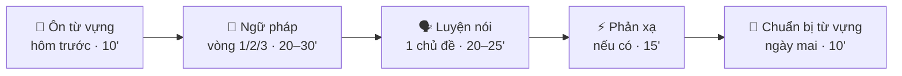

import StudyPlan from '@site/src/components/StudyPlan';

# Lộ trình 2 tháng (60 ngày)

**8 tuần + 4 ngày tổng ôn · khoảng 75–90 phút mỗi ngày · dùng toàn bộ Ngữ pháp, Luyện nói và Phản xạ trên trang này.**

## Nguyên tắc của lộ trình

| Phần | Cách sắp xếp |
|---|---|
| 📘 **Ngữ pháp – 3 vòng** | Mỗi chủ đề G01–G29 được học **đúng 3 lần**. **Vòng 1** (tuần 1–4): học mới 1–2 chủ đề/ngày. **Vòng 2** (tuần 5–6): ôn lần 2, làm quiz trước rồi chỉ đọc lại phần sai. **Vòng 3** (tuần 7–8): ôn lần 3, tự viết lại công thức từ trí nhớ. |
| 🗣️ **Luyện nói – mỗi ngày 1 chủ đề** | Tuần 1–6: học mới cả 36 chủ đề theo dàn ý 3 cấp (6 chủ đề/tuần, Chủ nhật nói lại 1 chủ đề ở cấp 3). Tuần 7–8: nói lại chủ đề cũ không nhìn dàn ý và **phỏng vấn thử** các chủ đề IT. |
| ⚡ **Phản xạ** | Tuần 1–6: 3 buổi/tuần (ngày 2, 4, 6 của tuần). Tuần 7–8 nhẹ ngữ pháp hơn nên phản xạ mọi ngày học. Chủ nhật ôn lại câu sai trong tuần. Đủ 30 chủ đề. |
| 🔁 **Ôn từ vựng** | **Đầu mỗi buổi** (10'): ôn từ của chủ đề nói và phản xạ hôm trước. **Chủ nhật** (20'): buổi ôn từ vựng của cả tuần. |
| 📒 **Chuẩn bị từ vựng** | **Cuối mỗi buổi** (10'): nghe 🔊 và chọn 5 từ của chủ đề nói ngày mai, để hôm sau vào bài là dùng được ngay. |
| 📝 **Kiểm tra** | Bài kiểm tra Tuần 1–4 ở các Chủ nhật tuần 2–5, làm lại ở tuần 6–7, **Bài kiểm tra cuối khóa** ở ngày 58. |

## Một buổi học mẫu

:::tip[Cách dùng trang này]
- Bấm **▶ Bắt đầu lộ trình từ hôm nay**: trang tự đánh dấu **Hôm nay là ngày mấy** và mở sẵn ngày đó.
- Mỗi ngày có link thẳng tới bài ngữ pháp, chủ đề nói, chủ đề phản xạ cần học. Học xong tích **Đánh dấu đã hoàn thành**.
- Lỡ một ngày? Không cần học bù 2 buổi – cứ làm **ngày chưa xong đầu tiên**, lộ trình lùi lại 1 ngày.
- Mỗi ngày nên **giữ một file ghi âm**; ngày 60 bạn sẽ nghe lại bản ghi ngày 1 để thấy mình tiến bộ thế nào.
- Tiến độ lưu trên trình duyệt của bạn (không cần đăng nhập).
:::

## Lịch 60 ngày

<StudyPlan />
