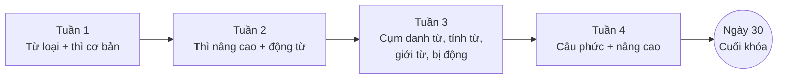

import ProgressDashboard from '@site/src/components/ProgressDashboard';

# Lộ trình 30 ngày – 60 phút/ngày

Nhập **ngày bắt đầu**, sau mỗi buổi học mở ngày tương ứng và bấm **Đánh dấu hoàn thành** + tự đánh giá.
Ô vàng nét đứt là ngày kiểm tra.

<ProgressDashboard />

## Cấu trúc lộ trình

| Tuần | Nội dung | Chủ đề | Kiểm tra |
|---|---|---|---|
| [Tuần 1](./tuan-1.mdx) | Nền tảng & các thì cơ bản | G01–G07 | Ngày 7 · 40 câu |
| [Tuần 2](./tuan-2.mdx) | Thì nâng cao, động từ khuyết thiếu, V-ing/to V | G08–G13 | Ngày 14 · 40 câu |
| [Tuần 3](./tuan-3.mdx) | Danh từ, tính từ, so sánh, giới từ, bị động | G14–G19 | Ngày 21 · 40 câu |
| [Tuần 4](./tuan-4.mdx) | Câu phức & cấu trúc nâng cao | G20–G29 | Ngày 29 · 42 câu |
| [Tổng kết](./tuan-4.mdx#ngay-30) | Tổng ôn toàn bộ | G01–G29 | Ngày 30 · 60 câu |

