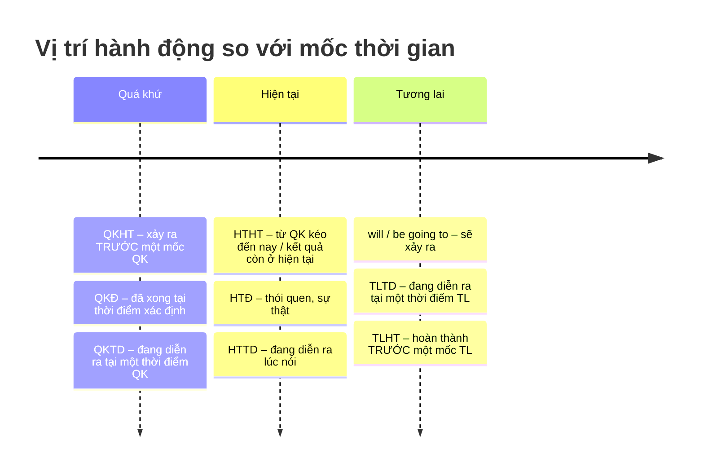

# Tổng hợp 12 thì tiếng Anh

Mỗi thì = **thời gian** (hiện tại / quá khứ / tương lai) × **thể** (đơn / tiếp diễn / hoàn thành / hoàn thành tiếp diễn).
Nắm được 2 trục này là suy ra được công thức của cả 12 thì.

## Ma trận công thức

| | **Đơn** | **Tiếp diễn** (be + V-ing) | **Hoàn thành** (have + V3) | **HT tiếp diễn** (have been + V-ing) |
|---|---|---|---|---|
| **Hiện tại** | `S + V(s/es)`  [G02](/docs/ngu-phap/g02-hien-tai-don) | `S + am/is/are + V-ing`  [G03](/docs/ngu-phap/g03-hien-tai-tiep-dien) | `S + have/has + V3`  [G06](/docs/ngu-phap/g06-hien-tai-hoan-thanh) | `S + have/has been + V-ing`  [G07](/docs/ngu-phap/g07-hien-tai-hoan-thanh-tiep-dien) |
| **Quá khứ** | `S + V2/V-ed`  [G04](/docs/ngu-phap/g04-qua-khu-don) | `S + was/were + V-ing`  [G05](/docs/ngu-phap/g05-qua-khu-tiep-dien) | `S + had + V3`  [G08](/docs/ngu-phap/g08-qua-khu-hoan-thanh) | `S + had been + V-ing`  [G08](/docs/ngu-phap/g08-qua-khu-hoan-thanh) |
| **Tương lai** | `S + will + V`  [G09](/docs/ngu-phap/g09-tuong-lai-will-be-going-to-httd) | `S + will be + V-ing`  [G10](/docs/ngu-phap/g10-tuong-lai-tiep-dien-tuong-lai-hoan-thanh) | `S + will have + V3`  [G10](/docs/ngu-phap/g10-tuong-lai-tiep-dien-tuong-lai-hoan-thanh) | `S + will have been + V-ing`  _(ít dùng)_ |

:::tip[Quy luật ghép công thức]
- **Tiếp diễn** luôn có `be + V-ing` → chia `be` theo thời gian: *am/is/are – was/were – will be*.
- **Hoàn thành** luôn có `have + V3` → chia `have` theo thời gian: *have/has – had – will have*.
- **Hoàn thành tiếp diễn** = ghép cả hai: `have been + V-ing`.
:::

## Trục thời gian

## Dấu hiệu nhận biết nhanh

| Thì | Từ khóa thường gặp |
|---|---|
| Hiện tại đơn | always, usually, often, sometimes, never, every day, once a week |
| Hiện tại tiếp diễn | now, right now, at the moment, at present, Look!, Listen! |
| Hiện tại hoàn thành | ever, never, already, yet, just, recently, so far, since, for |
| HTHT tiếp diễn | for, since, all day, all morning, how long |
| Quá khứ đơn | yesterday, last week, … ago, in 2010 |
| Quá khứ tiếp diễn | at 8 p.m. yesterday, at this time last week, while, when |
| Quá khứ hoàn thành | before, after, by the time, already (+ mốc QK) |
| Tương lai đơn / going to | tomorrow, next week, soon, I think, probably / Look at the clouds! |
| Tương lai tiếp diễn | this time tomorrow, at 9 a.m. tomorrow |
| Tương lai hoàn thành | by + mốc tương lai, by the time … |

## Các cặp thì hay nhầm

| Cặp | Phân biệt |
|---|---|
| HTĐ ↔ HTTD | Thói quen / sự thật **vs** đang xảy ra, tạm thời. Động từ trạng thái (know, like, want…) không dùng tiếp diễn. |
| QKĐ ↔ HTHT | Có **thời điểm xác định** trong quá khứ → QKĐ. Không nói rõ thời điểm / còn liên quan hiện tại → HTHT. |
| QKĐ ↔ QKTD | Hành động **xen vào** → QKĐ; hành động **đang diễn ra** → QKTD. |
| QKĐ ↔ QKHT | Hành động xảy ra **trước** → QKHT; hành động **sau** → QKĐ. |
| will ↔ be going to | Quyết định tức thời, dự đoán chủ quan **vs** dự định có trước, dự đoán có căn cứ. |
