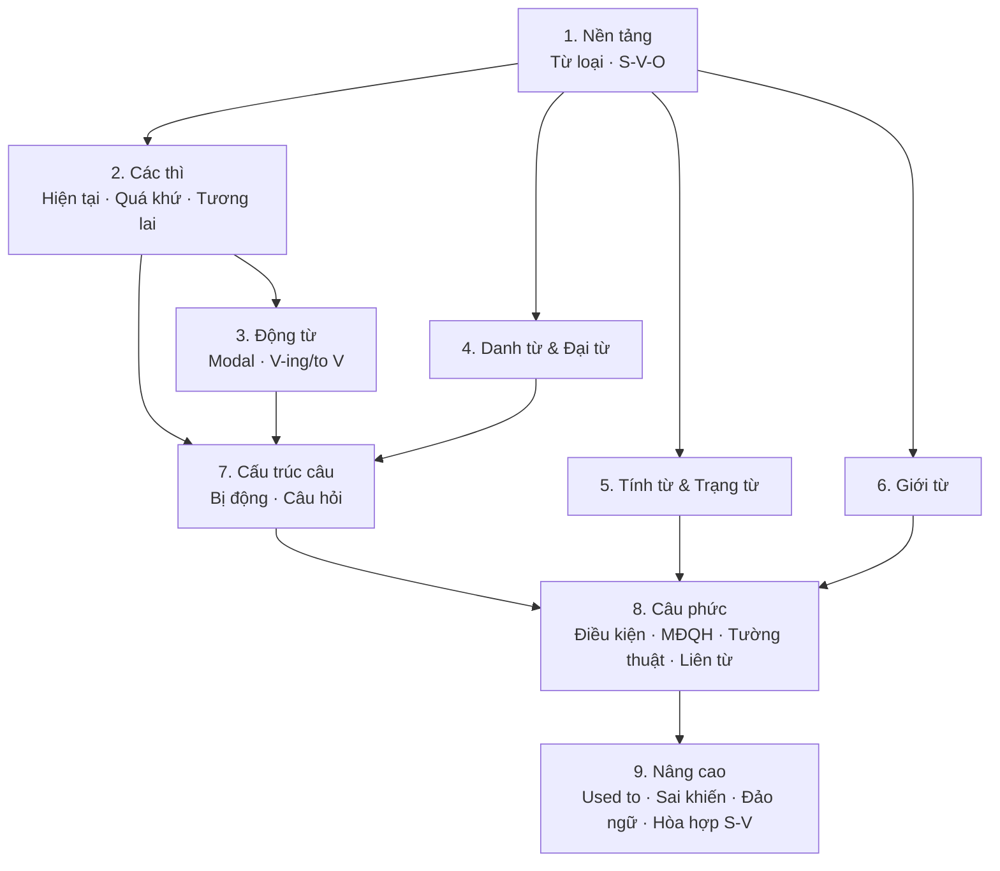

# Bản đồ ngữ pháp: 29 chủ đề, 9 nhóm

Các chủ đề được sắp xếp theo **cấp độ ngôn ngữ**, từ đơn vị nhỏ đến lớn: mỗi nhóm dựa trên kiến thức của nhóm trước.

## Danh sách theo nhóm

| Nhóm | Chủ đề |
|---|---|
| **1. Nền tảng** | [G01a · Từ loại](/docs/ngu-phap/g01-tu-loai) · [G01b · Cấu trúc câu cơ bản](/docs/ngu-phap/g01-cau-truc-cau-co-ban) |
| **2. Các thì** | [Tổng hợp 12 thì](./02-thi/tong-hop-12-thi.mdx) |
| &nbsp;&nbsp;↳ Hiện tại | [G02 · Hiện tại đơn](/docs/ngu-phap/g02-hien-tai-don) · [G03 · Hiện tại tiếp diễn](/docs/ngu-phap/g03-hien-tai-tiep-dien) · [G06 · Hiện tại hoàn thành](/docs/ngu-phap/g06-hien-tai-hoan-thanh) · [G07 · HTHT tiếp diễn](/docs/ngu-phap/g07-hien-tai-hoan-thanh-tiep-dien) |
| &nbsp;&nbsp;↳ Quá khứ | [G04 · Quá khứ đơn](/docs/ngu-phap/g04-qua-khu-don) · [G05 · Quá khứ tiếp diễn](/docs/ngu-phap/g05-qua-khu-tiep-dien) · [G08 · Quá khứ hoàn thành](/docs/ngu-phap/g08-qua-khu-hoan-thanh) |
| &nbsp;&nbsp;↳ Tương lai | [G09 · will / be going to](/docs/ngu-phap/g09-tuong-lai-will-be-going-to-httd) · [G10 · TL tiếp diễn & hoàn thành](/docs/ngu-phap/g10-tuong-lai-tiep-dien-tuong-lai-hoan-thanh) |
| **3. Động từ** | [G11 · Modal verbs](/docs/ngu-phap/g11-dong-tu-khuyet-thieu) · [G12 · Modal hoàn thành](/docs/ngu-phap/g12-modal-hoan-thanh) · [G13 · V-ing & to V](/docs/ngu-phap/g13-danh-dong-tu-dong-tu-nguyen-mau) |
| **4. Danh từ & Đại từ** | [G14 · Danh từ & mạo từ](/docs/ngu-phap/g14-danh-tu-dem-duoc-khong-dem-duoc-mao-tu) · [G15 · Lượng từ & đại từ](/docs/ngu-phap/g15-luong-tu-dai-tu) |
| **5. Tính từ & Trạng từ** | [G16 · Tính từ & trạng từ](/docs/ngu-phap/g16-tinh-tu-trang-tu) · [G17 · So sánh](/docs/ngu-phap/g17-so-sanh) |
| **6. Giới từ** | [G18 · Giới từ & Adj + Prep](/docs/ngu-phap/g18-gioi-tu-adj-prep) |
| **7. Cấu trúc câu** | [G19 · Câu bị động](/docs/ngu-phap/g19-cau-bi-dong) · [G25 · Câu hỏi đuôi, gián tiếp, chủ ngữ](/docs/ngu-phap/g25-cau-hoi-duoi-gian-tiep-chu-ngu) |
| **8. Câu phức** | [G20 · Điều kiện 0-1-2](/docs/ngu-phap/g20-cau-dieu-kien-loai-0-1-2) · [G21 · Điều kiện 3, hỗn hợp, wish](/docs/ngu-phap/g21-dieu-kien-loai-3-hon-hop-cau-uoc) · [G22 · Mệnh đề quan hệ](/docs/ngu-phap/g22-menh-de-quan-he) · [G23 · Câu tường thuật](/docs/ngu-phap/g23-cau-tuong-thuat) · [G24 · Liên từ & từ nối](/docs/ngu-phap/g24-lien-tu-tu-noi) |
| **9. Nâng cao** | [G26 · Used to](/docs/ngu-phap/g26-used-to-be-used-to-get-used-to) · [G27 · Thể sai khiến](/docs/ngu-phap/g27-the-sai-khien) · [G28 · Đảo ngữ](/docs/ngu-phap/g28-dao-ngu) · [G29 · Hòa hợp S-V](/docs/ngu-phap/g29-hoa-hop-chu-ngu-dong-tu) |

:::info[Mã chủ đề G01–G29]
Mã chủ đề giữ nguyên theo **thứ tự học** gợi ý, còn menu bên trái nhóm theo **phân loại ngữ pháp**.
Vì vậy G25 (câu hỏi) nằm trong nhóm *Cấu trúc câu* cùng G19, dù được học ở tuần 4.
:::
