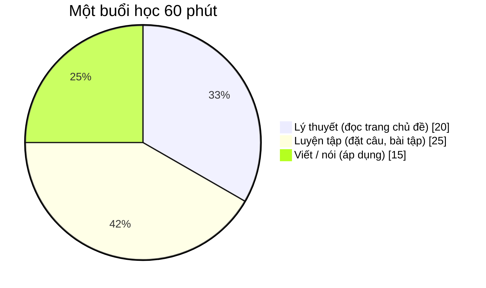
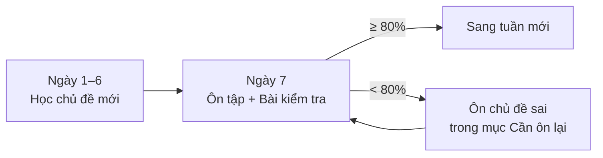

# Phương pháp học: nắm ngữ pháp trong 1 tháng

## 5 quy tắc

| # | Quy tắc | Chi tiết |
|---|---|---|
| 1 | **Đều đặn** | Học đủ **60 phút MỖI NGÀY**, không dồn. |
| 2 | **Tự đặt câu** | Mỗi chủ đề tự viết **ít nhất 10 câu** về cuộc sống của chính bạn – đây là bước giúp nhớ lâu nhất. |
| 3 | **Ngưỡng qua bài** | Bài kiểm tra tuần đạt **≥ 80%** mới coi là qua. Dưới 80%: ôn lại đúng các chủ đề trong mục *Cần ôn lại* rồi làm lại. |
| 4 | **Sổ lỗi sai** | Ghi mọi lỗi sai vào sổ tay. Đọc lại sổ lỗi (và trang [Sổ tay lỗi thường gặp](/docs/tra-cuu/loi-thuong-gap)) trước mỗi bài kiểm tra. |
| 5 | **Áp dụng** | Mỗi tuần đọc 2–3 bài báo / truyện ngắn tiếng Anh và gạch chân cấu trúc đã học. |

## Chia 60 phút mỗi ngày

- **20' lý thuyết** – đọc phần *Cấu trúc*, *Cách dùng*, *Dấu hiệu nhận biết* của chủ đề.
- **25' luyện tập** – làm phần *Bài tập trong ngày* và *Bài kiểm tra theo cấp độ*.
- **15' viết / nói** – tự viết câu về bản thân, đọc to và ghi âm lại.

## Chu trình học một tuần

## Cách làm bài kiểm tra

1. Làm hết các câu **không xem tài liệu**, rồi bấm **Nộp bài**.
2. Xem điểm, đáp án đúng và **giải thích** cho từng câu.
3. Mục **Cần ôn lại** liệt kê các chủ đề có câu sai – bấm vào để ôn đúng chỗ.
4. Làm lại bất cứ lúc nào bằng nút **Làm lại**; điểm cao nhất được lưu ở trang [Lộ trình](/docs/lo-trinh).
