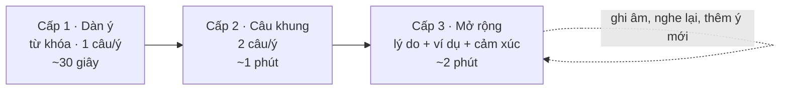

# Nói theo dàn ý – 3 cấp mở rộng

:::info[Ý tưởng chính]
Đừng cố nói một bài dài ngay từ đầu. Hãy **dựng khung trước** (3–5 ý chính), nói được bộ khung đó, rồi **mở rộng từng ý một**.
Cách này giúp bạn không bị "trống đầu", không lạc đề, và mỗi lần luyện đều nói dài hơn lần trước.
:::

## Quy trình 3 cấp

| Cấp | Bạn làm gì | Mỗi ý nói | Tổng thời gian |
|---|---|---|---|
| **1 · Dàn ý** | Đọc câu hỏi gợi ý, ghi 2–4 **từ khóa** tiếng Anh vào ô "Từ khóa của tôi" | 1 câu | ~30 giây |
| **2 · Câu khung** | Ghép từ khóa vào **câu khung** có sẵn, thêm 1 chi tiết | 2 câu | ~1 phút |
| **3 · Mở rộng** | Với mỗi ý trả lời thêm: *Vì sao? Ví dụ? Cảm thấy thế nào? Trước đây thì sao?* | 3–4 câu | ~2 phút |

:::tip[Mỗi chủ đề làm theo thứ tự này]
1. Học **từ vựng** và **mẫu câu** của chủ đề (mục 1–2).
2. Mở **dàn ý** ngay dưới đề Part 2 → làm **Cấp 1**, nói to, bấm ⏱ để canh giờ.
3. Hôm sau làm **Cấp 2**, rồi **Cấp 3**. Bài mẫu Part 2 (mục 4) dùng để **so sánh và lấy thêm cụm từ** sau khi đã tự nói, không phải để học thuộc. Nếu bài tập có bước shadowing trước đó, hãy shadowing các bài mẫu Part 1, còn bài mẫu Part 2 để sau.
4. Ý bạn ghi trong ô được lưu lại trên trình duyệt, lần sau mở ra vẫn còn để nói tiếp.
:::

## Mở rộng một ý như thế nào?

Lấy ý **"Sở thích: chạy bộ"** làm ví dụ:

| Cấp | Câu nói | Kỹ thuật |
|---|---|---|
| 1 | *I love running.* | Ý chính |
| 2 | *I love running. I usually run three times a week in the park near my house.* | + chi tiết (khi nào, ở đâu, bao lâu) |
| 3 | *I love running. I usually run three times a week in the park near my house. **The main reason is that** it clears my head after work. **For example**, last month I was really stressed about a project, and a long run every evening helped me sleep much better. **I used to hate** exercise, **but now** I can't imagine my week without it.* | + lý do + ví dụ cụ thể + so sánh trước/nay |

Bộ câu hỏi "mở rộng" dùng được cho **mọi ý**:

| Câu hỏi tự đặt | Cụm từ bắt đầu |
|---|---|
| Vì sao? | *The main reason is that… · That's because… · What I like about it is…* |
| Ví dụ? | *For example,… · I remember once… · Last week/month,…* |
| Cảm thấy thế nào? | *It makes me feel… · I find it really… · To be honest, I was…* |
| Trước đây / sau này? | *I used to…, but now… · In the future, I'd like to…* |
| So với cái khác? | *Compared to…, it's much… · Unlike…,* |
| Nếu…? | *If I had more time, I would… · If it weren't for…,* |

## Từ nối theo vị trí trong dàn ý

| Vị trí | Từ nối |
|---|---|
| Mở bài | *I'd like to talk about… · The … I want to describe is… · Well, let me tell you about…* |
| Sang ý 2 | *First of all,… · To start with,… · The first thing is…* |
| Sang ý tiếp | *Another thing is that… · On top of that,… · As for…,* |
| Đối lập | *However,… · On the other hand,… · Although…,* |
| Kết bài | *So, all in all,… · That's why… · Overall, I'd say…* |

## 9 dàn ý khung cho các dạng đề thường gặp

Hầu hết đề nói thuộc một trong các dạng dưới đây. Thuộc khung này, gặp đề mới bạn chỉ cần **điền ý vào khung**.

### 1. Tả một người

<Outline id="khung-nguoi" title="Describe a person (a friend, a teacher, someone you admire…)">
  <Step label="Mở bài: người đó là ai" ask="Tên, quan hệ với bạn, quen bao lâu?" keys="my aunt Hoa · known her all my life" frame="The person I'd like to talk about is…, who is my…" more="How did you meet? How long have you known them?" />
  <Step label="Ngoại hình / công việc" ask="Họ làm gì, trông như thế nào?" keys="teacher · tall · always smiling" frame="She works as… and she's quite…" more="Thêm 1 chi tiết đặc biệt dễ nhớ (giọng nói, cách ăn mặc…)." />
  <Step label="Tính cách + ví dụ" ask="2 tính từ chính, mỗi tính từ 1 ví dụ." keys="patient · generous · helped me with maths" frame="What I like most about her is that she's really…" more="For example, once she… · That's why everyone…" />
  <Step label="Ảnh hưởng tới bạn" ask="Họ đã thay đổi bạn thế nào?" keys="taught me · confident · reading habit" frame="She has taught me to…" more="I used to…, but thanks to her, now I…" />
  <Step label="Kết bài" ask="Cảm xúc chung, mong muốn." keys="grateful · want to be like her" frame="All in all, I'm really grateful to have her in my life." />
</Outline>

### 2. Tả một nơi chốn

<Outline id="khung-noi-chon" title="Describe a place (a city, a café, a place you visited…)">
  <Step label="Mở bài: nơi nào" ask="Tên, ở đâu, bạn đến khi nào / bao lâu một lần?" keys="Hoi An · central Vietnam · last summer" frame="I'd like to talk about…, which is located in…" />
  <Step label="Trông như thế nào" ask="2–3 đặc điểm nhìn/nghe/ngửi thấy." keys="yellow houses · lanterns · river" frame="The first thing you notice is…" more="Dùng tính từ mạnh: stunning, peaceful, lively, crowded…" />
  <Step label="Bạn làm gì ở đó" ask="Hoạt động chính." keys="walk · eat cao lau · take photos" frame="When I was there, I spent most of my time…-ing" more="I remember one evening when… (kể 1 khoảnh khắc)" />
  <Step label="Vì sao đặc biệt" ask="Điều khiến bạn thích / nhớ." keys="slow pace · history · friendly people" frame="What makes it special for me is…" more="Compared to the big city where I live, it's much…" />
  <Step label="Kết bài" ask="Có muốn quay lại / giới thiệu cho ai?" keys="go back · recommend" frame="I'd definitely love to go back there with…" />
</Outline>

### 3. Tả một đồ vật

<Outline id="khung-do-vat" title="Describe an object (a gift, a gadget, something important to you…)">
  <Step label="Mở bài: vật gì" ask="Tên vật, có từ khi nào, từ ai?" keys="an old watch · from my dad · 18th birthday" frame="I'm going to talk about…, which I got…" />
  <Step label="Trông như thế nào" ask="Kích thước, màu, chất liệu." keys="silver · small · scratched" frame="It's a… made of…" />
  <Step label="Dùng để làm gì / khi nào" ask="Bạn dùng nó ra sao?" keys="wear every day · interviews" frame="I use it whenever I…" more="It's especially useful when…" />
  <Step label="Ý nghĩa" ask="Vì sao nó quan trọng với bạn?" keys="reminds me of dad · lucky" frame="It means a lot to me because…" more="If I lost it, I would feel…" />
</Outline>

### 4. Kể một trải nghiệm / sự kiện

<Outline id="khung-trai-nghiem" title="Describe an experience / event (a trip, a celebration, a difficult time…)">
  <Step label="Bối cảnh" ask="Khi nào, ở đâu, với ai?" keys="2 years ago · Da Lat · my classmates" frame="It happened about… ago, when I was…" />
  <Step label="Mở đầu câu chuyện" ask="Chuyện bắt đầu thế nào?" keys="planned a trip · rainy morning" frame="At first, we were…-ing when…" more="Dùng quá khứ tiếp diễn cho bối cảnh: It was raining and we were waiting for…" />
  <Step label="Diễn biến chính" ask="2–3 việc xảy ra theo thứ tự." keys="bus broke down · walked · met a farmer" frame="Then… · After that… · Suddenly…" more="Thêm lời thoại ngắn: He said, 'Don't worry…'" />
  <Step label="Kết thúc" ask="Kết quả ra sao?" keys="arrived late · amazing view" frame="In the end,…" />
  <Step label="Cảm xúc & bài học" ask="Bạn cảm thấy / học được gì?" keys="tired but happy · be flexible" frame="Looking back, I realise that…" more="If it hadn't…, we would never have…" />
</Outline>

### 5. Nói về một hoạt động / thói quen

<Outline id="khung-hoat-dong" title="Talk about an activity or habit (a hobby, a sport, a routine…)">
  <Step label="Hoạt động gì" ask="Tên hoạt động, bắt đầu từ khi nào?" keys="cooking · since university" frame="I've been…-ing since…" />
  <Step label="Làm như thế nào" ask="Bao lâu một lần, ở đâu, với ai?" keys="weekends · at home · with my sister" frame="I usually… about… times a week." />
  <Step label="Vì sao thích" ask="1–2 lý do." keys="relaxing · creative · save money" frame="The main reason I enjoy it is that…" more="For example, last weekend I…" />
  <Step label="Khó khăn / tiến bộ" ask="Lúc đầu thế nào, giờ ra sao?" keys="burned rice · now better" frame="At first, I found it… but now…" />
  <Step label="Dự định" ask="Muốn làm gì tiếp?" keys="take a class · open a blog" frame="In the future, I'm planning to…" />
</Outline>

### 6. Nêu quan điểm (đồng ý / không đồng ý)

<Outline id="khung-quan-diem" title="Give your opinion (Do you agree…? Is it good that…?)">
  <Step label="Trả lời thẳng" ask="Đồng ý / không / tùy trường hợp?" keys="mostly agree" frame="Personally, I (strongly) believe that…" />
  <Step label="Lý do 1 + ví dụ" ask="Lý do mạnh nhất." keys="saves time · my office" frame="The main reason is that…" more="For instance, in my company…" />
  <Step label="Lý do 2 + ví dụ" ask="Lý do thứ hai." keys="cheaper · statistics" frame="On top of that,…" more="A good example of this is…" />
  <Step label="Ý ngược lại" ask="Người phản đối sẽ nói gì? Bạn đáp lại ra sao?" keys="some say lonely · but online meetings" frame="Admittedly, some people argue that…. However,…" />
  <Step label="Kết luận" ask="Nhắc lại quan điểm ngắn gọn." keys="overall positive" frame="So, overall, I'd say that…" />
</Outline>

### 7. Ưu điểm & nhược điểm

<Outline id="khung-uu-nhuoc" title="Advantages and disadvantages (of living abroad, of social media…)">
  <Step label="Mở bài" ask="Giới thiệu vấn đề trong 1 câu." keys="social media · everyone uses it" frame="… has both benefits and drawbacks." />
  <Step label="Ưu điểm" ask="1–2 ưu điểm + ví dụ." keys="stay in touch · learn quickly" frame="On the positive side,…" more="For example, I keep in touch with friends who…" />
  <Step label="Nhược điểm" ask="1–2 nhược điểm + ví dụ." keys="waste time · fake news" frame="On the downside,…" more="If people aren't careful, they can…" />
  <Step label="Ý kiến của bạn" ask="Bên nào nặng hơn?" keys="benefits outweigh · if used wisely" frame="In my view, the advantages outweigh the disadvantages, as long as…" />
</Outline>

### 8. Vấn đề & giải pháp

<Outline id="khung-van-de" title="Problem and solution (traffic, pollution, stress at work…)">
  <Step label="Nêu vấn đề" ask="Vấn đề là gì, nghiêm trọng thế nào?" keys="traffic jams · rush hour · 1 hour" frame="One of the biggest problems in… is…" />
  <Step label="Nguyên nhân" ask="1–2 nguyên nhân chính." keys="too many motorbikes · poor planning" frame="This is mainly caused by…" />
  <Step label="Hậu quả" ask="Ảnh hưởng tới ai, thế nào?" keys="stress · pollution · lost time" frame="As a result,…" />
  <Step label="Giải pháp" ask="Chính phủ / cá nhân nên làm gì?" keys="metro · work from home" frame="I think the government should… · Individuals could also…" more="If more people…, the situation would…" />
</Outline>

### 9. So sánh hai lựa chọn

<Outline id="khung-so-sanh" title="Compare two things (city vs countryside, online vs offline…)">
  <Step label="Mở bài" ask="Hai lựa chọn là gì? Bạn thích cái nào?" keys="city vs countryside · prefer city" frame="Both… and… have their own appeal, but I prefer…" />
  <Step label="Điểm khác 1" ask="So sánh tiêu chí thứ nhất." keys="jobs · more opportunities" frame="Firstly,… is much more… than…" />
  <Step label="Điểm khác 2" ask="So sánh tiêu chí thứ hai." keys="air · cleaner · quieter" frame="On the other hand,… is far… than…" />
  <Step label="Kết luận" ask="Ai hợp với lựa chọn nào?" keys="young people · retired" frame="So it really depends on… For me,…" />
</Outline>

## Dàn ý cho phỏng vấn IT

Giai đoạn 5 dùng hai khung riêng: **Present – Past – Future** cho câu giới thiệu và **STAR** cho câu hỏi hành vi và kể dự án.
Xem chi tiết ở [Tổng quan phỏng vấn IT](./05-phong-van-it/index.mdx).
