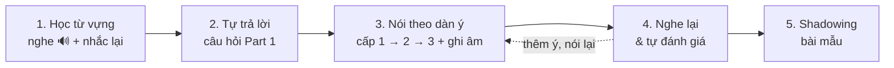

# Phương pháp luyện nói

## Quy trình cho mỗi chủ đề

| Bước | Làm gì | Thời gian |
|---|---|---|
| 1. Từ vựng | Bấm 🔊 nghe từng từ, nhắc lại 3 lần, đặt 1 câu về bản thân với mỗi từ quan trọng | 10' |
| 2. Trả lời ngắn | Trả lời từng câu Part 1 bằng 2–3 câu, dùng công thức **A-R-E** bên dưới | 5' |
| 3. Nói theo dàn ý | Mở **🧭 Dàn ý** dưới đề Part 2: cấp 1 (từ khóa, ~30") → cấp 2 (câu khung, ~1') → cấp 3 (mở rộng, ~2'). **Ghi âm** mỗi lần. Xem [Nói theo dàn ý](./dan-y.mdx) | 10' |
| 4. Đánh giá | Nghe lại bản ghi, đối chiếu checklist, thêm ý còn thiếu vào ô dàn ý rồi nói lại | 5' |
| 5. Shadowing | **Sau khi** đã tự nói, nghe bài mẫu và **nói đè theo** – bắt chước ngữ điệu, lấy thêm cụm từ hay cho dàn ý của bạn | 5' |

## Công thức trả lời A-R-E (không trả lời cụt)

| Bước | Ý nghĩa | Ví dụ – *Do you like cooking?* |
|---|---|---|
| **A**nswer | Trả lời thẳng | Yes, I really enjoy cooking. |
| **R**eason | Nêu lý do | It helps me relax after a long day at work. |
| **E**xample | Ví dụ / chi tiết | For example, last weekend I made *phở* for my whole family. |

:::tip[Mục tiêu độ dài]
- Câu hỏi ngắn (Part 1): **2–4 câu**, khoảng 15–25 giây.
- Đề nói dài (Part 2): **1–2 phút**, theo thứ tự các gợi ý trong đề.
- Câu hỏi thảo luận (Part 3): **4–6 câu**, có quan điểm + lý do + ví dụ + (tùy chọn) ý ngược lại.
:::

## Cụm từ "câu giờ" tự nhiên (thay cho "ờ… ừm…")

| Tình huống | Cụm từ |
|---|---|
| Cần nghĩ thêm | *Let me think…* · *That's an interesting question.* · *Well, I've never really thought about it, but…* |
| Nêu ý kiến | *Personally, I think…* · *In my opinion,…* · *As far as I'm concerned,…* |
| Thêm ý | *On top of that,…* · *What's more,…* · *Another thing is that…* |
| Đưa ví dụ | *For instance,…* · *Take … for example.* · *A good example is…* |
| Nói lại cho rõ | *What I mean is…* · *In other words,…* |
| Kết thúc | *So, that's why…* · *All in all,…* |

## Phát âm: 5 điểm người Việt hay sai

| Vấn đề | Ví dụ | Cách sửa |
|---|---|---|
| Bỏ âm cuối | *like* → "lai", *five* → "phai" | Luôn bật âm cuối /k/, /t/, /s/, /v/… nhất là đuôi **-s, -ed** |
| Không nối âm | *get up* → "ghét ắp" | Nối phụ âm cuối với nguyên âm đầu: *ge-tup*, *tur-noff* (turn off) |
| Nhấn sai trọng âm | *hotel*, *comfortable* | Tra từ điển, học trọng âm cùng từ mới: ho**TEL**, **COMF**-ta-ble |
| /θ/ và /ð/ | *think, this* → "thinh, đít" | Đặt đầu lưỡi giữa hai hàm răng rồi thổi hơi |
| Đọc đều từng từ | Nói như đọc chính tả | Nhấn vào từ mang nghĩa (danh từ, động từ chính), lướt nhanh từ chức năng (a, the, to, of) |

## Tự đánh giá theo 4 tiêu chí

| Tiêu chí | Câu hỏi tự kiểm tra |
|---|---|
| Trôi chảy & mạch lạc | Có ngắt quãng dài không? Có dùng từ nối (first, then, because, so…) không? |
| Từ vựng | Có dùng được ít nhất 5 từ/cụm từ mới của chủ đề không? |
| Ngữ pháp | Chia động từ đúng thì chưa? Có câu phức (because, when, if, which…) không? |
| Phát âm | Có bật âm cuối không? Trọng âm các từ dài đã đúng chưa? |
