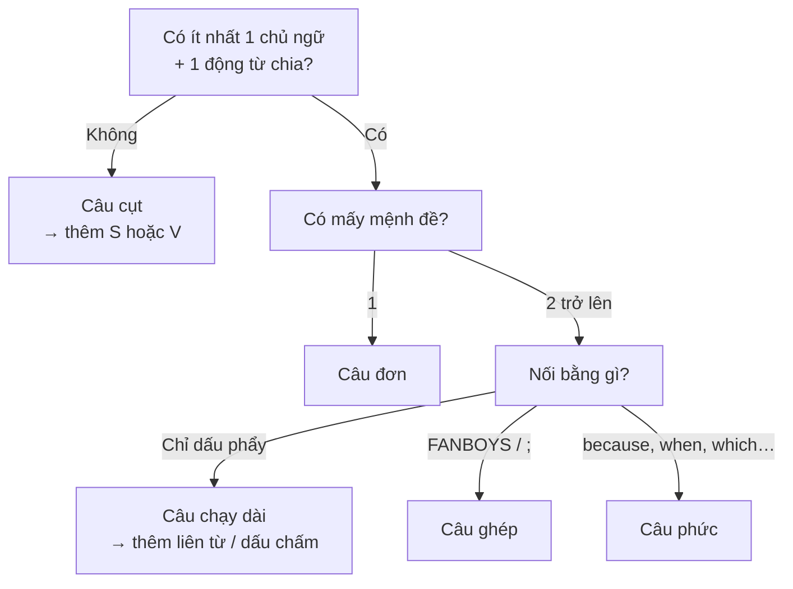

# Viết câu đúng: đơn, ghép, phức (Writing correct sentences)

<SkillMeta id="viet-01" />

:::info[Mục tiêu]
Viết được **ba loại câu** – **câu đơn**, **câu ghép**, **câu phức** – đúng cấu trúc, biết **nối** hai câu ngắn thành một câu dài hơn
và **sửa** hai lỗi phổ biến nhất: **câu chạy dài** (run-on) và **câu cụt** (fragment).
Ngữ pháp trọng tâm: [cấu trúc câu cơ bản](/docs/ngu-phap/g01-cau-truc-cau-co-ban), [liên từ & từ nối](/docs/ngu-phap/g24-lien-tu-tu-noi),
[mệnh đề quan hệ](/docs/ngu-phap/g22-menh-de-quan-he).
Đây là nền móng cho mọi bài viết: email, đoạn văn, bài luận, báo cáo công việc. Một đoạn văn tốt luôn **xen kẽ** câu ngắn và câu dài.
:::

## 1. Bố cục

### Ba loại câu

| Loại câu | Công thức | Dấu câu | Ví dụ |
|---|---|---|---|
| Câu đơn (simple) | **S + V** (+ O / bổ ngữ) – chỉ **1 mệnh đề độc lập** | Không cần dấu phẩy nối | *My brother works in Da Nang.* |
| Câu ghép (compound) | **Mệnh đề 1 + , + FANBOYS + mệnh đề 2** | Dấu phẩy **trước** liên từ | *It rained heavily, **so** we stayed at home.* |
| Câu ghép dùng từ nối | **Mệnh đề 1 + ; + however / therefore + , + mệnh đề 2** | Dấu chấm phẩy hoặc dấu chấm | *The hotel was cheap; **however**, it was very noisy.* |
| Câu phức (complex) | **Mệnh đề chính + liên từ phụ thuộc + mệnh đề phụ** | Không phẩy khi mệnh đề phụ đứng sau | *I felt nervous **because** it was my first interview.* |
| Câu phức (đảo vị trí) | **Liên từ phụ thuộc + mệnh đề phụ + , + mệnh đề chính** | Có phẩy khi mệnh đề phụ đứng **trước** | ***When** the meeting ended, everyone went for lunch.* |
| Câu phức với mệnh đề quan hệ | **Danh từ + who / which / that / where + mệnh đề** | Có phẩy nếu thông tin phụ | *Hoi An, **which** is famous for its lanterns, attracts many visitors.* |

### FANBOYS – 7 liên từ kết hợp (dùng trong câu ghép)

| Liên từ | Nghĩa | Ví dụ |
|---|---|---|
| **f**or | vì (trang trọng) | *She left early, for she had a train to catch.* |
| **a**nd | và | *Tuan cooked dinner, and his wife washed the dishes.* |
| **n**or | cũng không | *He does not drink coffee, nor does he drink tea.* |
| **b**ut | nhưng | *The flat is small, but it is close to my office.* |
| **o**r | hoặc | *You can pay by card, or you can transfer the money.* |
| **y**et | thế mà, vậy mà | *He studied hard, yet he failed the test.* |
| **s**o | nên | *The traffic was terrible, so I arrived late.* |

### Liên từ phụ thuộc (dùng trong câu phức)

| Ý nghĩa | Liên từ |
|---|---|
| Thời gian | *when, while, before, after, as soon as, until, since* |
| Nguyên nhân | *because, since, as* |
| Nhượng bộ | *although, even though, though* |
| Điều kiện | *if, unless, as long as* |
| Mục đích | *so that* |

### Sửa câu chạy dài & câu cụt

| Lỗi | Nhận biết | Cách sửa |
|---|---|---|
| Câu chạy dài (comma splice) | Hai mệnh đề độc lập chỉ nối bằng **dấu phẩy** | Tách bằng dấu chấm · thêm FANBOYS · dùng dấu chấm phẩy · đổi thành câu phức |
| Câu cụt (fragment) | Thiếu chủ ngữ, thiếu động từ, hoặc mệnh đề phụ đứng một mình | Thêm chủ ngữ/động từ · ghép mệnh đề phụ vào mệnh đề chính |

## 2. Từ vựng & cụm từ

### Thuật ngữ về câu

<VocabList>

| Từ / cụm từ | Phiên âm | Nghĩa | Ví dụ |
|---|---|---|---|
| subject | /ˈsʌbdʒɪkt/ | chủ ngữ | Every sentence needs a subject. |
| verb | /vɜːb/ | động từ | "Works" is the main verb in this sentence. |
| clause | /klɔːz/ | mệnh đề | A complex sentence has at least two clauses. |
| independent clause | /ˌɪndɪˈpendənt klɔːz/ | mệnh đề độc lập | An independent clause can stand alone. |
| dependent clause | /dɪˈpendənt klɔːz/ | mệnh đề phụ thuộc | "Because I was tired" is a dependent clause. |
| conjunction | /kənˈdʒʌŋkʃn/ | liên từ | Use a conjunction to join the two ideas. |
| run-on sentence | /ˈrʌn ɒn ˈsentəns/ | câu chạy dài | Your teacher marked this as a run-on sentence. |
| fragment | /ˈfræɡmənt/ | câu cụt, câu không trọn | "After the class." is a fragment, not a sentence. |

</VocabList>

### Từ nối thường dùng

<VocabList>

| Từ / cụm từ | Phiên âm | Nghĩa | Ví dụ |
|---|---|---|---|
| although | /ɔːlˈðəʊ/ | mặc dù | Although the room was small, it was very clean. |
| unless | /ənˈles/ | trừ khi | We will be late unless we leave now. |
| whereas | /weərˈæz/ | trong khi (đối lập) | My sister loves tea, whereas I prefer coffee. |
| as soon as | /əz suːn əz/ | ngay khi | Call me as soon as you arrive at the station. |
| so that | /səʊ ðæt/ | để mà | She saved money so that she could buy a laptop. |
| however | /haʊˈevə/ | tuy nhiên | The plan was good; however, it was too expensive. |
| therefore | /ˈðeəfɔː/ | vì vậy (trang trọng) | Sales fell sharply; therefore, the shop closed. |
| even though | /ˈiːvn ðəʊ/ | mặc dù (nhấn mạnh) | Even though he was ill, he went to work. |

</VocabList>

## 3. Mẫu câu & từ nối

| Chức năng | Mẫu câu |
|---|---|
| Thêm ý | *S + V, and S + V.* · *S + V; in addition, S + V.* |
| Đối lập | *S + V, but S + V.* · *Although S + V, S + V.* · *S + V, whereas S + V.* |
| Nguyên nhân | *S + V because S + V.* · *As S + V, S + V.* |
| Kết quả | *S + V, so S + V.* · *S + V; therefore, S + V.* |
| Thời gian | *When S + V, S + V.* · *S + V after S + V.* · *As soon as S + V, S + V.* |
| Điều kiện | *If S + V, S + will + V.* · *S + will + V unless S + V.* |
| Mục đích | *S + V so that S + can / could + V.* |
| Thêm thông tin về người | *N, who + V, …* · *The person who + V + is …* |
| Thêm thông tin về vật / nơi | *N, which + V, …* · *the place where S + V* |
| Lựa chọn | *S + can + V, or S + can + V.* |

## 4. Bài mẫu

<SpeakText title="Bài mẫu – Describe your morning routine using different sentence types (≈120 từ)">

I am a nurse at a busy hospital in Can Tho. My working day starts very early, so I usually get up at five o'clock. Before I leave home, I make a quick breakfast for my two children. My husband, who works from home, takes them to school. The hospital is only three kilometres away, but the roads are often crowded in the morning. Therefore, I always ride my motorbike instead of taking the bus. When I arrive, I change into my uniform and check the patient list. Although the job is tiring, I love it. I feel useful because I can help people every day. Some mornings are stressful; however, a smile from a patient always makes me happy.

Bản dịch

Tôi là y tá ở một bệnh viện đông đúc tại Cần Thơ. Ngày làm việc của tôi bắt đầu rất sớm nên tôi thường dậy lúc năm giờ. Trước khi ra khỏi nhà, tôi làm bữa sáng nhanh cho hai con. Chồng tôi, người làm việc tại nhà, đưa các con đến trường. Bệnh viện chỉ cách nhà ba cây số, nhưng buổi sáng đường thường đông. Vì vậy, tôi luôn đi xe máy thay vì đi xe buýt. Khi đến nơi, tôi thay đồng phục và kiểm tra danh sách bệnh nhân. Mặc dù công việc mệt mỏi, tôi yêu nó. Tôi thấy mình có ích vì có thể giúp đỡ mọi người mỗi ngày. Có những buổi sáng căng thẳng; tuy nhiên, nụ cười của bệnh nhân luôn làm tôi vui.

</SpeakText>

:::note[Phân tích bài mẫu]
| Loại câu | Câu trong bài |
|---|---|
| Câu đơn | *I am a nurse at a busy hospital in Can Tho.* · *Therefore, I always ride my motorbike …* |
| Câu ghép (FANBOYS) | *My working day starts very early, **so** I usually get up …* · *The hospital is … away, **but** the roads …* |
| Câu ghép (dấu chấm phẩy + từ nối) | *Some mornings are stressful; **however**, a smile …* |
| Câu phức – thời gian | ***Before** I leave home, I make …* · ***When** I arrive, I change …* |
| Câu phức – nhượng bộ / nguyên nhân | ***Although** the job is tiring, I love it.* · *I feel useful **because** …* |
| Câu phức – mệnh đề quan hệ | *My husband, **who** works from home, takes them to school.* |
| Nhận xét | Câu ngắn và câu dài **xen kẽ** → đoạn văn đọc tự nhiên, không đơn điệu. |
:::

## 5. Đề bài luyện tập

1. **(Dễ)** Nối mỗi cặp câu bằng liên từ trong ngoặc: (a) It was cold. We went swimming. *(but)* – (b) I missed the bus. I got up late. *(because)* – (c) She finished her report. She went home. *(after)* – (d) My cousin lives in Hue. Hue is a beautiful city. *(which)*.
   

   
Gợi ý dàn ý

   (a) It was cold, **but** we went swimming. – (b) I missed the bus **because** I got up late. – (c) **After** she finished her report, she went home. – (d) My cousin lives in Hue, **which** is a beautiful city. Nhớ: FANBOYS → có dấu phẩy phía trước; mệnh đề phụ đứng đầu câu → có dấu phẩy sau nó.

   

2. **(Dễ)** Sửa các câu sau: (a) I love my job, it is very interesting. – (b) Because the shop was closed. – (c) My father a teacher at a high school. – (d) We were hungry, we ordered pizza.
3. **(Trung bình)** Viết 6 câu về thành phố của bạn: 2 câu đơn, 2 câu ghép (dùng *but, so*), 2 câu phức (dùng *although, which*).
4. **(Trung bình)** Viết đoạn văn 80–100 từ về một ngày cuối tuần điển hình của bạn, có ít nhất 3 câu ghép và 3 câu phức. Gạch chân các liên từ.
5. **(Khó)** Viết lại đoạn sau cho mạch lạc bằng cách nối câu (≈100 từ): *I work in an office. The office is in District 1. I start at 8. I often arrive early. The traffic is bad. I like my colleagues. They are friendly. The work is stressful sometimes. I enjoy it.* Sau đó viết thêm 2–3 câu nói về kế hoạch của bạn năm tới.

## 6. Lỗi thường gặp

| ❌ Sai | ✅ Đúng | Giải thích |
|---|---|---|
| I was tired, I went to bed early. | I was tired, **so** I went to bed early. | Hai mệnh đề độc lập không nối bằng dấu phẩy → thêm liên từ hoặc tách câu |
| Because it was raining. | We stayed inside **because** it was raining. | Mệnh đề *because* không đứng một mình → ghép với mệnh đề chính |
| Although he is rich, but he is not happy. | **Although** he is rich, he is not happy. | Không dùng *although* và *but* trong cùng một câu (tiếng Việt "tuy… nhưng") |
| My sister very beautiful. | My sister **is** very beautiful. | Câu thiếu động từ → thêm *be* |
| The film was long, however it was interesting. | The film was long; **however**, it was interesting. | *however* là trạng từ nối, không phải liên từ → dùng dấu chấm phẩy/chấm và phẩy sau nó |
| When I got home I cooked dinner. | When I got home, I cooked dinner. (thêm dấu phẩy sau *home*) | Mệnh đề phụ đứng đầu câu → có dấu phẩy |

## 7. Checklist tự sửa

- [ ] Mỗi câu có **ít nhất một chủ ngữ và một động từ chia**.
- [ ] Không có hai mệnh đề độc lập chỉ nối bằng **dấu phẩy**.
- [ ] Không có mệnh đề *because / when / although …* đứng **một mình**.
- [ ] Không dùng cặp *although … but* hay *because … so* trong cùng một câu.
- [ ] Dấu phẩy đặt đúng: **trước** FANBOYS, **sau** mệnh đề phụ đứng đầu, **sau** *however / therefore*.
- [ ] Đoạn văn có đủ **ba loại câu**, không có câu dài quá 30 từ.
