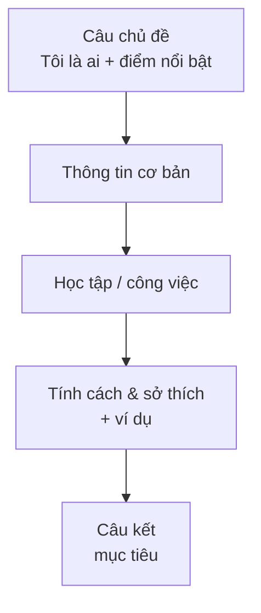

# Đoạn văn giới thiệu bản thân (Self-introduction paragraph)

<SkillMeta id="viet-02" />

:::info[Mục tiêu]
Viết được **một đoạn văn 100–150 từ** giới thiệu bản thân, có **câu chủ đề – thân đoạn – câu kết**, dùng đúng **hiện tại đơn**
(thông tin lâu dài), **hiện tại tiếp diễn** (việc đang làm) và **hiện tại hoàn thành** (kinh nghiệm).
Dạng bài này dùng trong email làm quen, hồ sơ xin học bổng, trang "About me", bài viết đầu khóa học.
:::

## 1. Bố cục

| Phần | Nội dung | Số câu | Ví dụ |
|---|---|---|---|
| Câu chủ đề | Tên + một nét nổi bật nhất | 1 | *My name is Lan, and I am a final-year student who loves travelling.* |
| Thông tin cơ bản | Tuổi, quê, nơi sống | 1–2 | *I am 22 years old and I come from Nghe An.* |
| Học tập / công việc | Đang học/làm gì, được bao lâu | 2 | *I am studying tourism at Hanoi University. I have also worked as a part-time tour guide for a year.* |
| Tính cách & sở thích | 1–2 tính cách + ví dụ chứng minh | 2–3 | *I am quite outgoing, so I enjoy meeting tourists from different countries.* |
| Câu kết | Mục tiêu / mong muốn | 1 | *In the future, I hope to open my own travel company.* |

## 2. Từ vựng & cụm từ

### Học tập & công việc

<VocabList>

| Từ / cụm từ | Phiên âm | Nghĩa | Ví dụ |
|---|---|---|---|
| final-year student | /ˈfaɪnl jɪə ˈstjuːdnt/ | sinh viên năm cuối | I am a final-year student at a technical university. |
| degree | /dɪˈɡriː/ | bằng đại học | I have a degree in economics. |
| graduate from | /ˈɡrædʒueɪt frɒm/ | tốt nghiệp | I graduated from Hue University in 2022. |
| internship | /ˈɪntɜːnʃɪp/ | kỳ thực tập | I did a three-month internship at a bank. |
| experience in | /ɪkˈspɪəriəns ɪn/ | kinh nghiệm về | I have two years of experience in sales. |
| skill | /skɪl/ | kỹ năng | Communication is my strongest skill. |
| colleague | /ˈkɒliːɡ/ | đồng nghiệp | My colleagues often ask me for help with Excel. |

</VocabList>

### Tính cách & sở thích

<VocabList>

| Từ / cụm từ | Phiên âm | Nghĩa | Ví dụ |
|---|---|---|---|
| sociable | /ˈsəʊʃəbl/ | hòa đồng | I am sociable and enjoy working in teams. |
| organised | /ˈɔːɡənaɪzd/ | ngăn nắp, có tổ chức | I am very organised, so I always plan my week on Sunday. |
| determined | /dɪˈtɜːmɪnd/ | quyết tâm | I am determined to pass the IELTS exam this year. |
| creative | /kriˈeɪtɪv/ | sáng tạo | I am creative and love designing posters. |
| passionate about | /ˈpæʃənət əˈbaʊt/ | đam mê | I am passionate about cooking. |
| spend time + V-ing | /spend taɪm/ | dành thời gian làm gì | I spend most weekends reading novels. |
| volunteer | /ˌvɒlənˈtɪə/ | tình nguyện | I volunteer at an animal shelter once a month. |

</VocabList>

## 3. Mẫu câu & từ nối

| Chức năng | Mẫu câu |
|---|---|
| Câu chủ đề | *My name is …, and I am a … who …* · *Let me introduce myself: I am …* |
| Quê quán | *I was born in … but I now live in …* · *I come from …, a … in …* |
| Việc đang làm | *I am currently + V-ing …* · *At the moment, I am working as …* |
| Kinh nghiệm | *I have + V3 … for/since …* · *I have always been interested in …* |
| Tính cách + bằng chứng | *I would describe myself as …; for example, …* |
| Sở thích | *In my free time, I enjoy + V-ing …* · *I am particularly interested in …* |
| Mục tiêu | *In the future, I hope to …* · *My long-term goal is to …* |
| Từ nối | *also, in addition, besides, however, so, because, for example* |

## 4. Bài mẫu

<SpeakText title="Bài mẫu – Introduce yourself to your new English class (≈140 từ)">

My name is Tran Minh Anh, and I am a hard-working accountant who is trying to improve my English. I am 27 years old and I come from Thai Binh, but I have lived in Hanoi since I started university. At the moment, I am working for an international logistics company, where I prepare financial reports every month. I would describe myself as organised and patient. For example, I always plan my week on Sunday evening, so I rarely miss a deadline. In my free time, I enjoy cooking traditional dishes and watching documentaries about history. I have also volunteered at a local library for two years, which has taught me how to explain things clearly. In the future, I hope to work in my company's Singapore office, so I really need to become more confident in English.

Bản dịch

Tôi tên là Trần Minh Anh, một kế toán chăm chỉ đang cố gắng cải thiện tiếng Anh. Tôi 27 tuổi, quê Thái Bình, nhưng đã sống ở Hà Nội từ khi vào đại học. Hiện tôi làm việc cho một công ty logistics quốc tế, nơi tôi lập báo cáo tài chính hằng tháng. Tôi tự thấy mình ngăn nắp và kiên nhẫn. Ví dụ, tôi luôn lên kế hoạch cho cả tuần vào tối Chủ nhật nên hiếm khi trễ hạn. Lúc rảnh, tôi thích nấu các món truyền thống và xem phim tài liệu lịch sử. Tôi cũng đã làm tình nguyện ở một thư viện địa phương được hai năm, điều này dạy tôi cách giải thích mọi thứ rõ ràng. Trong tương lai, tôi mong được làm việc ở văn phòng Singapore của công ty, vì vậy tôi thật sự cần tự tin hơn khi dùng tiếng Anh.

</SpeakText>

:::note[Phân tích bài mẫu]
| Phần | Câu trong bài |
|---|---|
| Câu chủ đề | *My name is Tran Minh Anh, and I am a hard-working accountant who is trying to improve my English.* |
| Thông tin cơ bản | *I am 27 … since I started university.* – **HTHT + since** |
| Công việc | *At the moment, I am working for … where I prepare …* – **HTTD + MĐ quan hệ where** |
| Tính cách + ví dụ | *I would describe myself as … For example, …* |
| Sở thích & kinh nghiệm | *In my free time, I enjoy + V-ing … I have also volunteered … which has taught me …* |
| Câu kết | *In the future, I hope to … so I really need to …* |
:::

## 5. Đề bài luyện tập

1. **(Dễ)** Write a paragraph (80–100 words) to introduce yourself to a new pen friend.
   

   
Gợi ý dàn ý

   Câu chủ đề (tên, tuổi) → quê & nơi sống → học/làm gì → 2 sở thích + lý do → câu kết: mong được làm bạn / hỏi lại về bạn ấy.

   

2. **(Dễ)** Write a short "About me" paragraph (about 100 words) for your social media profile.
3. **(Trung bình)** You have joined a new company. Write a paragraph (120–150 words) introducing yourself to your team, including your experience and your strengths.
4. **(Trung bình)** Write a paragraph (120–150 words) introducing yourself to an English teacher: explain why you are learning English and what you find difficult.
5. **(Khó)** Write a personal statement paragraph (150–180 words) for a scholarship application: describe your background, one achievement you are proud of, and your future goals.

## 6. Lỗi thường gặp

| ❌ Sai | ✅ Đúng | Giải thích |
|---|---|---|
| I am 27 years. | I am 27 years old. / I am 27. | Tuổi: *years old* đi cùng nhau, hoặc chỉ dùng số |
| I live in Hanoi since 2018. | I **have lived** in Hanoi since 2018. | Có *since* + kéo dài đến nay → hiện tại hoàn thành |
| I very like cooking. | I **really** like cooking. | *very* không bổ nghĩa cho động từ |
| My hobby is read books. | My hobby is **reading** books. | Sau *be* làm bổ ngữ cho danh từ → V-ing |
| I am work as a teacher. | I work as a teacher. | Không dùng *am* + động từ nguyên mẫu |
| I am interesting in music. | I am **interested** in music. | Cảm xúc của người → *-ed* |

## 7. Checklist tự sửa

- [ ] Câu đầu tiên là **câu chủ đề** nói rõ bạn là ai.
- [ ] Có đủ: thông tin cơ bản, học tập/công việc, tính cách + ví dụ, sở thích, mục tiêu.
- [ ] Mỗi tính cách đều có **ví dụ chứng minh**.
- [ ] Dùng đúng 3 thì: hiện tại đơn, hiện tại tiếp diễn, hiện tại hoàn thành.
- [ ] Có ít nhất 3 từ nối (*also, so, for example, however…*) và 1 câu có *who/which/where*.
- [ ] Độ dài đúng yêu cầu; không viết tắt nếu là văn phong trang trọng.
