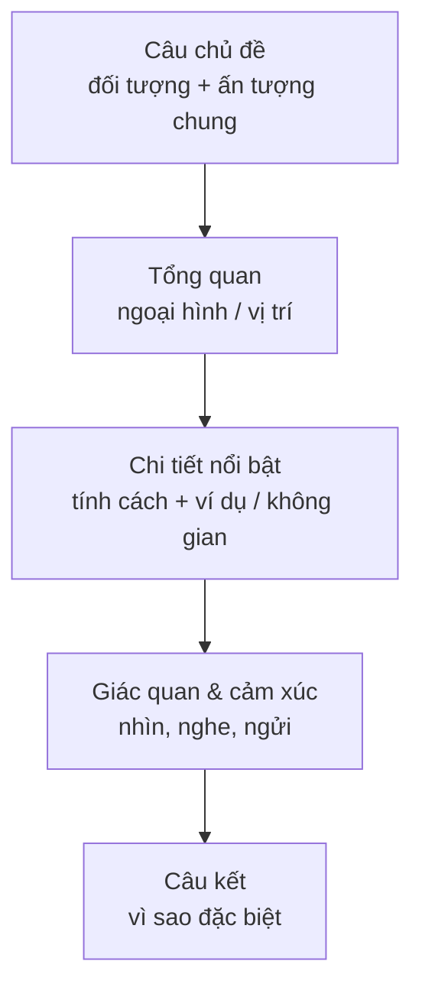

# Đoạn văn miêu tả người & nơi chốn (Descriptive paragraph)

<SkillMeta id="viet-03" />

:::info[Mục tiêu]
Viết được **một đoạn văn 120–160 từ** miêu tả **một người** hoặc **một nơi chốn** sao cho người đọc "nhìn thấy" được đối tượng:
có **câu chủ đề – chi tiết miêu tả theo trình tự – cảm nhận – câu kết**.
Ngữ pháp trọng tâm: [tính từ & trạng từ](/docs/ngu-phap/g16-tinh-tu-trang-tu) (thứ tự tính từ), [giới từ nơi chốn](/docs/ngu-phap/g18-gioi-tu-adj-prep),
[mệnh đề quan hệ](/docs/ngu-phap/g22-menh-de-quan-he) (*who, which, where*).
Dạng bài này xuất hiện trong đề thi (describe a person you admire, a place you like), bài đăng du lịch, review quán cà phê, thư kể cho bạn bè.
:::

## 1. Bố cục

| Phần | Nội dung | Số câu | Ví dụ |
|---|---|---|---|
| Câu chủ đề | Giới thiệu đối tượng + **ấn tượng chung** | 1 | *My grandmother is the kindest and most hard-working person I know.* |
| Ngoại hình / tổng quan | Người: dáng, mặt, tóc, trang phục · Nơi: vị trí, kích thước, không khí | 2–3 | *She is small and slim, with short grey hair and warm brown eyes.* |
| Chi tiết nổi bật | Người: tính cách + **ví dụ** · Nơi: miêu tả theo không gian (từ ngoài vào trong, từ trái sang phải) | 2–3 | *Next to the window, there is a wooden table where she makes tea every morning.* |
| Cảm nhận / giác quan | Âm thanh, mùi, cảm xúc của người viết | 1–2 | *The house always smells of jasmine and fresh rice.* |
| Câu kết | Vì sao người/nơi này đặc biệt | 1 | *Whenever I feel tired, I think of her and feel calm again.* |

## 2. Từ vựng & cụm từ

### Miêu tả người

<VocabList>

| Từ / cụm từ | Phiên âm | Nghĩa | Ví dụ |
|---|---|---|---|
| in his / her fifties | /ɪn hɪz ˈfɪftiz/ | khoảng năm mươi mấy tuổi | My uncle is in his fifties, but he looks much younger. |
| well-built | /ˌwel ˈbɪlt/ | vạm vỡ, cân đối | The coach is tall and well-built. |
| shoulder-length hair | /ˈʃəʊldə leŋθ heə/ | tóc ngang vai | Ngoc has straight, shoulder-length hair. |
| wrinkles | /ˈrɪŋklz/ | nếp nhăn | Her face has a few wrinkles around the eyes. |
| cheerful | /ˈtʃɪəfl/ | vui vẻ | He is always cheerful, even on Monday mornings. |
| generous | /ˈdʒenərəs/ | hào phóng, rộng lượng | She is generous with her time and her money. |
| easy-going | /ˌiːzi ˈɡəʊɪŋ/ | dễ tính | My boss is easy-going, so the office feels relaxed. |
| look up to | /lʊk ˈʌp tə/ | kính trọng, ngưỡng mộ | I have always looked up to my older brother. |

</VocabList>

### Miêu tả nơi chốn

<VocabList>

| Từ / cụm từ | Phiên âm | Nghĩa | Ví dụ |
|---|---|---|---|
| located | /ləʊˈkeɪtɪd/ | nằm ở | The café is located at the end of a quiet lane. |
| surrounded by | /səˈraʊndɪd baɪ/ | được bao quanh bởi | The village is surrounded by rice fields. |
| cosy | /ˈkəʊzi/ | ấm cúng | It is a cosy room with soft yellow lights. |
| spacious | /ˈspeɪʃəs/ | rộng rãi | The living room is bright and spacious. |
| crowded | /ˈkraʊdɪd/ | đông đúc | Ben Thanh Market is always crowded at weekends. |
| peaceful | /ˈpiːsfl/ | yên bình | The lake is peaceful early in the morning. |
| breathtaking view | /ˈbreθteɪkɪŋ vjuː/ | cảnh đẹp ngoạn mục | From the top of the hill, there is a breathtaking view of the bay. |
| in the distance | /ɪn ðə ˈdɪstəns/ | ở phía xa | In the distance, you can see the mountains of Sa Pa. |

</VocabList>

### Giác quan & cảm xúc

<VocabList>

| Từ / cụm từ | Phiên âm | Nghĩa | Ví dụ |
|---|---|---|---|
| smell of | /smel əv/ | có mùi | The kitchen smells of ginger and garlic. |
| the sound of | /ðə saʊnd əv/ | âm thanh của | I love the sound of the rain on the roof. |
| lively | /ˈlaɪvli/ | sôi động, nhộn nhịp | The night market is lively and colourful. |
| feel at home | /fiːl ət həʊm/ | thấy thoải mái như ở nhà | Everyone feels at home in her little shop. |

</VocabList>

## 3. Mẫu câu & từ nối

| Chức năng | Mẫu câu |
|---|---|
| Câu chủ đề (người) | *One person I really admire is …, who …* · *… is the most … person I have ever met.* |
| Câu chủ đề (nơi) | *My favourite place in … is …, a … where …* |
| Ngoại hình | *He / She is … and …, with … hair and … eyes.* · *He / She usually wears …* |
| Tính cách + ví dụ | *He / She is very …; for instance, …* · *What I like most about him / her is …* |
| Vị trí | *It is located in / on / next to …* · *It is surrounded by …* |
| Miêu tả không gian | *As you walk in, you can see …* · *On the left / In the middle / At the back, there is / are …* |
| Giác quan | *It smells of …* · *You can hear the sound of …* · *It looks like …* |
| Thứ tự tính từ | *a beautiful old wooden house* (ý kiến → kích thước/tuổi → màu → chất liệu → danh từ) |
| Câu kết | *For me, … is not just a …; it is …* · *Whenever I …, I think of …* |
| Từ nối | *also, besides, in addition, for instance, as well as, especially, however* |

## 4. Bài mẫu

<SpeakText title="Bài mẫu – Describe a place where you like to spend time (≈150 từ)">

My favourite place in Da Lat is a small coffee shop that my friends and I discovered three years ago. It is located on a narrow street near Xuan Huong Lake and is surrounded by pine trees and flower gardens. From the outside, it looks like an old French villa with a red roof and tall windows. As you walk in, you can see a cosy room with wooden tables and a large bookshelf in the corner. On the right, there is a glass door which leads to a balcony, where you can enjoy a breathtaking view of the hills in the distance. The shop always smells of fresh coffee and warm bread, and you can hear soft jazz music in the background. The owner, who is a friendly man in his sixties, always remembers his customers' names. For me, this café is not just a place to drink coffee; it is a place where I feel completely at home.

Bản dịch

Nơi tôi yêu thích nhất ở Đà Lạt là một quán cà phê nhỏ mà tôi và bạn bè tìm ra ba năm trước. Quán nằm trên một con phố hẹp gần hồ Xuân Hương, xung quanh là hàng thông và vườn hoa. Nhìn từ bên ngoài, quán trông như một biệt thự kiểu Pháp cũ với mái ngói đỏ và những ô cửa sổ cao. Bước vào trong, bạn sẽ thấy một căn phòng ấm cúng với bàn gỗ và một giá sách lớn ở góc phòng. Bên phải có một cửa kính dẫn ra ban công, nơi bạn có thể ngắm cảnh đồi núi tuyệt đẹp ở phía xa. Quán lúc nào cũng thơm mùi cà phê mới pha và bánh mì nóng, và bạn có thể nghe tiếng nhạc jazz nhẹ nhàng. Ông chủ quán, một người đàn ông thân thiện ngoài sáu mươi tuổi, luôn nhớ tên khách quen. Với tôi, quán cà phê này không chỉ là nơi uống cà phê; đó là nơi tôi thấy thoải mái như ở nhà.

</SpeakText>

:::note[Phân tích bài mẫu]
| Phần | Câu trong bài |
|---|---|
| Câu chủ đề | *My favourite place in Da Lat is a small coffee shop that …* – **MĐ quan hệ that** |
| Tổng quan – vị trí | *It is located on … near … and is surrounded by …* – **giới từ nơi chốn** |
| Ngoại hình bên ngoài | *From the outside, it looks like an old French villa with …* – **thứ tự tính từ** |
| Không gian bên trong | *As you walk in … On the right, there is … which … where …* – miêu tả **từ ngoài vào trong** |
| Giác quan | *The shop always smells of … you can hear …* |
| Con người | *The owner, who is a friendly man in his sixties, …* – **MĐ quan hệ who** |
| Câu kết | *For me, this café is not just …; it is a place where …* |
:::

## 5. Đề bài luyện tập

1. **(Dễ)** Write a paragraph (80–100 words) describing a member of your family.
   

   
Gợi ý dàn ý

   Câu chủ đề (người đó là ai + ấn tượng chung) → tuổi & ngoại hình (dáng, tóc, mắt) → 2 tính cách, mỗi tính cách một ví dụ → một thói quen/việc người đó hay làm → câu kết: bạn cảm thấy thế nào về người đó.

   

2. **(Dễ)** Write a paragraph (about 100 words) describing your bedroom or your workspace.
3. **(Trung bình)** Write a paragraph (120–150 words) describing a teacher who has influenced you. Include his or her appearance, personality and one memory.
4. **(Trung bình)** A travel website is asking readers to describe a beautiful place in Vietnam. Write a paragraph (130–150 words) using at least three senses (sight, sound, smell).
5. **(Khó)** Write a paragraph (150–180 words) describing how your hometown has changed over the last ten years. Compare what it looked like before with what it looks like now.

## 6. Lỗi thường gặp

| ❌ Sai | ✅ Đúng | Giải thích |
|---|---|---|
| She has a hair long and black. | She has **long black hair**. | Tính từ đứng **trước** danh từ; *hair* (tóc nói chung) không đếm được → không dùng *a* |
| a wooden old beautiful house | a **beautiful old wooden** house | Thứ tự: ý kiến → tuổi → chất liệu |
| The café is located at Tran Phu Street. | The café is located **on** Tran Phu Street. / … **at** 25 Tran Phu Street. | Tên đường dùng *on* (Anh-Anh cũng dùng *in*); chỉ dùng *at* khi có số nhà cụ thể |
| He is a man who he is very kind. | He is a man **who** is very kind. | *who* đã thay cho chủ ngữ → không lặp *he* |
| The place where I was born in is Nam Dinh. | The place where I was born is Nam Dinh. | *where* đã bao hàm giới từ → bỏ *in* |
| She looks very beautifully. | She looks very **beautiful**. | Sau động từ nối *look, seem, smell* → tính từ, không dùng trạng từ |

## 7. Checklist tự sửa

- [ ] Câu chủ đề nêu rõ **đối tượng** và **ấn tượng chung**.
- [ ] Chi tiết được sắp xếp theo **trình tự** (tổng quan → chi tiết, ngoài → trong).
- [ ] Mỗi tính cách đều có **ví dụ**; có ít nhất 2 **giác quan** khác nhau.
- [ ] Tính từ đứng **trước** danh từ và đúng **thứ tự**; sau *look/seem/smell* dùng tính từ.
- [ ] Có ít nhất 2 mệnh đề quan hệ (*who / which / where*) và giới từ nơi chốn đúng.
- [ ] Không lặp *beautiful, nice, good* quá 2 lần – thay bằng từ cụ thể hơn.
