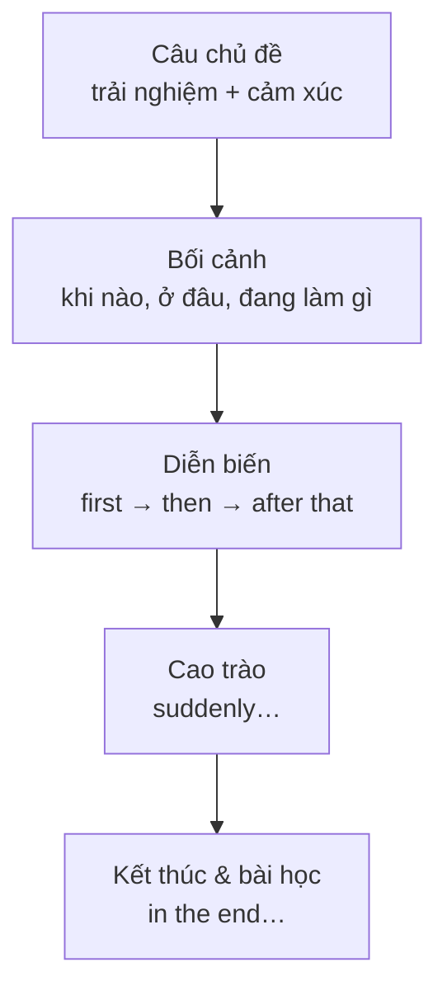

# Đoạn văn kể lại trải nghiệm (Narrative paragraph)

<SkillMeta id="viet-04" />

:::info[Mục tiêu]
Viết được **một đoạn văn 130–170 từ** kể lại một trải nghiệm đáng nhớ theo **trình tự thời gian**: bối cảnh → sự việc chính → cao trào → kết thúc → bài học/cảm xúc.
Ngữ pháp trọng tâm: [quá khứ đơn](/docs/ngu-phap/g04-qua-khu-don) (chuỗi hành động), [quá khứ tiếp diễn](/docs/ngu-phap/g05-qua-khu-tiep-dien) (bối cảnh, hành động bị cắt ngang),
[quá khứ hoàn thành](/docs/ngu-phap/g08-qua-khu-hoan-thanh) (việc xảy ra trước một mốc quá khứ).
Dạng bài này dùng khi kể chuyện trong email cho bạn, bài đăng mạng xã hội, đề thi (*Write a story that begins/ends with …*), phỏng vấn xin việc (kể về một thử thách đã vượt qua).
:::

## 1. Bố cục

| Phần | Nội dung | Số câu | Ví dụ |
|---|---|---|---|
| Câu chủ đề | Trải nghiệm gì + cảm xúc chung | 1 | *My first business trip abroad was the most stressful experience of my life.* |
| Bối cảnh | Khi nào, ở đâu, với ai, đang làm gì (QKTD) | 1–2 | *It was a rainy evening in March, and I was waiting for my flight to Seoul.* |
| Diễn biến | Chuỗi sự việc theo thứ tự (QKĐ + từ nối thời gian) | 2–3 | *First, I checked in. Then I went to a café to prepare my slides.* |
| Cao trào | Sự cố / bất ngờ (*suddenly*, QKHT) | 1–2 | *Suddenly, I realised that I had left my passport at the counter.* |
| Kết thúc & bài học | Chuyện kết thúc thế nào + cảm xúc / bài học | 1–2 | *In the end, I caught the plane, and since then I have always double-checked my bag.* |

## 2. Từ vựng & cụm từ

### Từ nối thời gian & trình tự

<VocabList>

| Từ / cụm từ | Phiên âm | Nghĩa | Ví dụ |
|---|---|---|---|
| at first | /ət ˈfɜːst/ | lúc đầu | At first, everything seemed normal. |
| soon afterwards | /suːn ˈɑːftəwədz/ | ngay sau đó | Soon afterwards, the lights went out. |
| meanwhile | /ˈmiːnwaɪl/ | trong lúc đó | Meanwhile, my brother was calling the police. |
| all of a sudden | /ɔːl əv ə ˈsʌdn/ | bỗng nhiên | All of a sudden, a dog ran into the road. |
| by the time | /baɪ ðə taɪm/ | vào lúc mà (đã…) | By the time we arrived, the concert had started. |
| eventually | /ɪˈventʃuəli/ | cuối cùng (sau nhiều khó khăn) | We eventually found the hotel after an hour. |
| in the end | /ɪn ði end/ | rốt cuộc, kết cục là | In the end, we laughed about the whole thing. |
| looking back | /ˈlʊkɪŋ bæk/ | nhìn lại | Looking back, it was a valuable lesson. |

</VocabList>

### Sự cố & phản ứng

<VocabList>

| Từ / cụm từ | Phiên âm | Nghĩa | Ví dụ |
|---|---|---|---|
| get lost | /ɡet lɒst/ | bị lạc | We got lost in the old quarter of Hoi An. |
| break down | /breɪk daʊn/ | (xe) chết máy, hỏng | Our car broke down on the way to Vung Tau. |
| run out of | /rʌn ˈaʊt əv/ | hết (cái gì) | Halfway up the mountain, we ran out of water. |
| realise | /ˈrɪəlaɪz/ | nhận ra | I realised that I had taken the wrong bus. |
| panic | /ˈpænɪk/ | hoảng loạn | Don't panic – we can ask someone for directions. |
| turn out | /tɜːn ˈaʊt/ | hóa ra là | The stranger turned out to be my old classmate. |

</VocabList>

### Cảm xúc

<VocabList>

| Từ / cụm từ | Phiên âm | Nghĩa | Ví dụ |
|---|---|---|---|
| terrified | /ˈterɪfaɪd/ | vô cùng sợ hãi | I was terrified when the boat started to shake. |
| relieved | /rɪˈliːvd/ | nhẹ nhõm | We were so relieved to see the lights of the village. |
| embarrassed | /ɪmˈbærəst/ | ngượng, xấu hổ | I felt embarrassed because everyone was looking at me. |
| unforgettable | /ˌʌnfəˈɡetəbl/ | không thể quên | It was an unforgettable day. |
| thrilled | /θrɪld/ | cực kỳ phấn khích | She was thrilled to receive the scholarship. |

</VocabList>

## 3. Mẫu câu & từ nối

| Chức năng | Mẫu câu |
|---|---|
| Câu chủ đề | *I will never forget the day when …* · *One of the most … experiences I have ever had was …* |
| Bối cảnh (QKTD) | *It was a … morning, and I was + V-ing …* · *The sun was shining and people were + V-ing …* |
| Hành động bị cắt ngang | *While I was + V-ing, S + V2 …* · *I was + V-ing when suddenly …* |
| Chuỗi hành động (QKĐ) | *First, … Then … After that, … Finally, …* |
| Việc xảy ra trước (QKHT) | *When I arrived, S + had + V3 …* · *I realised that I had + V3 …* |
| Cao trào | *Suddenly, …* · *To my surprise, …* · *Just as …, …* |
| Cảm xúc | *I was so + adj + that …* · *I have never felt so … in my life.* |
| Kết thúc | *In the end, …* · *Eventually, …* · *Luckily, …* |
| Bài học | *Looking back, I realise that …* · *The experience taught me that …* |

## 4. Bài mẫu

<SpeakText title="Bài mẫu – Write about a time when something went wrong on a trip (≈160 từ)">

I will never forget the day when my family got stuck on Hai Van Pass. It was a hot afternoon last July, and we were driving from Hue to Da Nang for a short holiday. My father was driving, and my younger sister was singing along to the radio. Halfway up the pass, the car suddenly made a strange noise and stopped. My father tried to start it again, but nothing happened. We soon realised that we had forgotten to check the engine before the trip. At first, we panicked because there were very few cars on the road. Then my mother noticed a small tea stall a few hundred metres away, so we walked there and asked for help. The owner turned out to be very kind. He called his cousin, who was a mechanic, and by the time the sun set, the car was working again. Looking back, it was a stressful day, but it taught me to always prepare carefully before a journey.

Bản dịch

Tôi sẽ không bao giờ quên ngày cả nhà bị mắc kẹt trên đèo Hải Vân. Đó là một buổi chiều nóng nực tháng Bảy năm ngoái, và chúng tôi đang lái xe từ Huế vào Đà Nẵng cho một kỳ nghỉ ngắn. Bố tôi lái xe, còn em gái tôi đang hát theo đài. Lên được nửa đèo, chiếc xe bỗng phát ra một tiếng động lạ rồi dừng lại. Bố tôi cố khởi động lại nhưng không được. Chúng tôi nhanh chóng nhận ra rằng mình đã quên kiểm tra động cơ trước chuyến đi. Lúc đầu, cả nhà hoảng hốt vì trên đường có rất ít xe. Rồi mẹ tôi nhìn thấy một quán nước nhỏ cách đó vài trăm mét, nên chúng tôi đi bộ tới đó nhờ giúp đỡ. Hóa ra ông chủ quán rất tốt bụng. Ông gọi cho người em họ là thợ sửa xe, và đến lúc mặt trời lặn thì xe đã chạy lại được. Nhìn lại, đó là một ngày căng thẳng, nhưng nó dạy tôi luôn chuẩn bị kỹ lưỡng trước mỗi chuyến đi.

</SpeakText>

:::note[Phân tích bài mẫu]
| Phần | Câu trong bài |
|---|---|
| Câu chủ đề | *I will never forget the day when my family got stuck on Hai Van Pass.* |
| Bối cảnh | *It was a hot afternoon … we were driving … my sister was singing …* – **QKTD** |
| Cao trào | *Halfway up the pass, the car suddenly made a strange noise and stopped.* – **QKĐ + suddenly** |
| Nguyên nhân (trước đó) | *We soon realised that we had forgotten to check the engine …* – **QKHT** |
| Diễn biến | *At first, we panicked … Then my mother noticed … so we walked …* – **từ nối thời gian** |
| Kết thúc | *The owner turned out to be … by the time the sun set, the car was working again.* |
| Bài học | *Looking back, it was a stressful day, but it taught me to …* |
:::

## 5. Đề bài luyện tập

1. **(Dễ)** Write a paragraph (90–110 words) about your first day at university or at a new job.
   

   
Gợi ý dàn ý

   Câu chủ đề (ngày đó thế nào: hồi hộp/vui) → bối cảnh: thời gian, thời tiết, bạn đang cảm thấy gì → 3 việc xảy ra theo thứ tự (*first, then, after that*) → một điều bất ngờ → câu kết: cảm xúc cuối ngày.

   

2. **(Dễ)** Write a paragraph (about 100 words) about a festival or celebration you enjoyed, for example Tet or a friend's wedding.
3. **(Trung bình)** Write a paragraph (130–150 words) about a time when you helped someone or someone helped you.
4. **(Trung bình)** Write a short story (140–160 words) that begins with this sentence: *"When I opened the door, I could not believe my eyes."*
5. **(Khó)** Describe a mistake you made and what you learnt from it (160–180 words). Use the past simple, past continuous and past perfect at least twice each.

## 6. Lỗi thường gặp

| ❌ Sai | ✅ Đúng | Giải thích |
|---|---|---|
| Yesterday I go to the market and buy some fruit. | Yesterday I **went** to the market and **bought** some fruit. | Kể chuyện đã xảy ra → động từ ở quá khứ, kể cả động từ thứ hai |
| While I walked home, it started to rain. | While I **was walking** home, it started to rain. | Hành động đang diễn ra bị cắt ngang → QKTD |
| When I arrived, the train already left. | When I arrived, the train **had** already **left**. | Việc xảy ra **trước** mốc quá khứ → QKHT |
| I was very suprised. | I was very **surprised**. | Chính tả: *surprised* có hai chữ *r* |
| After that I was so scare. | After that, I was so **scared**. | Cảm xúc của người → tính từ *-ed*; phẩy sau từ nối đầu câu |
| We arrived to the hotel at midnight. | We arrived **at** the hotel at midnight. | *arrive at* (địa điểm cụ thể) / *arrive in* (thành phố, quốc gia) |

## 7. Checklist tự sửa

- [ ] Câu chủ đề cho biết **trải nghiệm gì** và **cảm xúc** chung.
- [ ] Có đủ: bối cảnh, diễn biến, cao trào, kết thúc, bài học/cảm xúc.
- [ ] Sự việc được kể theo **trình tự thời gian** với ít nhất 4 từ nối (*first, then, suddenly, in the end…*).
- [ ] Mọi động từ kể chuyện ở **quá khứ**; bối cảnh dùng QKTD; việc xảy ra trước dùng QKHT.
- [ ] Động từ bất quy tắc viết đúng (*went, bought, left, caught…*).
- [ ] Có ít nhất 2 tính từ cảm xúc (*relieved, terrified…*) thay vì chỉ *happy / sad*.
