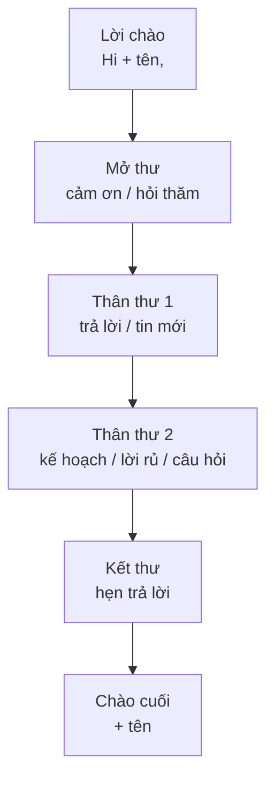

# Email thân mật (Informal email)

<SkillMeta id="viet-05" />

:::info[Mục tiêu]
Viết được **một email thân mật 120–150 từ** gửi bạn bè, người thân: hỏi thăm, kể tin mới, trả lời câu hỏi, đưa ra kế hoạch và kết thư tự nhiên.
Ngữ pháp trọng tâm: [hiện tại hoàn thành](/docs/ngu-phap/g06-hien-tai-hoan-thanh) (tin mới: *I have just…, I have finally…*) và
[tương lai](/docs/ngu-phap/g09-tuong-lai-will-be-going-to-httd) (*will / be going to / HTTD* cho kế hoạch).
Đây là dạng bài quen thuộc trong đề thi B1–B2 (PET, VSTEP task 1) và trong đời sống: nhắn cho bạn nước ngoài, trả lời thư của người bạn qua mạng, rủ bạn đi chơi.
:::

## 1. Bố cục

| Phần | Nội dung | Độ dài | Ví dụ |
|---|---|---|---|
| Lời chào | *Hi / Hello / Dear* + tên, dấu phẩy | 1 dòng | *Hi Jenny,* |
| Mở thư | Cảm ơn thư / hỏi thăm / xin lỗi vì trả lời muộn | 1–2 câu | *Thanks for your email – it was great to hear from you!* |
| Thân thư 1 | Trả lời câu hỏi của bạn / kể tin mới | 2–4 câu | *You asked about my new job. Well, I've been at the company for a month now …* |
| Thân thư 2 | Kế hoạch, lời rủ, lời khuyên, câu hỏi lại | 2–4 câu | *Why don't you come and visit me in August?* |
| Kết thư | Câu chốt + nhắn trả lời | 1–2 câu | *Write back soon and tell me what you think!* |
| Chào cuối & tên | *Love / Best wishes / Take care* + tên, **mỗi thứ một dòng** | 2 dòng | *Best wishes,* / *Hoa* |

## 2. Từ vựng & cụm từ

### Mở thư & hỏi thăm

<VocabList>

| Từ / cụm từ | Phiên âm | Nghĩa | Ví dụ |
|---|---|---|---|
| hear from | /ˈhɪə frɒm/ | nhận tin từ ai | It was lovely to hear from you. |
| get back to | /ɡet ˈbæk tə/ | trả lời lại | Sorry I didn't get back to you sooner. |
| up to | /ˈʌp tə/ | đang làm gì (thân mật) | What have you been up to lately? |
| catch up | /kætʃ ˈʌp/ | hàn huyên, cập nhật tin nhau | We should catch up over coffee soon. |
| hectic | /ˈhektɪk/ | bận rộn, cuống cuồng | Work has been really hectic this month. |
| guess what | /ɡes ˈwɒt/ | đoán xem (báo tin vui) | Guess what? I've passed my driving test! |

</VocabList>

### Kể tin & kế hoạch

<VocabList>

| Từ / cụm từ | Phiên âm | Nghĩa | Ví dụ |
|---|---|---|---|
| move house | /muːv haʊs/ | chuyển nhà | We've just moved house, so everything is in boxes. |
| settle in | /ˌsetl ˈɪn/ | ổn định, quen dần | I'm slowly settling in at my new school. |
| get promoted | /ɡet prəˈməʊtɪd/ | được thăng chức | My sister has just got promoted to team leader. |
| look forward to | /lʊk ˈfɔːwəd tə/ | mong chờ | I'm really looking forward to your visit. |
| show someone around | /ʃəʊ ˈsʌmwʌn əˈraʊnd/ | dẫn ai đi tham quan | I'll show you around the Old Quarter. |
| can't wait | /kɑːnt weɪt/ | nóng lòng | I can't wait to see you! |
| fancy + V-ing | /ˈfænsi/ | thích, muốn (thân mật) | Do you fancy going camping next weekend? |

</VocabList>

### Kết thư

<VocabList>

| Từ / cụm từ | Phiên âm | Nghĩa | Ví dụ |
|---|---|---|---|
| drop me a line | /drɒp miː ə laɪn/ | nhắn cho tôi vài dòng | Drop me a line when you have time. |
| keep in touch | /kiːp ɪn tʌtʃ/ | giữ liên lạc | Let's keep in touch after you move to Canada. |
| give my love to | /ɡɪv maɪ lʌv tə/ | gửi lời hỏi thăm tới | Give my love to your parents. |
| take care | /teɪk keə/ | giữ gìn sức khỏe (lời chào) | Take care, and see you soon. |

</VocabList>

## 3. Mẫu câu & từ nối

| Chức năng | Mẫu câu |
|---|---|
| Lời chào | *Hi Tom, · Hello Mai, · Dear Aunt Lan,* |
| Cảm ơn thư | *Thanks for your email / message.* · *It was great to hear from you.* |
| Xin lỗi trả lời muộn | *Sorry I haven't written for ages – I've been so busy with …* |
| Hỏi thăm | *How are things with you?* · *How's your new job going?* |
| Chuyển sang tin mới | *Anyway, I've got some news.* · *Guess what? I've just …* |
| Trả lời câu hỏi | *You asked me about … Well, …* · *As for …, …* |
| Rủ, gợi ý | *Why don't we …?* · *How about + V-ing …?* · *Do you fancy + V-ing …?* |
| Kế hoạch | *I'm going to …* · *I'm meeting … next Saturday.* |
| Kết thư | *Write back soon!* · *Can't wait to hear from you.* · *Let me know what you think.* |
| Chào cuối | *Love, · Lots of love, · Best wishes, · Take care, · Cheers,* |
| Từ nối thân mật | *anyway, by the way, well, so, actually, oh, and …* |

## 4. Bài mẫu

<SpeakText title="Bài mẫu – Reply to a friend who asked about your new flat and invited you to visit (≈150 từ)">

Hi Sophie,

Thanks so much for your email – it was lovely to hear from you! Sorry I haven't replied sooner, but it's been a hectic couple of weeks.

You asked about my new flat. Well, I've finally moved in, and I love it! It's on the eighth floor of a building near West Lake, so I can see the water from my balcony. It's quite small, but it's bright and much quieter than my old place. I've already bought some plants and a big sofa, so it feels like home now.

Anyway, thanks for inviting me to Melbourne. I'd love to come! I'm going to have some time off in December, so how about then? By the way, do you still want to visit Vietnam next year? If you do, I'll show you around Hanoi.

Write back soon and give my love to your family!

Lots of love,

Thu

Bản dịch

Chào Sophie,

Cảm ơn bạn nhiều vì đã gửi email – nhận tin bạn mình vui lắm! Xin lỗi vì không trả lời sớm hơn, mấy tuần vừa rồi mình bận tối mắt.

Bạn hỏi về căn hộ mới của mình. À, cuối cùng mình cũng chuyển vào rồi, và mình rất thích nó! Căn hộ ở tầng tám của một tòa nhà gần Hồ Tây nên từ ban công mình nhìn thấy mặt hồ. Nó khá nhỏ nhưng sáng sủa và yên tĩnh hơn chỗ cũ nhiều. Mình đã mua vài chậu cây và một chiếc sofa to, nên giờ đã thấy như ở nhà rồi.

Mà này, cảm ơn bạn đã mời mình sang Melbourne. Mình rất muốn đi! Tháng Mười Hai mình sẽ được nghỉ vài ngày, vậy lúc đó được không? À tiện thể, bạn vẫn muốn sang Việt Nam năm sau chứ? Nếu có thì mình sẽ dẫn bạn đi tham quan Hà Nội.

Viết thư lại sớm nhé, và gửi lời hỏi thăm cả nhà bạn!

Thương,

Thu

</SpeakText>

:::note[Phân tích bài mẫu]
| Phần | Câu trong bài |
|---|---|
| Lời chào | *Hi Sophie,* |
| Mở thư | *Thanks so much for your email … Sorry I haven't replied sooner …* – **HTHT** |
| Thân thư 1 – trả lời câu hỏi | *You asked about my new flat. Well, I've finally moved in …* – **HTHT báo tin mới** |
| Thân thư 2 – lời mời & kế hoạch | *I'd love to come! I'm going to have some time off … how about then?* – **be going to** |
| Câu hỏi lại + lời hứa | *Do you still want to …? If you do, I'll show you around …* – **will** |
| Kết thư | *Write back soon and give my love to your family!* |
| Chào cuối | *Lots of love,* / *Thu* – mỗi phần một dòng |
:::

## 5. Đề bài luyện tập

1. **(Dễ)** Your English friend, Mark, has asked what you did last weekend. Write an email to him (80–100 words).
   

   
Gợi ý dàn ý

   *Hi Mark,* → cảm ơn thư + hỏi thăm → kể 2–3 việc cuối tuần (ở đâu, với ai, cảm thấy thế nào) → hỏi lại cuối tuần của Mark → *Write back soon!* → *Best wishes,* + tên.

   

2. **(Dễ)** Write an email (about 100 words) to a cousin telling him or her some good news: you have just passed an important exam.
3. **(Trung bình)** Your pen friend from Japan is visiting Vietnam next month and asks for advice on what to see and eat. Write an email (120–150 words).
4. **(Trung bình)** You have not contacted a close friend for a long time. Write an email (120–150 words): apologise, tell him or her your news, and suggest meeting up.
5. **(Khó)** Your friend is thinking about quitting his job to start a small business. Write an email (150–180 words) giving your opinion and advice, and offering to help.

## 6. Lỗi thường gặp

| ❌ Sai | ✅ Đúng | Giải thích |
|---|---|---|
| Dear my friend Lisa, | Hi Lisa, / Dear Lisa, | Không dùng *my* trong lời chào |
| Yours sincerely, Hoa | Best wishes, / Love, … | Thư thân mật → không dùng lời chào cuối trang trọng |
| I have moved to Da Nang last month. | I **moved** to Da Nang last month. | Có mốc thời gian quá khứ (*last month*) → quá khứ đơn |
| I look forward to hear from you. | I'm looking forward to **hearing** from you. | *look forward to* + V-ing |
| How about we go to the cinema? | How about **going** to the cinema? | *How about* + V-ing |
| Best wishes, Minh (cùng một dòng) | Best wishes, / Minh (hai dòng riêng) | Lời chào cuối và tên viết trên **hai dòng** |

## 7. Checklist tự sửa

- [ ] Có lời chào (*Hi / Dear* + tên,) và lời chào cuối + tên trên **dòng riêng**.
- [ ] Mở thư bằng cảm ơn / hỏi thăm, không lao ngay vào nội dung.
- [ ] Trả lời **đủ mọi câu hỏi** trong đề, mỗi ý một đoạn ngắn.
- [ ] Giọng văn thân mật: có viết tắt (*I'm, it's*), từ nối *anyway, by the way*, câu hỏi lại cho người nhận.
- [ ] Dùng đúng HTHT cho tin mới, QKĐ khi có mốc thời gian, *will / be going to* cho kế hoạch.
- [ ] Đủ số từ; không dùng cụm trang trọng như *Yours faithfully, I am writing to inform you*.
