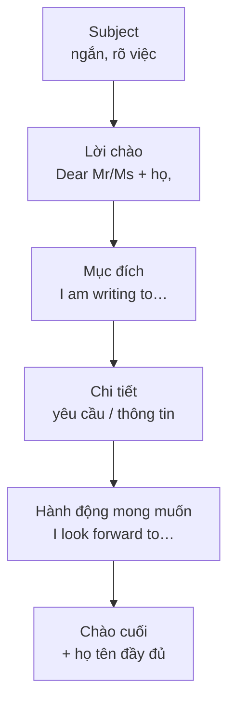

# Email trang trọng (Formal email)

<SkillMeta id="viet-06" />

:::info[Mục tiêu]
Viết được **một email trang trọng 150–180 từ** gửi người lạ, công ty, nhà trường, cơ quan: **nêu rõ mục đích ngay đầu thư**, trình bày yêu cầu lịch sự, kết thư chuyên nghiệp.
Ngữ pháp trọng tâm: [động từ khuyết thiếu](/docs/ngu-phap/g11-dong-tu-khuyet-thieu) (*could, would, might* để lịch sự),
[câu hỏi gián tiếp](/docs/ngu-phap/g25-cau-hoi-duoi-gian-tiep-chu-ngu) (*I would like to know whether…*), [câu bị động](/docs/ngu-phap/g19-cau-bi-dong) (*Your advertisement was published…*).
Dùng khi: hỏi thông tin khóa học, xin việc/thực tập, gửi đối tác, liên hệ phòng nhân sự, đề thi VSTEP/IELTS General task 1.
:::

## 1. Bố cục

| Phần | Nội dung | Độ dài | Ví dụ |
|---|---|---|---|
| Tiêu đề (Subject) | Ngắn, nêu rõ việc | 1 dòng | *Subject: Enquiry about the Business English course* |
| Lời chào | *Dear Mr/Ms + họ,* hoặc *Dear Sir or Madam,* | 1 dòng | *Dear Ms Nguyen,* |
| Mở thư – mục đích | Tôi là ai (ngắn) + vì sao viết | 1–2 câu | *I am writing to enquire about the evening course advertised on your website.* |
| Thân thư – chi tiết | Thông tin cần hỏi / trình bày, mỗi ý một đoạn | 2 đoạn, 3–5 câu | *I would be grateful if you could tell me whether the course includes a certificate.* |
| Kết thư – hành động | Mong phản hồi, cảm ơn, tài liệu đính kèm | 1–2 câu | *I look forward to hearing from you.* |
| Chào cuối & chữ ký | *Yours sincerely / faithfully / Kind regards* + họ tên đầy đủ, chức danh | 2–3 dòng | *Yours sincerely,* / *Le Quang Huy* |

:::tip[Sincerely hay faithfully?]
Biết tên người nhận (*Dear Mr Brown,*) → **Yours sincerely,** · Không biết tên (*Dear Sir or Madam,*) → **Yours faithfully,** (Anh-Anh).
Email công việc hằng ngày có thể dùng **Kind regards, / Best regards,**
:::

## 2. Từ vựng & cụm từ

### Mục đích & yêu cầu

<VocabList>

| Từ / cụm từ | Phiên âm | Nghĩa | Ví dụ |
|---|---|---|---|
| enquire about | /ɪnˈkwaɪər əˈbaʊt/ | hỏi thông tin về | I am writing to enquire about your summer programme. |
| regarding | /rɪˈɡɑːdɪŋ/ | liên quan đến | I am contacting you regarding the job advertisement. |
| apply for | /əˈplaɪ fɔː/ | ứng tuyển, nộp đơn | I would like to apply for the position of marketing assistant. |
| position | /pəˈzɪʃn/ | vị trí công việc | The position was advertised in the Tuoi Tre newspaper. |
| request | /rɪˈkwest/ | yêu cầu, đề nghị | I would like to request a copy of the schedule. |
| provide | /prəˈvaɪd/ | cung cấp | Could you provide more details about the fees? |
| confirm | /kənˈfɜːm/ | xác nhận | Please confirm the date of the interview. |
| availability | /əˌveɪləˈbɪləti/ | thời gian rảnh, còn chỗ | Could you let me know about the availability of rooms? |

</VocabList>

### Thông tin & đính kèm

<VocabList>

| Từ / cụm từ | Phiên âm | Nghĩa | Ví dụ |
|---|---|---|---|
| attached | /əˈtætʃt/ | được đính kèm | Please find attached my CV. |
| qualification | /ˌkwɒlɪfɪˈkeɪʃn/ | bằng cấp, trình độ | I have a qualification in accounting. |
| relevant | /ˈreləvənt/ | liên quan, phù hợp | I have three years of relevant experience. |
| further information | /ˈfɜːðər ˌɪnfəˈmeɪʃn/ | thêm thông tin | I would appreciate further information about the course. |
| convenient | /kənˈviːniənt/ | thuận tiện | Please let me know a convenient time for a call. |
| at your earliest convenience | /ət jɔːr ˈɜːliɪst kənˈviːniəns/ | sớm nhất khi có thể | Please reply at your earliest convenience. |

</VocabList>

### Lịch sự & kết thư

<VocabList>

| Từ / cụm từ | Phiên âm | Nghĩa | Ví dụ |
|---|---|---|---|
| be grateful if | /bi ˈɡreɪtfl ɪf/ | rất biết ơn nếu | I would be grateful if you could reply by Friday. |
| appreciate | /əˈpriːʃieɪt/ | trân trọng, cảm kích | I would appreciate your help with this matter. |
| hesitate | /ˈhezɪteɪt/ | ngần ngại | Please do not hesitate to contact me. |
| look forward to | /lʊk ˈfɔːwəd tə/ | mong đợi | I look forward to receiving your reply. |
| sincerely | /sɪnˈsɪəli/ | trân trọng (chào cuối) | Yours sincerely, Tran Thi Mai |

</VocabList>

## 3. Mẫu câu & từ nối

| Chức năng | Trang trọng (dùng) | Thân mật (tránh) |
|---|---|---|
| Lời chào | *Dear Mr Hoang, · Dear Sir or Madam,* | *Hi, · Hey,* |
| Nêu mục đích | *I am writing to enquire about / apply for / inform you that …* | *I want to ask …* |
| Tham chiếu | *With reference to your advertisement in …,* · *Further to our phone call,* | *About your ad, …* |
| Giới thiệu bản thân | *I am a … at …, and I have … years of experience in …* | *I'm …* |
| Yêu cầu lịch sự | *Could you please …?* · *I would be grateful if you could …* | *Can you …?* · *Send me …* |
| Câu hỏi gián tiếp | *I would like to know whether / when / how much …* · *Could you tell me what …?* | *When is it? How much is it?* |
| Bổ sung ý | *In addition, · Furthermore, · I would also like to know …* | *Also, · And …* |
| Đính kèm | *Please find attached …* · *I have attached …* | *Here's my CV.* |
| Kết thư | *I look forward to hearing from you.* · *Please do not hesitate to contact me if …* | *Write back soon!* |
| Chào cuối | *Yours sincerely, · Yours faithfully, · Kind regards,* | *Love, · Cheers,* |

## 4. Bài mẫu

<SpeakText title="Bài mẫu – Write to a language centre to ask about a course (≈170 từ)">

Subject: Enquiry about the IELTS Evening Course

Dear Sir or Madam,

I am writing to enquire about the IELTS preparation course which was advertised on your website last week.

I am a software engineer at a technology company in Ho Chi Minh City, and I am planning to apply for a master's programme in Australia next year. I need an overall score of 6.5, and my current level is around 5.5. Therefore, I am very interested in your twelve-week evening course.

I would be grateful if you could provide some further information. Firstly, I would like to know whether the classes are held on weekdays or at weekends, as I work until 6 p.m. Secondly, could you tell me how many students there are in each class? In addition, I would appreciate it if you could confirm whether the fee includes course books and mock tests.

Please find attached a copy of my most recent test result. I look forward to hearing from you at your earliest convenience.

Yours faithfully,

Pham Duc Long

Bản dịch

Tiêu đề: Hỏi thông tin về khóa IELTS buổi tối

Kính gửi Quý trung tâm,

Tôi viết thư này để hỏi thông tin về khóa luyện thi IELTS được quảng cáo trên trang web của trung tâm tuần trước.

Tôi là kỹ sư phần mềm tại một công ty công nghệ ở TP. Hồ Chí Minh và đang dự định nộp hồ sơ học thạc sĩ ở Úc vào năm sau. Tôi cần đạt tổng điểm 6.5, trong khi trình độ hiện tại khoảng 5.5. Vì vậy, tôi rất quan tâm đến khóa học buổi tối kéo dài mười hai tuần của trung tâm.

Tôi rất biết ơn nếu trung tâm có thể cung cấp thêm thông tin. Thứ nhất, tôi muốn biết lớp học vào ngày thường hay cuối tuần, vì tôi làm việc đến 6 giờ chiều. Thứ hai, xin cho biết mỗi lớp có bao nhiêu học viên? Ngoài ra, tôi rất cảm kích nếu trung tâm xác nhận giúp học phí đã bao gồm giáo trình và bài thi thử hay chưa.

Tôi xin gửi kèm bản sao kết quả thi gần đây nhất. Tôi mong sớm nhận được phản hồi từ trung tâm.

Trân trọng,

Phạm Đức Long

</SpeakText>

:::note[Phân tích bài mẫu]
| Phần | Câu trong bài |
|---|---|
| Tiêu đề | *Subject: Enquiry about the IELTS Evening Course* |
| Lời chào | *Dear Sir or Madam,* → không biết tên → chào cuối *Yours faithfully,* |
| Mục đích | *I am writing to enquire about … which was advertised …* – **bị động** |
| Bối cảnh bản thân | *I am a software engineer … I am planning to apply for …* |
| Yêu cầu chi tiết | *I would be grateful if … I would like to know whether … could you tell me how many …* – **modal lịch sự + câu hỏi gián tiếp** |
| Từ nối trang trọng | *Therefore, Firstly, Secondly, In addition* |
| Kết thư | *Please find attached … I look forward to hearing from you …* |
:::

## 5. Đề bài luyện tập

1. **(Dễ)** You want to join a gym near your office. Write an email (100–120 words) to the manager asking about opening hours, prices and classes.
   

   
Gợi ý dàn ý

   *Subject: Enquiry about membership* → *Dear Sir or Madam,* → mục đích: *I am writing to enquire about …* → giới thiệu ngắn (làm việc gần đó, muốn tập sau giờ làm) → 3 câu hỏi gián tiếp: giờ mở cửa, giá thẻ tháng, lớp yoga → *I look forward to hearing from you.* → *Yours faithfully,* + họ tên.

   

2. **(Dễ)** Write an email (about 120 words) to your manager, Mr Tanaka, asking for two days off next week and explaining why.
3. **(Trung bình)** You saw an advertisement for a part-time job as a tour guide assistant. Write an email (150–170 words) applying for the job, describing your experience and skills.
4. **(Trung bình)** You are organising a company trip for 40 people. Write an email (150–170 words) to a hotel in Nha Trang asking about rooms, meeting facilities and group discounts.
5. **(Khó)** You attended a job interview last week but have not heard back. Write a follow-up email (160–180 words) to the HR manager, Ms Vo, thanking her, restating your interest and politely asking about the next steps.

## 6. Lỗi thường gặp

| ❌ Sai | ✅ Đúng | Giải thích |
|---|---|---|
| Dear Mr Nam, (Nguyen Van Nam) | Dear Mr **Nguyen**, | Trong thư tiếng Anh, *Mr/Ms* đi với **họ**; hoặc viết đủ *Dear Mr Nguyen Van Nam,* |
| I want to know when does the course start. | I would like to know when the course **starts**. | Câu hỏi gián tiếp → **không đảo** trợ động từ; *would like* lịch sự hơn *want* |
| Dear Sir or Madam, … Yours sincerely, | Dear Sir or Madam, … Yours **faithfully**, | Không biết tên người nhận → *Yours faithfully* |
| I'm writing to ask about the job, can you send me more info? | I am writing to ask about the position. Could you please send me further information? | Văn trang trọng: không viết tắt, không nối câu bằng dấu phẩy, tránh *info* |
| I look forward to hear from you. | I look forward to **hearing** from you. | *to* ở đây là giới từ → V-ing |
| Please find attach my CV. | Please find **attached** my CV. | Cố định: *Please find attached* |

## 7. Checklist tự sửa

- [ ] Có **Subject** ngắn gọn, rõ ràng.
- [ ] Lời chào và chào cuối **khớp nhau** (*Sir or Madam → faithfully*, có tên → *sincerely*).
- [ ] **Mục đích** được nêu ngay trong 1–2 câu đầu.
- [ ] Yêu cầu dùng *Could you… / I would be grateful if…*; câu hỏi gián tiếp **không đảo ngữ**.
- [ ] **Không viết tắt** (*I'm, don't, info*), không dùng từ lóng hay dấu chấm than.
- [ ] Kết thư có hành động mong muốn (*I look forward to…*) và **họ tên đầy đủ**.
