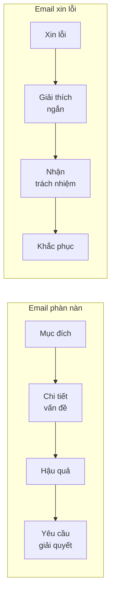

# Email phàn nàn & xin lỗi (Complaint & apology emails)

<SkillMeta id="viet-07" />

:::info[Mục tiêu]
Viết được **email phàn nàn** (150–180 từ) **lịch sự nhưng kiên quyết**: nêu vấn đề, đưa chi tiết cụ thể, đề xuất cách giải quyết;
và **email xin lỗi** (120–160 từ) **chân thành**: nhận lỗi, giải thích ngắn, đưa ra cách khắc phục.
Ngữ pháp trọng tâm: [quá khứ đơn](/docs/ngu-phap/g04-qua-khu-don) (kể sự việc), [modal hoàn thành](/docs/ngu-phap/g12-modal-hoan-thanh) (*should have, could have, should not have*),
[câu bị động](/docs/ngu-phap/g19-cau-bi-dong) (*the order was delivered late* – nói về sự việc mà không đổ lỗi trực tiếp).
Dùng khi: khiếu nại đơn hàng online, khách sạn, dịch vụ; trả lời khách hàng; xin lỗi đồng nghiệp, sếp, bạn bè; đề thi B1–B2.
:::

## 1. Bố cục

### Email phàn nàn

| Phần | Nội dung | Độ dài | Ví dụ |
|---|---|---|---|
| Lời chào + mục đích | Nói rõ đang phàn nàn về việc gì | 1–2 câu | *I am writing to complain about the poor service I received at your restaurant on 12 May.* |
| Chi tiết vấn đề | Khi nào, ở đâu, chuyện gì (số đơn hàng, ngày, tên) | 3–5 câu | *The order was delivered four days late, and the screen was cracked.* |
| Hậu quả | Vấn đề gây ảnh hưởng gì | 1–2 câu | *As a result, I could not use the laptop for an important presentation.* |
| Yêu cầu giải quyết | Muốn hoàn tiền, đổi hàng, xin lỗi… + thời hạn | 1–2 câu | *I would like a full refund within seven days.* |
| Kết thư | Mong phản hồi | 1 câu | *I look forward to your prompt reply.* |

### Email xin lỗi

| Phần | Nội dung | Độ dài | Ví dụ |
|---|---|---|---|
| Lời xin lỗi | Xin lỗi ngay câu đầu, nêu rõ về việc gì | 1–2 câu | *I am writing to apologise for missing our meeting yesterday.* |
| Giải thích | Lý do ngắn, không đổ lỗi | 1–3 câu | *Unfortunately, my flight was delayed.* |
| Nhận trách nhiệm | Thừa nhận điều lẽ ra nên làm | 1 câu | *I should have informed you earlier.* |
| Khắc phục | Đề xuất bù đắp / cam kết | 1–2 câu | *I would be happy to reschedule at a time that suits you.* |
| Kết thư | Xin lỗi lần nữa, cảm ơn sự thông cảm | 1 câu | *Thank you for your understanding.* |

## 2. Từ vựng & cụm từ

### Phàn nàn

<VocabList>

| Từ / cụm từ | Phiên âm | Nghĩa | Ví dụ |
|---|---|---|---|
| complain about | /kəmˈpleɪn əˈbaʊt/ | phàn nàn về | I am writing to complain about the noise from the next room. |
| disappointed with | /ˌdɪsəˈpɔɪntɪd wɪð/ | thất vọng với | I was very disappointed with the quality of the food. |
| faulty | /ˈfɔːlti/ | bị lỗi, hỏng | The rice cooker I bought is faulty. |
| damaged | /ˈdæmɪdʒd/ | bị hư hại | The box was damaged when it arrived. |
| unacceptable | /ˌʌnəkˈseptəbl/ | không thể chấp nhận | A three-hour delay is simply unacceptable. |
| refund | /ˈriːfʌnd/ | tiền hoàn lại | I would like a full refund. |
| replacement | /rɪˈpleɪsmənt/ | hàng thay thế | Please send me a replacement as soon as possible. |
| compensation | /ˌkɒmpenˈseɪʃn/ | tiền bồi thường | I expect some compensation for the inconvenience. |

</VocabList>

### Xin lỗi

<VocabList>

| Từ / cụm từ | Phiên âm | Nghĩa | Ví dụ |
|---|---|---|---|
| apologise for | /əˈpɒlədʒaɪz fɔː/ | xin lỗi về | We apologise for the delay in delivering your order. |
| sincere apologies | /sɪnˈsɪər əˈpɒlədʒiz/ | lời xin lỗi chân thành | Please accept our sincere apologies. |
| inconvenience | /ˌɪnkənˈviːniəns/ | sự bất tiện | We are sorry for any inconvenience this has caused. |
| misunderstanding | /ˌmɪsʌndəˈstændɪŋ/ | sự hiểu lầm | There seems to have been a misunderstanding. |
| take responsibility | /teɪk rɪˌspɒnsəˈbɪləti/ | chịu trách nhiệm | I take full responsibility for the mistake. |
| make it up to | /meɪk ɪt ˈʌp tə/ | bù đắp cho ai | Let me make it up to you – dinner is on me. |
| ensure | /ɪnˈʃʊə/ | đảm bảo | We will ensure that this does not happen again. |
| look into | /lʊk ˈɪntə/ | xem xét, điều tra | Our team is looking into the problem. |

</VocabList>

## 3. Mẫu câu & từ nối

| Chức năng | Mẫu câu |
|---|---|
| Mở thư phàn nàn | *I am writing to complain about …* · *I am writing to express my dissatisfaction with …* |
| Nêu chi tiết | *On 3 June, I ordered … (order number …).* · *When the parcel arrived, I found that …* |
| Nêu vấn đề bằng bị động | *The item was delivered late.* · *I was not informed about …* · *I was charged twice.* |
| Điều lẽ ra phải xảy ra | *The goods should have arrived on …* · *Your staff could have warned us …* |
| Hậu quả | *As a result, …* · *This meant that …* · *Consequently, …* |
| Yêu cầu | *I would like / I expect a refund / replacement.* · *I would appreciate it if you could …* |
| Mở thư xin lỗi (trang trọng) | *I am writing to apologise for …* · *Please accept my sincere apologies for …* |
| Mở thư xin lỗi (thân mật) | *I'm really sorry about …* · *I feel terrible about …* |
| Nhận lỗi | *I should have + V3 …* · *I should not have + V3 …* · *It was my fault.* |
| Khắc phục | *To make up for this, …* · *I will make sure that …* · *We would like to offer you …* |
| Kết thư | *Thank you for your patience / understanding.* · *I hope you can forgive me.* |

## 4. Bài mẫu

### Bài mẫu 1 – Email phàn nàn

<SpeakText title="Bài mẫu – Complain to an online shop about a faulty product (≈175 từ)">

Subject: Complaint about order no. 58217

Dear Customer Service Team,

I am writing to complain about a coffee machine which I ordered from your website on 2 October.

According to your website, the machine should have been delivered within three working days. However, it did not arrive until 14 October, almost two weeks later. I was not informed about the delay, and nobody answered when I called your hotline. When I finally opened the box, I found that the water tank was cracked and the machine did not work at all.

As a result, I was unable to use it at my small café for the weekend, which caused me considerable inconvenience. I have attached photos of the damaged machine and a copy of the receipt.

I would appreciate it if you could send a replacement or give me a full refund within seven days. I would also like to know how you will prevent this problem in the future.

I look forward to your prompt reply.

Yours faithfully,

Dang Thi Thu Ha

Bản dịch

Tiêu đề: Khiếu nại về đơn hàng số 58217

Kính gửi Bộ phận Chăm sóc Khách hàng,

Tôi viết thư này để khiếu nại về chiếc máy pha cà phê tôi đặt trên trang web của quý công ty ngày 2 tháng 10.

Theo trang web, máy lẽ ra phải được giao trong vòng ba ngày làm việc. Tuy nhiên, đến ngày 14 tháng 10 máy mới tới, gần hai tuần sau khi đặt. Tôi không hề được thông báo về việc chậm trễ, và gọi đường dây nóng cũng không ai nghe máy. Khi mở hộp, tôi phát hiện bình chứa nước bị nứt và máy hoàn toàn không hoạt động.

Vì vậy, tôi không thể dùng máy cho quán cà phê nhỏ của mình vào cuối tuần, gây cho tôi nhiều bất tiện. Tôi xin đính kèm ảnh chiếc máy bị hỏng và bản sao hóa đơn.

Tôi rất mong quý công ty gửi máy thay thế hoặc hoàn lại toàn bộ tiền trong vòng bảy ngày. Tôi cũng muốn biết quý công ty sẽ làm gì để tránh sự việc này trong tương lai.

Tôi mong sớm nhận được phản hồi.

Trân trọng,

Đặng Thị Thu Hà

</SpeakText>

### Bài mẫu 2 – Email xin lỗi

<SpeakText title="Bài mẫu – Apologise to a colleague for missing a deadline (≈140 từ)">

Subject: Apology for the late sales report

Dear Mr Bui,

I am writing to apologise for not sending you the monthly sales report on Friday as I had promised.

Unfortunately, two of our branch managers sent me their figures late, and I spent most of Friday correcting several errors in the data. However, I take full responsibility for the delay. I should have told you about the problem earlier instead of waiting until the end of the day, and I realise that this made it difficult for you to prepare for Monday's meeting.

I have now completed the report, and you will find it attached to this email. To make sure this does not happen again, I will ask the branches to send their data at least three days before the deadline.

Once again, I am sorry for the inconvenience, and thank you for your understanding.

Kind regards,

Ngo Thanh Tung

Bản dịch

Tiêu đề: Xin lỗi về báo cáo doanh số nộp trễ

Kính gửi anh Bùi,

Tôi viết thư này để xin lỗi vì đã không gửi anh báo cáo doanh số tháng vào thứ Sáu như đã hứa.

Không may là hai quản lý chi nhánh gửi số liệu cho tôi muộn, và tôi đã mất gần hết ngày thứ Sáu để sửa một số lỗi trong dữ liệu. Tuy vậy, tôi hoàn toàn chịu trách nhiệm về việc chậm trễ này. Lẽ ra tôi nên báo với anh về vấn đề sớm hơn thay vì đợi đến cuối ngày, và tôi hiểu rằng điều này khiến anh khó chuẩn bị cho cuộc họp hôm thứ Hai.

Hiện tôi đã hoàn thành báo cáo và đính kèm trong email này. Để việc này không lặp lại, tôi sẽ yêu cầu các chi nhánh gửi dữ liệu ít nhất ba ngày trước hạn.

Một lần nữa, tôi xin lỗi vì sự bất tiện này và cảm ơn anh đã thông cảm.

Trân trọng,

Ngô Thanh Tùng

</SpeakText>

:::note[Phân tích bài mẫu]
| Phần | Bài 1 – Phàn nàn | Bài 2 – Xin lỗi |
|---|---|---|
| Mục đích | *I am writing to complain about …* | *I am writing to apologise for not sending …* |
| Chi tiết / giải thích | *should have been delivered … did not arrive until … I was not informed …* – **modal hoàn thành + bị động** | *two of our branch managers sent me their figures late …* – **QKĐ** |
| Hậu quả / nhận lỗi | *As a result, I was unable to …* | *I take full responsibility … I should have told you …* |
| Bằng chứng / khắc phục | *I have attached photos … and a copy of the receipt.* | *I have now completed the report … I will ask the branches …* |
| Yêu cầu / cam kết | *I would appreciate it if you could send a replacement or …* | *To make sure this does not happen again, …* |
| Kết thư | *I look forward to your prompt reply.* · *Yours faithfully,* | *Thank you for your understanding.* · *Kind regards,* |
:::

## 5. Đề bài luyện tập

1. **(Dễ)** You booked a hotel room with a sea view in Nha Trang, but you got a room facing the car park. Write an email (100–120 words) to the hotel manager to complain.
   

   
Gợi ý dàn ý

   *Dear Sir or Madam,* → mục đích: *I am writing to complain about …* → chi tiết: ngày ở, số phòng, đã đặt phòng hướng biển nhưng nhận phòng nhìn ra bãi đỗ xe, lễ tân không giúp → hậu quả: kỳ nghỉ không trọn vẹn → yêu cầu: hoàn một phần tiền → *I look forward to …* → *Yours faithfully,* + họ tên.

   

2. **(Dễ)** You forgot your best friend's birthday party. Write an informal email (about 100 words) to apologise and suggest how to make it up to him or her.
3. **(Trung bình)** You took an English course, but the teacher often cancelled classes and the room was too crowded. Write an email (150–170 words) to the director of the language centre.
4. **(Trung bình)** You work for a food delivery company. A customer, Mr Harris, complained that his order arrived cold and one dish was missing. Write a reply (140–160 words) apologising and offering a solution.
5. **(Khó)** You borrowed a colleague's laptop and accidentally damaged it. Write an email (160–180 words) to apologise, explain what happened, take responsibility and offer to pay for the repair.

## 6. Lỗi thường gặp

| ❌ Sai | ✅ Đúng | Giải thích |
|---|---|---|
| Your staff is very rude and stupid! | I was disappointed with the attitude of one of your staff members. | Phàn nàn lịch sự và cụ thể, không xúc phạm, không dùng dấu chấm than |
| The package delivered late. | The package **was delivered** late. | Gói hàng không tự giao → dùng bị động |
| You should delivered it on Monday. | It **should have been delivered** on Monday. | Điều lẽ ra phải xảy ra trong quá khứ → *should have + V3* |
| I apologise about the mistake. | I apologise **for** the mistake. | *apologise for* / *complain about* |
| Sorry for the inconvenient. | Sorry for the **inconvenience**. | Cần danh từ *inconvenience*, không phải tính từ *inconvenient* |
| I want you give me my money back. | I would like **a full refund**. | Yêu cầu lịch sự bằng *I would like*; *want* + O + **to V** |

## 7. Checklist tự sửa

- [ ] Câu đầu nêu rõ **phàn nàn / xin lỗi về việc gì**.
- [ ] Email phàn nàn có **chi tiết cụ thể**: ngày, số đơn hàng, tên sản phẩm, hậu quả.
- [ ] Có **yêu cầu giải quyết** rõ ràng (hoàn tiền, đổi hàng…) hoặc **cách khắc phục** (với email xin lỗi).
- [ ] Dùng đúng *should have + V3* và bị động (*was delivered, was not informed*).
- [ ] Giọng văn lịch sự, kiên quyết, **không xúc phạm**, không đổ lỗi khi xin lỗi.
- [ ] Lời chào và chào cuối phù hợp mức độ trang trọng; không viết tắt trong email trang trọng.
