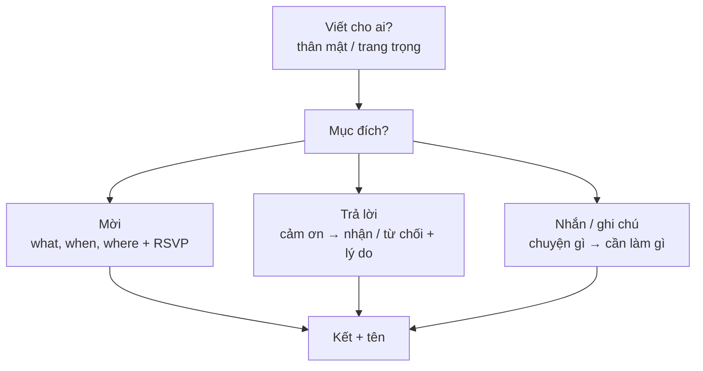

# Lời mời, tin nhắn & ghi chú (Invitations, messages & notes)

<SkillMeta id="viet-08" />

:::info[Mục tiêu]
Viết được các **văn bản ngắn 35–80 từ**: **lời mời**, **nhận lời / từ chối lời mời**, **tin nhắn nhờ vả – nhắc việc**, **ghi chú để lại** cho người khác,
với đủ thông tin cần thiết và giọng văn phù hợp (thân mật hay trang trọng).
Ngữ pháp trọng tâm: [tương lai](/docs/ngu-phap/g09-tuong-lai-will-be-going-to-httd) (*I'm having a party…, I'll be back…*), [động từ khuyết thiếu](/docs/ngu-phap/g11-dong-tu-khuyet-thieu) (*Could you…? You should…*),
[V-ing / to V](/docs/ngu-phap/g13-danh-dong-tu-dong-tu-nguyen-mau) (*would love to come, don't forget to…, thanks for inviting…*).
Đây là dạng bài ngắn trong đề thi KET/PET (short message 35–45 từ), và là thứ bạn viết mỗi ngày: tin nhắn Zalo/Messenger, ghi chú trên bàn làm việc, thiệp mời sinh nhật, lời mời họp nhóm.
:::

## 1. Bố cục

| Phần | Lời mời | Trả lời lời mời | Tin nhắn / ghi chú |
|---|---|---|---|
| Mở | Chào + dịp gì | Chào + cảm ơn lời mời | Chào (có thể bỏ nếu rất ngắn) |
| Nội dung chính | **Sự kiện gì, khi nào, ở đâu** (Wh-) | **Nhận lời** + hỏi thêm / **Từ chối** + lý do | **Chuyện gì + cần người đọc làm gì** |
| Chi tiết thêm | Mang gì, mặc gì, cách đến | Đề nghị giúp / hẹn dịp khác | Thời hạn, nơi để đồ, số điện thoại |
| Kết | Đề nghị trả lời (*Let me know by…*) | *See you then!* / *Have a great time!* | Cảm ơn + tên |
| Độ dài | 50–80 từ | 35–60 từ | 25–50 từ |

## 2. Từ vựng & cụm từ

### Mời & trả lời lời mời

<VocabList>

| Từ / cụm từ | Phiên âm | Nghĩa | Ví dụ |
|---|---|---|---|
| invite someone to | /ɪnˈvaɪt ˈsʌmwʌn tə/ | mời ai đến | We'd like to invite you to our wedding. |
| throw a party | /θrəʊ ə ˈpɑːti/ | tổ chức tiệc | Linh is throwing a party for her 30th birthday. |
| housewarming | /ˈhaʊswɔːmɪŋ/ | tiệc tân gia | Come to our housewarming on Saturday! |
| RSVP | /ˌɑːr es viː ˈpiː/ | vui lòng hồi đáp | Please RSVP by 20 November. |
| accept | /əkˈsept/ | nhận lời | I am delighted to accept your invitation. |
| turn down | /tɜːn ˈdaʊn/ | từ chối | I'm afraid I have to turn down the invitation. |
| make it | /meɪk ɪt/ | đến được, tham dự được | Sorry, I can't make it on Friday. |
| a previous engagement | /ə ˈpriːviəs ɪnˈɡeɪdʒmənt/ | có hẹn trước (trang trọng) | Unfortunately, I have a previous engagement that evening. |
| dress code | /ˈdres kəʊd/ | quy định trang phục | The dress code is smart casual. |

</VocabList>

### Tin nhắn & ghi chú

<VocabList>

| Từ / cụm từ | Phiên âm | Nghĩa | Ví dụ |
|---|---|---|---|
| just a quick note | /dʒʌst ə kwɪk nəʊt/ | vài dòng nhắn nhanh | Just a quick note to say I've gone to the bank. |
| pop out | /pɒp ˈaʊt/ | ra ngoài một lát | I've popped out to buy some milk. |
| pick up | /pɪk ˈʌp/ | đón; lấy (đồ) | Could you pick up my parcel from reception? |
| remind | /rɪˈmaɪnd/ | nhắc nhở | Just to remind you that the meeting starts at 9. |
| don't forget to | /dəʊnt fəˈɡet tə/ | đừng quên | Don't forget to lock the door. |
| give someone a call | /ɡɪv ˈsʌmwʌn ə kɔːl/ | gọi điện cho ai | Give me a call when you get this message. |
| on my way | /ɒn maɪ weɪ/ | đang trên đường | I'm on my way – see you in ten minutes. |
| running late | /ˈrʌnɪŋ leɪt/ | đang bị muộn | Sorry, I'm running late because of the traffic. |
| in case | /ɪn keɪs/ | phòng khi | Take an umbrella in case it rains. |

</VocabList>

## 3. Mẫu câu & từ nối

| Chức năng | Thân mật | Trang trọng |
|---|---|---|
| Mời | *Would you like to come to …?* · *Do you fancy + V-ing …?* · *I'm having a … on …* | *We would be delighted if you could attend …* · *You are cordially invited to …* |
| Nêu chi tiết | *It starts at 7 at my place.* · *It's on Saturday at …* | *The event will take place on … at …* |
| Đề nghị hồi đáp | *Let me know if you can come.* · *Text me by Friday.* | *Please RSVP by …* · *Kindly confirm your attendance by …* |
| Nhận lời | *I'd love to come!* · *Count me in!* · *Sounds great!* | *Thank you for your kind invitation. I would be delighted to attend.* |
| Từ chối | *I'd love to, but …* · *Sorry, I can't make it because …* | *Unfortunately, I will be unable to attend due to …* |
| Đề nghị dịp khác | *Maybe next time?* · *How about next weekend instead?* | *I hope there will be another opportunity to meet.* |
| Nhờ vả | *Could you …, please?* · *Can you do me a favour?* | *I would be grateful if you could …* |
| Nhắc việc | *Don't forget to …* · *Remember to …* | *This is a reminder that …* |
| Báo vắng / thông báo | *I've gone to … I'll be back at …* | *I will be out of the office until …* |
| Kết | *Thanks! · See you soon! · Cheers,* | *Thank you in advance. · Best regards,* |

## 4. Bài mẫu

<SpeakText title="Bài mẫu 1 – Invite a friend to your housewarming party (≈70 từ)">

Hi Khanh,

Guess what? We've finally moved into our new flat! We're having a housewarming party on Saturday, 15 March, from 6 p.m., and we'd love you to come. The address is 12 Nguyen Trai Street, Flat 704. Don't worry about bringing anything – we're going to order lots of food. Oh, and there's free parking behind the building. Could you let me know by Wednesday?

Cheers,

Vy

Bản dịch

Chào Khanh,

Đoán xem? Cuối cùng tụi mình cũng dọn vào căn hộ mới rồi! Tụi mình tổ chức tiệc tân gia vào thứ Bảy, ngày 15 tháng 3, từ 6 giờ tối, và rất mong bạn đến. Địa chỉ là căn hộ 704, số 12 đường Nguyễn Trãi. Bạn không cần mang gì đâu – tụi mình sẽ đặt nhiều đồ ăn lắm. À, phía sau tòa nhà có chỗ để xe miễn phí nhé. Báo mình trước thứ Tư được không?

Thân,

Vy

</SpeakText>

<SpeakText title="Bài mẫu 2 – Decline a formal invitation politely (≈55 từ)">

Dear Ms Dinh,

Thank you very much for inviting me to the opening ceremony of your new branch on 20 June. Unfortunately, I will be unable to attend, as I will be on a business trip to Singapore that week. I wish you every success with the new office, and I hope we will have another opportunity to meet soon.

Best regards,

Hoang Minh Chau

Bản dịch

Kính gửi chị Đinh,

Xin chân thành cảm ơn chị đã mời tôi dự lễ khai trương chi nhánh mới vào ngày 20 tháng 6. Rất tiếc tôi không thể tham dự vì tuần đó tôi đi công tác Singapore. Chúc văn phòng mới của chị thành công tốt đẹp, và mong chúng ta sớm có dịp gặp nhau.

Trân trọng,

Hoàng Minh Châu

</SpeakText>

<SpeakText title="Bài mẫu 3 – Leave a note for your flatmate (≈40 từ)">

Hi Nhi,

I've gone to the airport to pick up my mum, and I'll be back around 9 tonight. Could you feed the cat at 7, please? Her food is in the cupboard next to the fridge. Oh, and don't forget to take the rubbish out!

Thanks,

Quynh

Bản dịch

Chào Nhi,

Mình ra sân bay đón mẹ, khoảng 9 giờ tối nay mình về. Bạn cho mèo ăn lúc 7 giờ giúp mình nhé? Thức ăn của nó ở trong tủ cạnh tủ lạnh. À, đừng quên đổ rác nha!

Cảm ơn nhé,

Quỳnh

</SpeakText>

:::note[Phân tích bài mẫu]
| Phần | Bài 1 – Lời mời | Bài 2 – Từ chối trang trọng | Bài 3 – Ghi chú |
|---|---|---|---|
| Mở | *Guess what? We've finally moved …* | *Thank you very much for inviting me to …* – **for + V-ing** | *I've gone to the airport …* |
| Thông tin chính | *We're having a … on Saturday … from 6 p.m.* – **HTTD cho kế hoạch** | *Unfortunately, I will be unable to attend, as …* | *I'll be back around 9 …* – **will** |
| Chi tiết / yêu cầu | Địa chỉ, *Don't worry about bringing …*, chỗ đỗ xe | *I wish you every success …* | *Could you feed the cat …? Don't forget to …* – **modal + to V** |
| Kết | *Could you let me know by Wednesday?* · *Cheers,* | *I hope we will have another opportunity …* · *Best regards,* | *Thanks,* + tên |
:::

## 5. Đề bài luyện tập

1. **(Dễ)** Write a message (35–45 words) to your classmate, Bao, inviting him to watch a football match with you. Say when and where, and what you will do after the match.
   

   
Gợi ý dàn ý

   *Hi Bao,* → lời mời: *Do you fancy watching … ?* → khi nào, ở đâu (quán cà phê / nhà bạn) → sau trận làm gì (ăn phở, đi dạo) → *Let me know!* → tên.

   

2. **(Dễ)** Your friend Hanh has invited you to her birthday party, but you cannot go. Write a reply (35–45 words): thank her, explain why you cannot come and suggest another time to meet.
3. **(Trung bình)** You are going away for a week. Write a note (50–60 words) to your neighbour asking him or her to water your plants and collect your post. Explain where the key is.
4. **(Trung bình)** Write an email invitation (70–90 words) to all staff for your company's year-end party: date, time, place, dress code and how to confirm.
5. **(Khó)** Write two short texts (about 50 words each) for the same situation: your manager, Mr Park, has invited you to a client dinner. (a) Accept formally and ask one question about the arrangements. (b) Send an informal message to a colleague asking if he or she is going too.

## 6. Lỗi thường gặp

| ❌ Sai | ✅ Đúng | Giải thích |
|---|---|---|
| Thank you for invite me. | Thank you for **inviting** me. | Sau giới từ *for* → V-ing |
| I would like to invite you come to my party. | I would like to invite you **to come** to my party. | *invite* + O + **to V** |
| I'd love to come but I busy. | I'd love to come, but **I'm** busy. | Thiếu động từ *be*; phẩy trước *but* |
| Don't forget lock the door. | Don't forget **to lock** the door. | *forget* + to V (việc cần làm) |
| The party will start at 7pm at Saturday. | The party will start at 7 p.m. **on** Saturday. | *at* + giờ, *on* + thứ/ngày |
| I can't join. (không có lý do, không lời cảm ơn) | Thanks so much for asking! I'm afraid I can't join because I'm working that day. | Từ chối cần **cảm ơn + lý do**, nếu không sẽ thiếu lịch sự |

## 7. Checklist tự sửa

- [ ] Lời mời có đủ **what – when – where** và cách trả lời (*Let me know by…*).
- [ ] Trả lời lời mời có **cảm ơn**; từ chối luôn kèm **lý do** và gợi ý dịp khác.
- [ ] Tin nhắn/ghi chú nói rõ **chuyện gì** và **người đọc cần làm gì**.
- [ ] Giọng văn đúng đối tượng: bạn bè → *I'd love to, Cheers*; sếp/đối tác → *I would be delighted, Best regards*.
- [ ] Đúng cấu trúc: *thanks for + V-ing, invite + O + to V, don't forget + to V*; giới từ thời gian *at / on / in*.
- [ ] Đủ số từ yêu cầu – ngắn gọn nhưng **không thiếu thông tin**.
