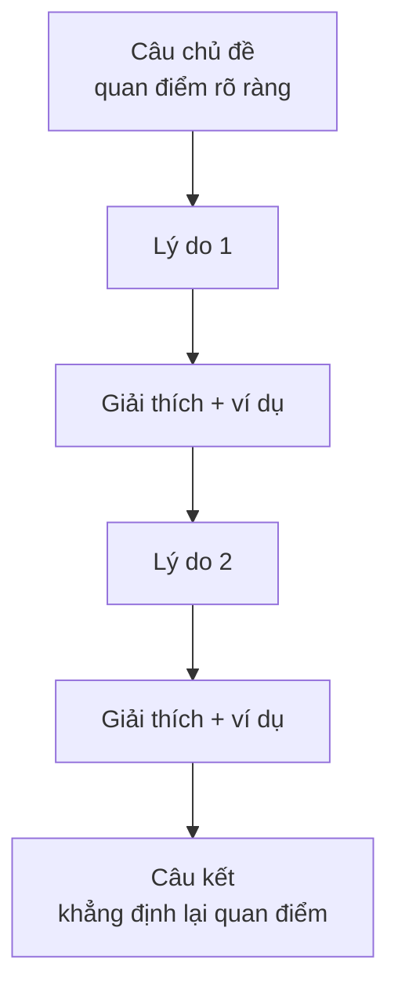

# Đoạn văn nêu ý kiến (Opinion paragraph)

<SkillMeta id="viet-09" />

:::info[Mục tiêu]
Viết được **một đoạn văn 150–200 từ** nêu rõ quan điểm cá nhân về một vấn đề, có **câu chủ đề nêu ý kiến → 2 lý do, mỗi lý do có ví dụ → câu kết khẳng định lại**.
Ngữ pháp trọng tâm: [liên từ & từ nối](/docs/ngu-phap/g24-lien-tu-tu-noi) (*firstly, moreover, for instance, therefore*) và [động từ khuyết thiếu](/docs/ngu-phap/g11-dong-tu-khuyet-thieu) (*should, must, can, might*) để đưa ra lập trường và đề xuất một cách mềm mại.
Dạng đoạn này là "viên gạch" của IELTS Writing Task 2, bài luận ở đại học, bài đăng góp ý và email đề xuất trong công việc.
:::

## 1. Bố cục

| Phần | Nội dung | Số câu | Ví dụ |
|---|---|---|---|
| Câu chủ đề | Nêu rõ quan điểm (đồng ý / không đồng ý) | 1 | *In my view, students should be allowed to use smartphones in class.* |
| Lý do 1 | Lý do mạnh nhất | 1 | *Firstly, phones give learners instant access to useful information.* |
| Giải thích / ví dụ 1 | Làm rõ + ví dụ cụ thể | 1–2 | *For instance, they can look up a new word in seconds instead of waiting for the teacher.* |
| Lý do 2 | Lý do thứ hai | 1 | *Moreover, learning apps can make lessons more interactive.* |
| Giải thích / ví dụ 2 | Làm rõ + ví dụ cụ thể | 1–2 | *Quiz apps such as Kahoot encourage even shy students to take part.* |
| Câu kết | Nhắc lại quan điểm bằng từ khác | 1 | *Therefore, I believe that phones, if used wisely, are a valuable learning tool.* |

## 2. Từ vựng & cụm từ

### Nêu và bảo vệ quan điểm

<VocabList>

| Từ / cụm từ | Phiên âm | Nghĩa | Ví dụ |
|---|---|---|---|
| in my view | /ɪn maɪ vjuː/ | theo quan điểm của tôi | In my view, homework should be optional for young children. |
| I strongly believe | /aɪ ˈstrɒŋli bɪˈliːv/ | tôi tin chắc rằng | I strongly believe that public transport should be free. |
| be in favour of | /bi ɪn ˈfeɪvə əv/ | ủng hộ | I am in favour of a four-day working week. |
| be opposed to | /bi əˈpəʊzd tə/ | phản đối | Many parents are opposed to longer school days. |
| argue | /ˈɑːɡjuː/ | lập luận | Some people argue that exams cause too much stress. |
| convincing | /kənˈvɪnsɪŋ/ | thuyết phục | She gave a convincing reason for her decision. |
| point of view | /pɔɪnt əv vjuː/ | quan điểm | From an economic point of view, the plan makes sense. |
| justify | /ˈdʒʌstɪfaɪ/ | biện minh, chứng minh là đúng | It is hard to justify such high ticket prices. |

</VocabList>

### Lý do & bằng chứng

<VocabList>

| Từ / cụm từ | Phiên âm | Nghĩa | Ví dụ |
|---|---|---|---|
| the main reason is that | /ðə meɪn ˈriːzn ɪz ðæt/ | lý do chính là | The main reason is that online courses are cheaper. |
| evidence | /ˈevɪdəns/ | bằng chứng | There is clear evidence that exercise improves memory. |
| a clear example | /ə klɪər ɪɡˈzɑːmpl/ | một ví dụ rõ ràng | Singapore is a clear example of a clean, well-planned city. |
| benefit | /ˈbenɪfɪt/ | lợi ích | One major benefit of cycling is lower pollution. |
| drawback | /ˈdrɔːbæk/ | nhược điểm | The main drawback of remote work is loneliness. |
| outweigh | /ˌaʊtˈweɪ/ | lớn hơn, vượt trội hơn | The advantages clearly outweigh the disadvantages. |
| have a positive impact on | /hæv ə ˈpɒzətɪv ˈɪmpækt ɒn/ | có tác động tích cực đến | Reading has a positive impact on children's vocabulary. |
| encourage somebody to | /ɪnˈkʌrɪdʒ ˈsʌmbədi tə/ | khuyến khích ai làm gì | Free museums encourage families to learn together. |

</VocabList>

### Đề xuất & mức độ chắc chắn

<VocabList>

| Từ / cụm từ | Phiên âm | Nghĩa | Ví dụ |
|---|---|---|---|
| should | /ʃʊd/ | nên | Governments should invest more in green energy. |
| ought to | /ˈɔːt tə/ | nên (khuyên) | Schools ought to teach basic cooking skills. |
| it is essential that | /ɪt ɪz ɪˈsenʃl ðæt/ | điều thiết yếu là | It is essential that children learn to swim. |
| might | /maɪt/ | có thể (ít chắc chắn) | A ban on plastic bags might annoy shoppers at first. |
| undoubtedly | /ʌnˈdaʊtɪdli/ | chắc chắn, không nghi ngờ | Technology has undoubtedly changed the way we study. |
| to some extent | /tə sʌm ɪkˈstent/ | ở một mức độ nào đó | I agree with this idea to some extent. |

</VocabList>

## 3. Mẫu câu & từ nối

| Chức năng | Mẫu câu |
|---|---|
| Nêu quan điểm | *In my opinion, …* · *I firmly believe that …* · *From my perspective, …* |
| Đồng ý / phản đối | *I completely agree that …* · *I strongly disagree with the idea that …* |
| Đồng ý một phần | *I agree with this view to some extent, but …* |
| Lý do thứ nhất | *Firstly, …* · *The main reason is that …* |
| Thêm lý do | *Moreover, …* · *In addition, …* · *Another reason is that …* |
| Giải thích | *This is because …* · *This means that …* |
| Đưa ví dụ | *For instance, …* · *A good example of this is …* · *such as …* |
| Đề xuất | *… should …* · *It is essential that …* · *… ought to …* |
| Nhượng bộ | *Although some people claim that …, I believe …* |
| Kết quả | *As a result, …* · *Therefore, …* |
| Câu kết | *For these reasons, I am convinced that …* · *Overall, I believe that …* |

## 4. Bài mẫu

> **Đề bài:** Some people think that university education should be free for everyone. Do you agree? Write a paragraph of about 170 words.

<SpeakText title="Bài mẫu – Should university education be free? (≈160 từ)">

I firmly believe that university education should be free for all students. The main reason is that free tuition gives young people from poor families the same chances as wealthier students. At present, many talented teenagers in rural areas give up higher education because their parents simply cannot afford the fees. If tuition were free, these students could focus on their studies instead of working long hours in part-time jobs. Moreover, a country with more graduates usually has a stronger economy. For instance, Germany, where public universities charge almost no tuition, has a highly skilled workforce and many innovative companies. Although some people argue that free education would be too expensive for the government, I think this spending should be seen as a long-term investment. Graduates tend to earn higher salaries, so they will pay more tax in the future. For these reasons, I am convinced that making university free would benefit not only individual students but also society as a whole.

Bản dịch

Tôi tin chắc rằng giáo dục đại học nên được miễn phí cho mọi sinh viên. Lý do chính là học phí miễn phí mang lại cho người trẻ từ các gia đình nghèo cơ hội ngang bằng với sinh viên khá giả. Hiện nay, nhiều thanh thiếu niên có năng lực ở nông thôn phải từ bỏ việc học lên cao chỉ vì cha mẹ không đủ tiền đóng học phí. Nếu được miễn học phí, các em có thể tập trung vào việc học thay vì làm thêm nhiều giờ. Hơn nữa, một quốc gia có nhiều người tốt nghiệp đại học thường có nền kinh tế mạnh hơn. Ví dụ, Đức – nơi các trường đại học công gần như không thu học phí – có lực lượng lao động tay nghề cao và nhiều công ty đổi mới sáng tạo. Mặc dù một số người cho rằng giáo dục miễn phí sẽ quá tốn kém cho chính phủ, tôi nghĩ khoản chi này nên được xem là một khoản đầu tư dài hạn. Người tốt nghiệp đại học thường có thu nhập cao hơn, nên họ sẽ đóng nhiều thuế hơn trong tương lai. Vì những lý do đó, tôi tin rằng miễn phí đại học sẽ có lợi không chỉ cho từng sinh viên mà còn cho toàn xã hội.

</SpeakText>

:::note[Phân tích bài mẫu]
| Phần | Câu trong bài |
|---|---|
| Câu chủ đề | *I firmly believe that university education should be free for all students.* – **should** nêu lập trường |
| Lý do 1 | *The main reason is that free tuition gives young people from poor families the same chances …* |
| Giải thích 1 | *At present, many talented teenagers … If tuition were free, these students could …* – câu điều kiện loại 2 |
| Lý do 2 + ví dụ | *Moreover, a country with more graduates … For instance, Germany, where …* |
| Nhượng bộ & phản bác | *Although some people argue that …, I think this spending should be seen as …* |
| Câu kết | *For these reasons, I am convinced that … not only … but also …* |
:::

## 5. Đề bài luyện tập

1. **(Dễ)** Some people think that children should learn a foreign language at primary school. Do you agree? Write a paragraph of 120–150 words.
   

   
Gợi ý dàn ý

   Câu chủ đề: đồng ý → Lý do 1: trẻ nhỏ học phát âm dễ hơn (ví dụ: trẻ bắt chước giọng bản xứ qua bài hát) → Lý do 2: mở ra cơ hội học tập, việc làm sau này (ví dụ: học bổng du học) → Câu kết: nhắc lại quan điểm + đề xuất nhà trường nên có giáo viên giỏi.

   

2. **(Dễ)** Should people be allowed to eat and drink on public buses? Write a paragraph of about 150 words giving your opinion.
3. **(Trung bình)** Some people believe that working from home is better than working in an office. To what extent do you agree? Write a paragraph of 150–180 words.
4. **(Trung bình)** Many cities are banning cars from their centres. Do you think this is a good idea? Write a paragraph of 150–180 words.
5. **(Khó)** Some argue that governments should tax sugary drinks to reduce obesity. Give your opinion, including one opposing view and your response to it (180–200 words).

## 6. Lỗi thường gặp

| ❌ Sai | ✅ Đúng | Giải thích |
|---|---|---|
| According to me, homework is useless. | **In my opinion**, homework is useless. | *According to* dùng cho nguồn bên ngoài, không dùng cho chính mình |
| I am agree with this idea. | I **agree** with this idea. | *agree* là động từ, không dùng với *am* |
| Students should to wear uniforms. | Students **should wear** uniforms. | Sau động từ khuyết thiếu → động từ nguyên mẫu không *to* |
| Because it is cheap. Many people choose it. | Many people choose it **because** it is cheap. | *Because* mở đầu mệnh đề phụ, không đứng một mình thành câu |
| For example, such as Japan, … | For example, Japan … / … countries **such as** Japan | Không dùng *for example* và *such as* cùng lúc |
| On the other hand, I also think it is good. | **In addition**, I think it is beneficial. | *On the other hand* dùng để đối lập, không dùng để thêm ý |

## 7. Checklist tự sửa

- [ ] Câu chủ đề **nêu rõ quan điểm** (đồng ý / phản đối / đồng ý một phần).
- [ ] Có ít nhất **2 lý do**, mỗi lý do có **ví dụ hoặc giải thích cụ thể**.
- [ ] Dùng ít nhất 4 từ nối khác nhau (*firstly, moreover, for instance, therefore…*).
- [ ] Có ít nhất 1 câu dùng *should / ought to / must* và 1 câu nhượng bộ với *although*.
- [ ] Câu kết nhắc lại quan điểm **bằng từ khác**, không chép lại câu chủ đề.
- [ ] Độ dài 150–200 từ; văn phong trang trọng, không viết tắt (*don't, it's*).
