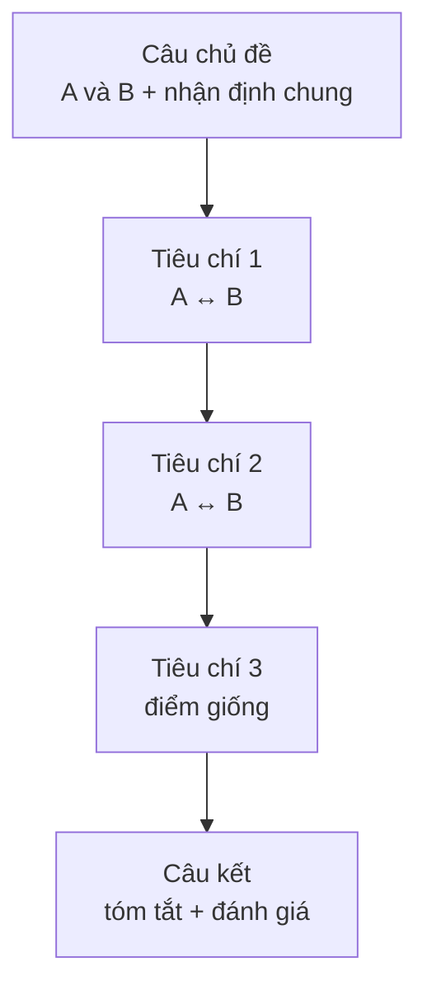

# Đoạn văn so sánh – đối chiếu (Compare & contrast paragraph)

<SkillMeta id="viet-10" />

:::info[Mục tiêu]
Viết được **một đoạn văn 150–200 từ** so sánh hai đối tượng (hai thành phố, hai cách học, hai công việc…), chỉ ra **điểm giống** và **điểm khác** theo từng tiêu chí rõ ràng.
Ngữ pháp trọng tâm: [so sánh](/docs/ngu-phap/g17-so-sanh) (*more … than, as … as, far/much + so sánh hơn, the most*) và [liên từ & từ nối](/docs/ngu-phap/g24-lien-tu-tu-noi) chỉ sự giống và khác (*similarly, whereas, while, in contrast*).
Dạng đoạn này xuất hiện trong IELTS Writing Task 1 (so sánh số liệu), Task 2 (dạng advantages – disadvantages), bài tập đại học và báo cáo lựa chọn phương án trong công việc.
:::

## 1. Bố cục

Có hai cách sắp xếp. Với đoạn văn ngắn, cách **theo điểm (point-by-point)** thường rõ ràng hơn.

| Phần | Nội dung | Số câu | Ví dụ |
|---|---|---|---|
| Câu chủ đề | Nêu 2 đối tượng + nhận định chung (giống nhiều hơn hay khác nhiều hơn) | 1 | *Although studying online and studying on campus share the same goal, they differ in several important ways.* |
| Tiêu chí 1 | So sánh A và B ở tiêu chí thứ nhất | 2 | *Online courses are far more flexible, whereas campus classes follow a fixed timetable.* |
| Tiêu chí 2 | So sánh A và B ở tiêu chí thứ hai | 2 | *In terms of cost, online learning is usually cheaper because students save on rent and travel.* |
| Tiêu chí 3 (điểm giống) | Một điểm tương đồng | 1–2 | *Similarly, both options require strong self-discipline.* |
| Câu kết | Tóm tắt + đánh giá / lựa chọn | 1 | *Overall, the better choice depends on each learner's lifestyle and budget.* |

## 2. Từ vựng & cụm từ

### Diễn đạt sự giống nhau

<VocabList>

| Từ / cụm từ | Phiên âm | Nghĩa | Ví dụ |
|---|---|---|---|
| similar to | /ˈsɪmələ tə/ | giống với | Life in Da Nang is similar to life in Nha Trang. |
| similarly | /ˈsɪmələli/ | tương tự như vậy | Similarly, both cities attract many tourists. |
| likewise | /ˈlaɪkwaɪz/ | cũng vậy | Doctors work long hours; likewise, nurses often do night shifts. |
| both … and … | /bəʊθ ænd/ | cả … và … | Both trains and buses are cheap in Vietnam. |
| share | /ʃeə/ | có chung | The two schools share the same teaching method. |
| have in common | /hæv ɪn ˈkɒmən/ | có điểm chung | The two jobs have a lot in common. |
| as … as | /æz æz/ | … bằng … | A tablet is almost as powerful as a laptop. |
| the same as | /ðə seɪm æz/ | giống hệt | My salary is the same as my colleague's. |

</VocabList>

### Diễn đạt sự khác nhau

<VocabList>

| Từ / cụm từ | Phiên âm | Nghĩa | Ví dụ |
|---|---|---|---|
| differ from | /ˈdɪfə frɒm/ | khác với | City life differs from rural life in many ways. |
| whereas | /weərˈæz/ | trong khi (đối lập) | Hanoi has four seasons, whereas Ho Chi Minh City has two. |
| while | /waɪl/ | trong khi | While trains are comfortable, buses are more flexible. |
| in contrast | /ɪn ˈkɒntrɑːst/ | ngược lại | In contrast, public schools have larger classes. |
| unlike | /ʌnˈlaɪk/ | không giống như | Unlike cats, dogs need to be walked every day. |
| far / much more … than | /fɑː mʌtʃ mɔː ðæn/ | … hơn nhiều so với | Flying is far more expensive than taking the train. |
| significantly | /sɪɡˈnɪfɪkəntli/ | đáng kể | Rents are significantly higher in the city centre. |
| not nearly as … as | /nɒt ˈnɪəli æz æz/ | còn lâu mới … bằng | Villages are not nearly as noisy as cities. |

</VocabList>

### Tiêu chí so sánh

<VocabList>

| Từ / cụm từ | Phiên âm | Nghĩa | Ví dụ |
|---|---|---|---|
| in terms of | /ɪn tɜːmz əv/ | xét về mặt | In terms of cost, the second option is better. |
| convenience | /kənˈviːniəns/ | sự tiện lợi | Online shopping offers great convenience. |
| affordable | /əˈfɔːdəbl/ | giá phải chăng | Street food is much more affordable than restaurant meals. |
| flexibility | /ˌfleksəˈbɪləti/ | sự linh hoạt | Freelancers enjoy more flexibility than office workers. |
| job security | /dʒɒb sɪˈkjʊərəti/ | sự ổn định công việc | Government jobs offer greater job security. |
| quality of life | /ˈkwɒləti əv laɪf/ | chất lượng cuộc sống | Many people move to the countryside for a better quality of life. |

</VocabList>

## 3. Mẫu câu & từ nối

| Chức năng | Mẫu câu |
|---|---|
| Câu chủ đề (khác) | *Although A and B …, they differ in several ways.* |
| Câu chủ đề (giống) | *A and B have a surprising amount in common.* |
| Giới thiệu tiêu chí | *In terms of …, …* · *When it comes to …, …* |
| So sánh hơn | *A is much / far + adj-er / more + adj than B.* |
| So sánh bằng | *A is (almost) as + adj + as B.* · *A is not as + adj + as B.* |
| So sánh nhất | *A is by far the most + adj …* |
| Đối lập trong một câu | *A …, whereas / while B …* |
| Đối lập giữa hai câu | *A … In contrast, / On the other hand, B …* |
| Đối lập đầu câu | *Unlike A, B …* |
| Giống nhau | *Similarly, …* · *Likewise, …* · *Both A and B …* · *Neither A nor B …* |
| Câu kết | *Overall, although A …, B …* · *In short, the better option depends on …* |

## 4. Bài mẫu

> **Đề bài:** Compare living in a big city and living in the countryside. Write a paragraph of about 180 words.

<SpeakText title="Bài mẫu – City life vs. country life (≈175 từ)">

Although living in a big city and living in the countryside both have their attractions, they offer very different lifestyles. In terms of opportunities, cities are far better. Most large companies, universities and hospitals are located in urban areas, so young people usually find jobs and training more easily there. In contrast, rural areas have fewer well-paid positions, which is why many villagers move away after finishing school. However, the countryside is much more affordable than the city. A family in a village can rent a spacious house for the same price as a tiny flat in the city centre, and fresh food is often cheaper as well. When it comes to health, country life also has a clear advantage. The air is cleaner and the pace of life is not nearly as stressful as in a crowded city, whereas city dwellers often suffer from noise and traffic jams. Overall, the city is the better choice for building a career, while the countryside is ideal for anyone who values peace and a healthier lifestyle.

Bản dịch

Mặc dù sống ở thành phố lớn và sống ở nông thôn đều có sức hấp dẫn riêng, hai nơi này mang lại những lối sống rất khác nhau. Xét về cơ hội, thành phố tốt hơn hẳn. Phần lớn các công ty lớn, trường đại học và bệnh viện đều nằm ở khu vực đô thị, nên người trẻ thường dễ tìm việc làm và cơ hội đào tạo hơn ở đó. Ngược lại, vùng nông thôn có ít vị trí lương cao hơn, đó là lý do nhiều người trong làng rời đi sau khi học xong. Tuy nhiên, chi phí sống ở nông thôn phải chăng hơn nhiều so với thành phố. Một gia đình ở làng có thể thuê một ngôi nhà rộng rãi với giá bằng một căn hộ nhỏ xíu ở trung tâm thành phố, và thực phẩm tươi cũng thường rẻ hơn. Về sức khỏe, cuộc sống nông thôn cũng có lợi thế rõ ràng. Không khí trong lành hơn và nhịp sống không hề căng thẳng như ở một thành phố đông đúc, trong khi cư dân thành phố thường khổ sở vì tiếng ồn và tắc đường. Nhìn chung, thành phố là lựa chọn tốt hơn để phát triển sự nghiệp, còn nông thôn lý tưởng cho những ai coi trọng sự yên bình và lối sống lành mạnh hơn.

</SpeakText>

:::note[Phân tích bài mẫu]
| Phần | Câu trong bài |
|---|---|
| Câu chủ đề | *Although living in a big city and living in the countryside both have their attractions, they offer very different lifestyles.* |
| Tiêu chí 1: cơ hội | *In terms of opportunities, cities are far better … In contrast, rural areas have fewer …* – **far + so sánh hơn** |
| Tiêu chí 2: chi phí | *However, the countryside is much more affordable than … for the same price as …* – **much more … than, the same as** |
| Tiêu chí 3: sức khỏe | *When it comes to health, … not nearly as stressful as …, whereas city dwellers …* |
| Câu kết | *Overall, the city is the better choice …, while the countryside is ideal for …* |
:::

## 5. Đề bài luyện tập

1. **(Dễ)** Compare studying alone and studying in a group. Write a paragraph of 120–150 words.
   

   
Gợi ý dàn ý

   Câu chủ đề: cả hai đều hiệu quả nhưng theo cách khác nhau → Tiêu chí 1: sự tập trung (học một mình ít bị phân tâm hơn) → Tiêu chí 2: hiểu bài (học nhóm giải thích cho nhau, học được nhiều góc nhìn) → Điểm giống: đều cần kế hoạch rõ ràng → Câu kết: nên kết hợp cả hai tùy môn học.

   

2. **(Dễ)** Compare travelling by train and travelling by plane in your country. Write a paragraph of about 150 words.
3. **(Trung bình)** Compare shopping online and shopping in traditional stores. Write a paragraph of 150–180 words.
4. **(Trung bình)** Compare working for a large company and working for a small start-up. Write a paragraph of 150–180 words.
5. **(Khó)** Compare the way people communicated 30 years ago with the way they communicate today. Write a paragraph of 180–200 words, using at least three criteria.

## 6. Lỗi thường gặp

| ❌ Sai | ✅ Đúng | Giải thích |
|---|---|---|
| The city is more cheaper than the village. | The city is **cheaper** than the village. | Tính từ ngắn đã thêm *-er* thì không dùng *more* |
| Hanoi is different with Hue. | Hanoi is different **from** Hue. | Cấu trúc chuẩn: *different from* |
| Hanoi is cold. Whereas Saigon is hot. | Hanoi is cold, **whereas** Saigon is hot. | *Whereas* nối hai mệnh đề trong **một câu** |
| Online courses are very cheaper. | Online courses are **much / far** cheaper. | Nhấn mạnh so sánh hơn dùng *much, far, a lot*, không dùng *very* |
| Unlike the city, the air in the countryside is clean. | **Unlike the air in the city**, the air in the countryside is clean. | Hai vế sau *unlike* phải cùng loại (không khí ↔ không khí) |
| This phone is as expensive than that one. | This phone is as expensive **as** that one. | So sánh bằng: *as … as*, không trộn với *than* |

## 7. Checklist tự sửa

- [ ] Câu chủ đề nêu rõ **hai đối tượng** và nhận định chung.
- [ ] So sánh theo **ít nhất 2–3 tiêu chí**, mỗi tiêu chí nói về **cả A và B**.
- [ ] Dùng đúng cả ba dạng: so sánh hơn, so sánh bằng (*as … as*) và so sánh nhất hoặc *much/far* + so sánh hơn.
- [ ] Có từ nối chỉ khác (*whereas, in contrast, unlike*) **và** chỉ giống (*similarly, both*).
- [ ] Câu kết có **đánh giá hoặc lựa chọn**, không chỉ lặp lại câu chủ đề.
- [ ] Độ dài 150–200 từ; không có lỗi *more + adj-er*.
