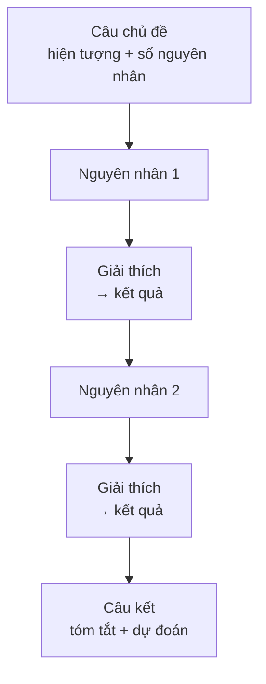

# Đoạn văn nguyên nhân – kết quả (Cause & effect paragraph)

<SkillMeta id="viet-11" />

:::info[Mục tiêu]
Viết được **một đoạn văn 150–200 từ** giải thích **nguyên nhân** của một hiện tượng hoặc **hậu quả** mà nó gây ra, trình bày thành chuỗi logic rõ ràng.
Ngữ pháp trọng tâm: [liên từ & từ nối](/docs/ngu-phap/g24-lien-tu-tu-noi) chỉ nguyên nhân – kết quả (*because of, due to, as a result, therefore, lead to*) và [câu điều kiện loại 0, 1, 2](/docs/ngu-phap/g20-cau-dieu-kien-loai-0-1-2) để nói về hệ quả chung hoặc dự đoán.
Dạng đoạn này rất phổ biến trong IELTS Writing Task 2 (dạng *causes – effects*, *causes – solutions*), bài luận khoa học xã hội ở đại học và báo cáo phân tích sự cố trong công việc.
:::

## 1. Bố cục

Hãy chọn **một trọng tâm**: hoặc tập trung vào **nguyên nhân**, hoặc vào **kết quả**. Bảng dưới là đoạn tập trung vào nguyên nhân.

| Phần | Nội dung | Số câu | Ví dụ |
|---|---|---|---|
| Câu chủ đề | Nêu hiện tượng + báo trước có mấy nguyên nhân / hậu quả | 1 | *There are two main reasons why more young people are suffering from stress.* |
| Nguyên nhân 1 | Nguyên nhân quan trọng nhất | 1 | *The first cause is the pressure to achieve high grades.* |
| Giải thích + kết quả 1 | Chuỗi: vì A → B → C | 1–2 | *Students study late every night, and as a result, they rarely get enough sleep.* |
| Nguyên nhân 2 | Nguyên nhân thứ hai | 1 | *Another factor is the heavy use of social media.* |
| Giải thích + kết quả 2 | Ví dụ / số liệu / điều kiện | 1–2 | *If teenagers compare themselves with others online, they often feel inadequate.* |
| Câu kết | Tóm tắt + hệ quả chung / lời khuyên | 1 | *Unless these pressures are reduced, the problem is likely to get worse.* |

## 2. Từ vựng & cụm từ

### Diễn đạt nguyên nhân

<VocabList>

| Từ / cụm từ | Phiên âm | Nghĩa | Ví dụ |
|---|---|---|---|
| cause | /kɔːz/ | nguyên nhân; gây ra | Heavy rain caused serious flooding in the city. |
| because of | /bɪˈkɒz əv/ | bởi vì (+ danh từ) | The flight was cancelled because of the storm. |
| due to | /djuː tə/ | do, vì (+ danh từ) | The delay was due to a technical problem. |
| stem from | /stem frɒm/ | bắt nguồn từ | Many health problems stem from a poor diet. |
| be the result of | /bi ðə rɪˈzʌlt əv/ | là kết quả của | Obesity is often the result of inactivity. |
| factor | /ˈfæktə/ | yếu tố | Cost is a key factor in choosing a university. |
| contribute to | /kənˈtrɪbjuːt tə/ | góp phần gây ra | Plastic waste contributes to ocean pollution. |
| be triggered by | /bi ˈtrɪɡəd baɪ/ | bị khởi phát bởi | His asthma attacks are triggered by dust. |

</VocabList>

### Diễn đạt kết quả

<VocabList>

| Từ / cụm từ | Phiên âm | Nghĩa | Ví dụ |
|---|---|---|---|
| lead to | /liːd tə/ | dẫn đến | Lack of sleep can lead to poor concentration. |
| result in | /rɪˈzʌlt ɪn/ | gây ra, dẫn đến | The new law resulted in fewer road accidents. |
| as a result | /æz ə rɪˈzʌlt/ | kết quả là | Prices rose; as a result, sales fell. |
| consequently | /ˈkɒnsɪkwəntli/ | do đó | He missed the bus and consequently arrived late. |
| therefore | /ˈðeəfɔː/ | vì vậy | The road is icy; therefore, drivers must be careful. |
| effect on | /ɪˈfekt ɒn/ | ảnh hưởng lên | Noise has a negative effect on children's learning. |
| affect | /əˈfekt/ | ảnh hưởng (động từ) | Air pollution affects millions of people. |
| consequence | /ˈkɒnsɪkwəns/ | hậu quả | Deforestation has serious consequences for wildlife. |

</VocabList>

### Chủ đề thường gặp

<VocabList>

| Từ / cụm từ | Phiên âm | Nghĩa | Ví dụ |
|---|---|---|---|
| sedentary lifestyle | /ˈsedntri ˈlaɪfstaɪl/ | lối sống ít vận động | A sedentary lifestyle increases the risk of heart disease. |
| traffic congestion | /ˈtræfɪk kənˈdʒestʃən/ | ùn tắc giao thông | Traffic congestion wastes hours of commuters' time. |
| urbanisation | /ˌɜːbənaɪˈzeɪʃn/ | đô thị hóa | Rapid urbanisation has put pressure on housing. |
| greenhouse gas emissions | /ˈɡriːnhaʊs ɡæs iˈmɪʃnz/ | khí thải nhà kính | Cars produce large amounts of greenhouse gas emissions. |
| mental health | /ˈmentl helθ/ | sức khỏe tinh thần | Regular exercise is good for mental health. |
| unemployment | /ˌʌnɪmˈplɔɪmənt/ | thất nghiệp | Automation may increase unemployment in factories. |

</VocabList>

## 3. Mẫu câu & từ nối

| Chức năng | Mẫu câu |
|---|---|
| Câu chủ đề (nguyên nhân) | *There are several reasons why …* · *… can be explained by two main factors.* |
| Câu chủ đề (kết quả) | *… has had a number of serious effects on …* |
| Nguyên nhân + mệnh đề | *because / since / as + S + V* |
| Nguyên nhân + danh từ | *because of / due to / owing to + N / V-ing* |
| Nguyên nhân (động từ) | *A is caused by B.* · *A stems from B.* · *B contributes to A.* |
| Kết quả (động từ) | *A leads to / results in / causes B.* |
| Kết quả giữa hai câu | *As a result, …* · *Consequently, …* · *Therefore, …* |
| Kết quả trong một câu | *…, so …* · *…, which means that …* |
| Chuỗi nhân quả | *This, in turn, leads to …* |
| Sự thật chung (loại 0) | *If people sleep less, they concentrate less.* |
| Dự đoán (loại 1) | *If this trend continues, … will …* · *Unless …, … will …* |
| Giả định (loại 2) | *If more people cycled, the air would be cleaner.* |
| Câu kết | *In short, … is mainly the result of …* |

## 4. Bài mẫu

> **Đề bài:** In many cities, traffic congestion is getting worse. What are the main causes of this problem? Write a paragraph of about 180 words.

<SpeakText title="Bài mẫu – Causes of traffic congestion (≈180 từ)">

There are two main reasons why traffic congestion is becoming worse in many cities. The first cause is the rapid growth in the number of private vehicles. As people's incomes rise, more families can afford to buy a car, and they naturally prefer the comfort of driving to waiting for a crowded bus. Consequently, roads that were designed for motorbikes and bicycles now have to carry thousands of cars every hour. Another important factor is poor urban planning. In many developing cities, offices, schools and shopping centres are all concentrated in the same central districts, so millions of people travel in the same direction at the same time. This, in turn, leads to long queues at every junction during rush hour. In addition, public transport systems are often too limited to offer a real alternative. If there were more reliable metro lines, fewer people would need to drive to work. In short, traffic jams are mainly the result of rising car ownership and badly planned cities, and unless both issues are tackled, the situation will continue to deteriorate.

Bản dịch

Có hai lý do chính khiến ùn tắc giao thông ngày càng trầm trọng ở nhiều thành phố. Nguyên nhân thứ nhất là số lượng phương tiện cá nhân tăng nhanh. Khi thu nhập tăng, nhiều gia đình có đủ khả năng mua ô tô, và họ đương nhiên thích sự thoải mái khi lái xe hơn là chờ một chuyến xe buýt đông đúc. Do đó, những con đường vốn được thiết kế cho xe máy và xe đạp giờ phải gánh hàng nghìn ô tô mỗi giờ. Một yếu tố quan trọng khác là quy hoạch đô thị kém. Ở nhiều thành phố đang phát triển, văn phòng, trường học và trung tâm mua sắm đều tập trung ở cùng các quận trung tâm, vì vậy hàng triệu người di chuyển cùng một hướng vào cùng một thời điểm. Điều này lại dẫn đến những hàng xe dài ở mọi ngã tư vào giờ cao điểm. Thêm vào đó, hệ thống giao thông công cộng thường quá hạn chế để trở thành một lựa chọn thay thế thực sự. Nếu có nhiều tuyến tàu điện ngầm đáng tin cậy hơn, sẽ ít người phải lái xe đi làm hơn. Tóm lại, tắc đường chủ yếu là hệ quả của việc sở hữu ô tô gia tăng và quy hoạch thành phố yếu kém, và nếu cả hai vấn đề không được giải quyết, tình hình sẽ tiếp tục xấu đi.

</SpeakText>

:::note[Phân tích bài mẫu]
| Phần | Câu trong bài |
|---|---|
| Câu chủ đề | *There are two main reasons why traffic congestion is becoming worse in many cities.* |
| Nguyên nhân 1 | *The first cause is the rapid growth in the number of private vehicles.* |
| Giải thích → kết quả 1 | *As people's incomes rise, … Consequently, roads that were designed for …* |
| Nguyên nhân 2 | *Another important factor is poor urban planning.* |
| Giải thích → kết quả 2 | *…, so millions of people … This, in turn, leads to long queues …* – **chuỗi nhân quả** |
| Ý bổ sung + giả định | *In addition, … If there were more reliable metro lines, fewer people would need …* – **câu điều kiện loại 2** |
| Câu kết | *In short, … are mainly the result of …, and unless …, the situation will …* – **unless + loại 1** |
:::

## 5. Đề bài luyện tập

1. **(Dễ)** Many students feel tired at school. What are the causes? Write a paragraph of 120–150 words.
   

   
Gợi ý dàn ý

   Câu chủ đề: có hai nguyên nhân chính → Nguyên nhân 1: ngủ muộn vì dùng điện thoại → kết quả: thiếu ngủ, khó tập trung → Nguyên nhân 2: bỏ bữa sáng, ít vận động → kết quả: thiếu năng lượng → Câu kết: nếu thay đổi thói quen, học sinh sẽ tỉnh táo hơn (câu điều kiện loại 1).

   

2. **(Dễ)** What are the effects of using smartphones for many hours a day? Write a paragraph of about 150 words.
3. **(Trung bình)** More and more young people are moving from rural areas to big cities. Explain the causes of this trend (150–180 words).
4. **(Trung bình)** Explain the effects of working from home on employees' health and productivity (150–180 words).
5. **(Khó)** Plastic pollution in the oceans has increased dramatically. Write a paragraph of 180–200 words explaining both its main causes and its effects on marine life and humans.

## 6. Lỗi thường gặp

| ❌ Sai | ✅ Đúng | Giải thích |
|---|---|---|
| Because of the price is high, few people buy it. | **Because** the price is high, few people buy it. | *Because of* + danh từ; *because* + mệnh đề |
| Pollution effects our health. | Pollution **affects** our health. | *affect* là động từ, *effect* là danh từ |
| Smoking leads to get cancer. | Smoking **leads to** cancer. / Smoking can **lead to** getting cancer. | *lead to* + danh từ / V-ing |
| So that, many people lose their jobs. | **As a result,** many people lose their jobs. | *So that* chỉ mục đích, không dùng chỉ kết quả đầu câu |
| If the government will build more roads, traffic will improve. | If the government **builds** more roads, traffic will improve. | Mệnh đề *if* loại 1 dùng hiện tại đơn |
| Because many reasons, people move to cities. | **For** many reasons, people move to cities. | *Because* không đứng trực tiếp trước danh từ |

## 7. Checklist tự sửa

- [ ] Câu chủ đề nói rõ đoạn văn bàn về **nguyên nhân** hay **kết quả**, và có bao nhiêu ý.
- [ ] Mỗi nguyên nhân / kết quả được **giải thích thành chuỗi** (A → B → C), không chỉ liệt kê.
- [ ] Phân biệt đúng *because / because of / due to* và *affect / effect*.
- [ ] Dùng ít nhất 1 câu điều kiện (*if / unless*) đúng thì.
- [ ] Có ít nhất 4 từ nối nhân quả khác nhau (*as a result, consequently, lead to, therefore…*).
- [ ] Câu kết tóm tắt nguyên nhân chính hoặc đưa ra dự đoán; độ dài 150–200 từ.
