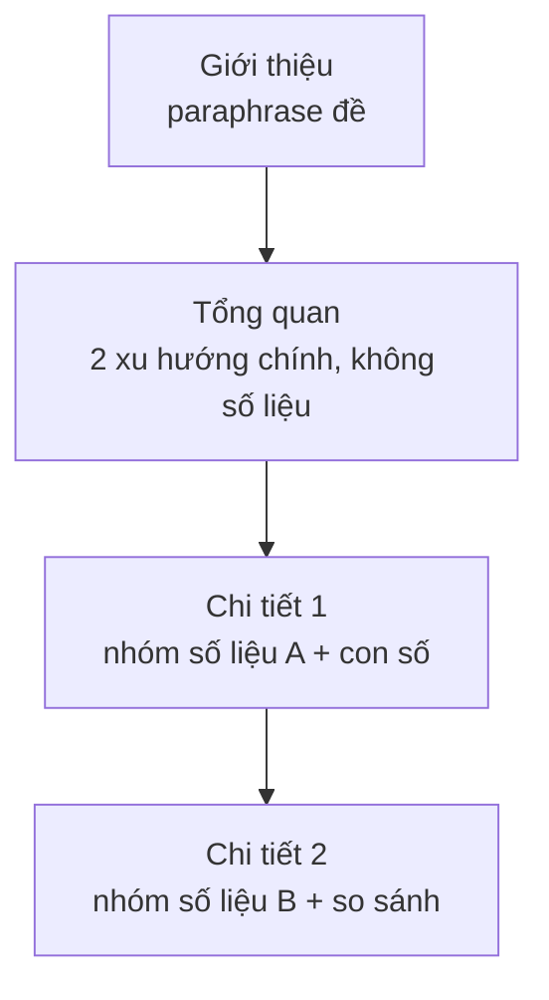

# Mô tả biểu đồ (Describing charts)

<SkillMeta id="viet-12" />

:::info[Mục tiêu]
Viết được **một bài mô tả số liệu khoảng 150 từ** (biểu đồ đường, cột, tròn hoặc bảng): giới thiệu biểu đồ, nêu **tổng quan (overview)** các xu hướng chính, rồi mô tả chi tiết có **số liệu và so sánh** – không đưa ý kiến cá nhân.
Ngữ pháp trọng tâm: [so sánh](/docs/ngu-phap/g17-so-sanh) (*higher than, twice as … as, the highest*), [câu bị động](/docs/ngu-phap/g19-cau-bi-dong) (*… was recorded, … is shown*) và [quá khứ đơn](/docs/ngu-phap/g04-qua-khu-don) cho số liệu trong quá khứ.
Dùng trong IELTS Academic Writing Task 1, báo cáo thí nghiệm / khảo sát ở đại học và báo cáo doanh số, KPI trong công việc.
:::

## 1. Bố cục

| Phần | Nội dung | Độ dài | Ví dụ |
|---|---|---|---|
| Giới thiệu | Diễn đạt lại đề: biểu đồ gì, đo cái gì, ở đâu, khi nào | 1 câu | *The line graph illustrates the proportion of households with internet access in three countries between 2000 and 2020.* |
| Tổng quan | 2 đặc điểm nổi bật nhất (xu hướng chung + cao nhất / thay đổi lớn nhất), **không có số liệu chi tiết** | 1–2 câu | *Overall, internet access rose sharply in all three countries, and the UK had the highest figures throughout the period.* |
| Chi tiết 1 | Nhóm số liệu thứ nhất (ví dụ: nước dẫn đầu) | 2–3 câu | *In 2000, a quarter of British households were online, and this figure more than doubled over the next five years.* |
| Chi tiết 2 | Nhóm số liệu còn lại, so sánh với nhóm 1 | 3–4 câu | *By contrast, Brazil and Vietnam started from very low levels.* |

Lưu ý: IELTS Task 1 **không cần câu kết** nêu ý kiến; phần tổng quan chính là "trái tim" của bài.

## 2. Từ vựng & cụm từ

### Xu hướng tăng – giảm – ổn định

<VocabList>

| Từ / cụm từ | Phiên âm | Nghĩa | Ví dụ |
|---|---|---|---|
| rise sharply | /raɪz ˈʃɑːpli/ | tăng mạnh | Sales rose sharply in the second quarter. |
| increase steadily | /ɪnˈkriːs ˈstedəli/ | tăng đều | The population increased steadily from 1990 to 2010. |
| surge | /sɜːdʒ/ | tăng vọt | Online orders surged during the holiday season. |
| double | /ˈdʌbl/ | tăng gấp đôi | The number of visitors doubled in five years. |
| fall slightly | /fɔːl ˈslaɪtli/ | giảm nhẹ | Unemployment fell slightly in 2019. |
| decline gradually | /dɪˈklaɪn ˈɡrædʒuəli/ | giảm dần | Coal use declined gradually over the decade. |
| drop dramatically | /drɒp drəˈmætɪkli/ | giảm mạnh | Ticket sales dropped dramatically in 2020. |
| remain stable | /rɪˈmeɪn ˈsteɪbl/ | giữ ổn định | Prices remained stable for three years. |
| fluctuate | /ˈflʌktʃueɪt/ | dao động | Temperatures fluctuated between 20 and 25 degrees. |

</VocabList>

### Điểm cao nhất, thấp nhất & tỉ lệ

<VocabList>

| Từ / cụm từ | Phiên âm | Nghĩa | Ví dụ |
|---|---|---|---|
| peak at | /piːk æt/ | đạt đỉnh ở mức | Exports peaked at 40 million tonnes in 2015. |
| reach a low of | /riːtʃ ə ləʊ əv/ | chạm mức thấp nhất | The figure reached a low of 5% in 2008. |
| account for | /əˈkaʊnt fɔː/ | chiếm (tỉ lệ) | Rice accounted for half of all exports. |
| the proportion of | /ðə prəˈpɔːʃn əv/ | tỉ lệ của | The proportion of elderly people is growing. |
| a quarter / a third | /ə ˈkwɔːtə ə θɜːd/ | một phần tư / một phần ba | A third of students walk to school. |
| the vast majority | /ðə vɑːst məˈdʒɒrəti/ | đại đa số | The vast majority of homes have a television. |
| overtake | /ˌəʊvəˈteɪk/ | vượt qua | Mobile sales overtook laptop sales in 2012. |
| respectively | /rɪˈspektɪvli/ | lần lượt | The figures for A and B were 10% and 20% respectively. |

</VocabList>

### Thời gian & dẫn dắt

<VocabList>

| Từ / cụm từ | Phiên âm | Nghĩa | Ví dụ |
|---|---|---|---|
| illustrate | /ˈɪləstreɪt/ | minh họa, thể hiện | The bar chart illustrates changes in energy use. |
| over the period | /ˈəʊvə ðə ˈpɪəriəd/ | trong suốt giai đoạn | Over the period, spending on food fell. |
| by the end of | /baɪ ði end əv/ | đến cuối | By the end of 2020, almost all homes were online. |
| throughout | /θruːˈaʊt/ | suốt | The UK remained ahead throughout the period. |
| in comparison | /ɪn kəmˈpærɪsn/ | để so sánh | In comparison, Brazil grew more slowly. |
| the figure for | /ðə ˈfɪɡə fɔː/ | số liệu của | The figure for Japan was much lower. |

</VocabList>

## 3. Mẫu câu & từ nối

| Chức năng | Mẫu câu |
|---|---|
| Giới thiệu | *The line graph / bar chart / table illustrates / compares …* |
| Tổng quan | *Overall, it is clear that …* · *In general, … while …* |
| Động từ + trạng từ | *… rose sharply / fell slightly / increased steadily from … to …* |
| Danh từ + tính từ | *There was a sharp rise / a slight fall / a steady increase in …* |
| Đỉnh / đáy | *… peaked at … in …* · *… reached a low of …* |
| Không đổi | *… remained stable at around …* · *… levelled off at …* |
| Tỉ lệ | *… accounted for …%* · *just over a quarter / nearly half* |
| So sánh | *… was twice as high as …* · *… was 20 points higher than …* |
| Vượt qua | *… overtook … to become …* |
| Bị động | *The highest figure was recorded in …* · *… is shown in the table.* |
| Đối lập | *By contrast, …* · *…, whereas …* |
| Mốc thời gian | *In 2000, …* · *Over the next five years, …* · *By 2020, …* |

## 4. Bài mẫu

> **Đề bài:** The table below shows the percentage of households with internet access in three countries between 2000 and 2020. Summarise the information by selecting and reporting the main features, and make comparisons where relevant. Write at least 150 words.

**Tỉ lệ hộ gia đình có internet (%)** – _số liệu minh họa cho bài luyện tập, không phải thống kê thực tế_

| Quốc gia | 2000 | 2005 | 2010 | 2015 | 2020 |
|---|---|---|---|---|---|
| United Kingdom | 25 | 55 | 73 | 86 | 96 |
| Brazil | 5 | 13 | 27 | 51 | 71 |
| Vietnam | 1 | 3 | 14 | 45 | 73 |

<SpeakText title="Bài mẫu – Households with internet access, 2000–2020 (≈175 từ)">

The table compares the proportion of households that had access to the internet in the United Kingdom, Brazil and Vietnam over a twenty-year period from 2000 to 2020.

Overall, internet access increased significantly in all three countries. The UK had the highest figures throughout the period, while Vietnam showed the most dramatic growth and eventually overtook Brazil.

In 2000, a quarter of British households were online, and this figure more than doubled to 55% over the next five years. After that, it continued to rise steadily and reached 96% in 2020, which means that almost every home was connected.

By contrast, Brazil and Vietnam started from very low levels, at 5% and 1% respectively. Brazil saw a gradual increase to 27% in 2010 before climbing to 71% by the end of the period. Vietnam's figure remained below 5% until 2005, but it then surged, reaching 45% in 2015. By 2020, 73% of Vietnamese households had internet access, which was slightly higher than the figure for Brazil but still 23 points lower than that of the UK.

Bản dịch

Bảng số liệu so sánh tỉ lệ hộ gia đình có truy cập internet ở Vương quốc Anh, Brazil và Việt Nam trong giai đoạn hai mươi năm từ 2000 đến 2020.

Nhìn chung, tỉ lệ truy cập internet tăng đáng kể ở cả ba quốc gia. Vương quốc Anh có số liệu cao nhất trong suốt giai đoạn, trong khi Việt Nam có mức tăng trưởng ấn tượng nhất và cuối cùng đã vượt qua Brazil.

Năm 2000, một phần tư số hộ gia đình ở Anh có internet, và con số này tăng hơn gấp đôi lên 55% trong năm năm tiếp theo. Sau đó, tỉ lệ này tiếp tục tăng đều và đạt 96% vào năm 2020, nghĩa là gần như mọi gia đình đều đã được kết nối.

Ngược lại, Brazil và Việt Nam khởi đầu ở mức rất thấp, lần lượt là 5% và 1%. Brazil tăng dần lên 27% vào năm 2010 trước khi leo lên 71% vào cuối giai đoạn. Số liệu của Việt Nam vẫn ở dưới 5% cho đến năm 2005, nhưng sau đó tăng vọt, đạt 45% vào năm 2015. Đến năm 2020, 73% hộ gia đình Việt Nam có internet, cao hơn một chút so với Brazil nhưng vẫn thấp hơn Anh 23 điểm phần trăm.

</SpeakText>

:::note[Phân tích bài mẫu]
| Phần | Câu trong bài |
|---|---|
| Giới thiệu | *The table compares the proportion of households that had access to the internet …* – paraphrase *percentage → proportion*, *shows → compares* |
| Tổng quan | *Overall, internet access increased significantly … The UK had the highest figures …, while Vietnam … eventually overtook Brazil.* – không có con số |
| Chi tiết 1: Anh | *In 2000, a quarter of … more than doubled to 55% … reached 96% in 2020* – **quá khứ đơn** |
| Chi tiết 2: Brazil & Việt Nam | *By contrast, … at 5% and 1% respectively … Vietnam's figure remained below 5% … then surged …* |
| So sánh cuối | *… slightly higher than the figure for Brazil but still 23 points lower than that of the UK.* – **so sánh hơn + that of** |
:::

## 5. Đề bài luyện tập

1. **(Dễ)** The table shows the number of students (in thousands) studying English at a language centre from 2018 to 2022: 2018 – 2.0, 2019 – 2.5, 2020 – 1.2, 2021 – 1.8, 2022 – 3.0. Write about 120 words describing the changes.
   

   
Gợi ý dàn ý

   Giới thiệu: paraphrase đề → Tổng quan: nhìn chung tăng, có một lần giảm mạnh năm 2020, cao nhất năm 2022 → Chi tiết 1: 2018–2019 tăng từ 2 000 lên 2 500; năm 2020 giảm mạnh còn 1 200 → Chi tiết 2: phục hồi lên 1 800 năm 2021 và đạt đỉnh 3 000 năm 2022, gấp 1,5 lần năm 2018.

   

2. **(Dễ)** A pie chart shows how a typical student spends a day: sleeping 33%, studying 25%, using a phone 17%, eating 8%, other activities 17%. Write about 150 words.
3. **(Trung bình)** The line graph shows the average monthly temperature and rainfall in Hanoi over one year. Write at least 150 words (use real or invented but consistent data).
4. **(Trung bình)** The bar chart compares the percentage of people who cycle, drive and use public transport to get to work in four cities. Write at least 150 words.
5. **(Khó)** Two pie charts show the sources of electricity in a country in 2000 and 2020 (coal, gas, hydro, solar, wind). Summarise the main changes in at least 170 words, using both verb + adverb and noun + adjective structures.

## 6. Lỗi thường gặp

| ❌ Sai | ✅ Đúng | Giải thích |
|---|---|---|
| The number of users increased sharp. | The number of users increased **sharply**. | Bổ nghĩa cho động từ → trạng từ |
| There was a sharply increase in sales. | There was a **sharp** increase in sales. | Bổ nghĩa cho danh từ → tính từ |
| The percentage of people was increased. | The percentage of people **increased**. | *increase, rise, fall* là nội động từ, không dùng bị động |
| In 2010, the figure rises to 27%. | In 2010, the figure **rose** to 27%. | Năm trong quá khứ → quá khứ đơn |
| Vietnam's figure was higher than Brazil. | Vietnam's figure was higher than **that of** Brazil / **Brazil's**. | So sánh cùng loại: số liệu ↔ số liệu |
| I think the UK is the best country for internet. | The UK had the highest figures throughout the period. | Task 1 chỉ mô tả, không đưa ý kiến cá nhân |

## 7. Checklist tự sửa

- [ ] Câu giới thiệu **paraphrase** đề, không chép nguyên văn.
- [ ] Có đoạn **tổng quan** nêu 2 đặc điểm nổi bật, không chứa số liệu chi tiết.
- [ ] Mỗi đoạn chi tiết có **con số cụ thể + năm**, và có so sánh giữa các đối tượng.
- [ ] Phân biệt đúng *rise sharply* (động từ + trạng từ) và *a sharp rise* (tính từ + danh từ).
- [ ] Thì động từ khớp với thời gian trong biểu đồ; không dùng bị động với *increase / rise / fall*.
- [ ] Tất cả con số trong bài **khớp với dữ liệu**; ít nhất 150 từ; không có ý kiến cá nhân.
