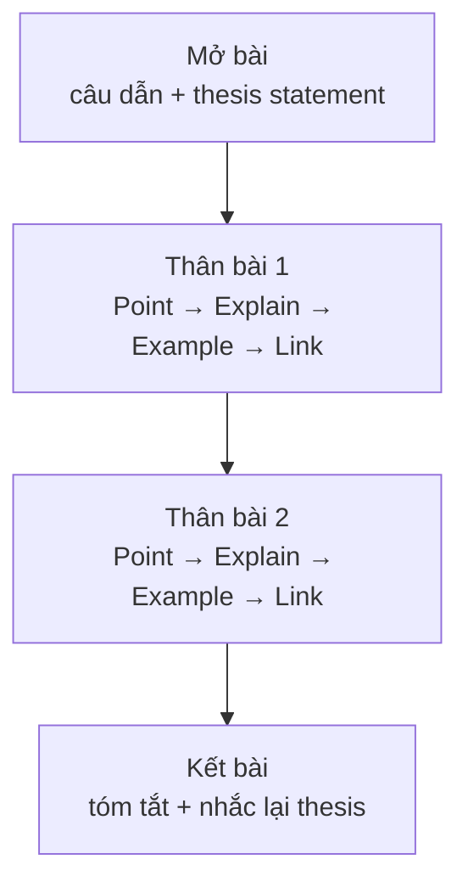

# Cấu trúc bài luận (Essay structure)

<SkillMeta id="viet-13" />

:::info[Mục tiêu]
Hiểu và áp dụng được **cấu trúc bài luận 4 đoạn (~250 từ)**: mở bài có **câu luận đề (thesis statement)**, hai đoạn thân bài theo mô hình **PEEL** (Point – Explain – Example – Link) và kết bài tóm tắt.
Ngữ pháp trọng tâm: [liên từ & từ nối](/docs/ngu-phap/g24-lien-tu-tu-noi) để liên kết câu và đoạn (*firstly, furthermore, however, in conclusion*) và [mệnh đề quan hệ](/docs/ngu-phap/g22-menh-de-quan-he) (*which, who, where*) để viết câu phức, gộp ý gọn gàng.
Đây là "khung xương" chung cho mọi dạng IELTS Writing Task 2, bài luận ở đại học và các báo cáo đề xuất trong công việc; các bài 14–16 đều xây dựng trên khung này.
:::

## 1. Bố cục

| Phần | Nội dung | Độ dài | Ví dụ |
|---|---|---|---|
| Mở bài | Câu dẫn (paraphrase đề) + câu luận đề (trả lời đề / nêu hướng bài) | 2–3 câu, 40–50 từ | *Nowadays, many young people spend several hours a day on social media. This essay will argue that it does more harm than good.* |
| Thân bài 1 | **P**oint – **E**xplain – **E**xample – **L**ink | 4–5 câu, 80–90 từ | *Firstly, social media reduces the time teenagers spend on real friendships …* |
| Thân bài 2 | Ý chính thứ hai, cũng theo PEEL | 4–5 câu, 80–90 từ | *Furthermore, it can seriously damage young people's self-esteem …* |
| Kết bài | Tóm tắt 2 ý + nhắc lại luận đề bằng từ khác (có thể thêm đề xuất) | 2 câu, 30–40 từ | *In conclusion, although social media keeps people connected, its effects on teenagers are largely negative.* |

## 2. Từ vựng & cụm từ

### Mở bài & câu luận đề

<VocabList>

| Từ / cụm từ | Phiên âm | Nghĩa | Ví dụ |
|---|---|---|---|
| thesis statement | /ˈθiːsɪs ˈsteɪtmənt/ | câu luận đề | Your thesis statement should answer the question directly. |
| nowadays | /ˈnaʊədeɪz/ | ngày nay | Nowadays, most students own a laptop. |
| it is widely believed that | /ɪt ɪz ˈwaɪdli bɪˈliːvd ðæt/ | nhiều người tin rằng | It is widely believed that exercise reduces stress. |
| a controversial issue | /ə ˌkɒntrəˈvɜːʃl ˈɪʃuː/ | một vấn đề gây tranh cãi | Animal testing remains a controversial issue. |
| this essay will argue that | /ðɪs ˈeseɪ wɪl ˈɑːɡjuː ðæt/ | bài luận này sẽ lập luận rằng | This essay will argue that homework is necessary. |
| this essay will discuss | /ðɪs ˈeseɪ wɪl dɪˈskʌs/ | bài luận này sẽ thảo luận | This essay will discuss both sides of the debate. |
| paraphrase | /ˈpærəfreɪz/ | diễn đạt lại | Always paraphrase the question in your introduction. |

</VocabList>

### Thân bài (PEEL)

<VocabList>

| Từ / cụm từ | Phiên âm | Nghĩa | Ví dụ |
|---|---|---|---|
| topic sentence | /ˈtɒpɪk ˈsentəns/ | câu chủ đề của đoạn | Each body paragraph begins with a topic sentence. |
| firstly | /ˈfɜːstli/ | thứ nhất | Firstly, online learning saves time. |
| furthermore | /ˌfɜːðəˈmɔː/ | hơn nữa | Furthermore, it is much cheaper. |
| this is because | /ðɪs ɪz bɪˈkɒz/ | điều này là bởi vì | This is because students do not need to travel. |
| to illustrate | /tə ˈɪləstreɪt/ | để minh họa | To illustrate, Finland gives pupils very little homework. |
| research shows that | /rɪˈsɜːtʃ ʃəʊz ðæt/ | nghiên cứu cho thấy | Research shows that music helps concentration. |
| consequently | /ˈkɒnsɪkwəntli/ | vì thế | Consequently, fewer students drop out. |
| coherent | /kəʊˈhɪərənt/ | mạch lạc | A coherent essay moves logically from one idea to the next. |

</VocabList>

### Kết bài

<VocabList>

| Từ / cụm từ | Phiên âm | Nghĩa | Ví dụ |
|---|---|---|---|
| in conclusion | /ɪn kənˈkluːʒn/ | tóm lại, kết luận | In conclusion, the benefits are greater than the risks. |
| to sum up | /tə sʌm ʌp/ | tóm lại | To sum up, both views have some merit. |
| on balance | /ɒn ˈbæləns/ | cân nhắc mọi mặt | On balance, I support the new policy. |
| reiterate | /riˈɪtəreɪt/ | nhắc lại | The conclusion should reiterate your main position. |
| it is recommended that | /ɪt ɪz ˌrekəˈmendɪd ðæt/ | khuyến nghị rằng | It is recommended that parents limit screen time. |
| in the long run | /ɪn ðə lɒŋ rʌn/ | về lâu dài | In the long run, this will save money. |

</VocabList>

## 3. Mẫu câu & từ nối

| Chức năng | Mẫu câu |
|---|---|
| Câu dẫn | *Nowadays, …* · *It is often argued that …* · *In recent years, there has been a growing debate about …* |
| Luận đề (ý kiến) | *I firmly believe that …* · *This essay will argue that …* |
| Luận đề (thảo luận) | *This essay will discuss both views before giving my own opinion.* |
| Câu chủ đề thân bài 1 | *The main reason why … is that …* · *Firstly, …* |
| Câu chủ đề thân bài 2 | *Another significant point is that …* · *Furthermore, …* |
| Giải thích | *This is because …* · *In other words, …* |
| Ví dụ | *For example, …* · *To illustrate, …* · *A case in point is …* |
| Mệnh đề quan hệ | *…, which means that …* · *Students who …* · *countries where …* |
| Câu nối cuối đoạn | *Therefore, it is clear that …* · *As a result, …* |
| Nhượng bộ | *Admittedly, …; however, …* |
| Kết bài | *In conclusion, …* · *To sum up, while …, I believe …* |
| Đề xuất cuối bài | *It is therefore recommended that …* |

## 4. Bài mẫu

### 4.1. Khung bài có chú thích

> **Đề bài:** Some people believe that children should start school at the age of four, while others think seven is a better age. Discuss.

| Phần | Khung câu | Chú thích |
|---|---|---|
| Mở bài – câu dẫn | *The age at which children should begin formal education is ….* | Paraphrase đề, **không chép nguyên văn** |
| Mở bài – luận đề | *This essay will argue that ….* | Trả lời thẳng câu hỏi, nêu hướng của cả bài |
| Thân bài 1 – Point | *The main reason is that ….* | Một ý duy nhất cho cả đoạn |
| Thân bài 1 – Explain | *This is because …, which ….* | Giải thích "tại sao"; dùng mệnh đề quan hệ |
| Thân bài 1 – Example | *For example, in Finland, where ….* | Ví dụ thực tế, số liệu hoặc trải nghiệm |
| Thân bài 1 – Link | *Therefore, ….* | Nối lại với luận đề |
| Thân bài 2 | *Furthermore, … / Admittedly, …; however, ….* | Ý thứ hai hoặc phản bác quan điểm đối lập |
| Kết bài | *In conclusion, … . It is therefore recommended that ….* | Tóm tắt, **không đưa ý mới** |

### 4.2. Bài luận hoàn chỉnh

<SpeakText title="Bài mẫu – At what age should children start school? (≈250 từ)">

The age at which children should begin formal education is a matter of debate in many countries. While some parents want their children to enter school at four, this essay will argue that seven is a more suitable age.

The main reason is that young children learn best through play rather than through lessons. This is because a four-year-old's brain develops mainly through movement, conversation and imagination, which are difficult to encourage in a classroom full of desks. For example, in Finland, where children do not start school until seven, pupils spend their early years in kindergartens that focus on games and outdoor activities. Nevertheless, Finnish students consistently achieve excellent results in international tests. Therefore, it is clear that starting later does not harm academic success.

Furthermore, older children are usually more emotionally ready for school. At seven, most children can sit still, follow instructions and cope with being away from their parents for a whole day. Admittedly, an early start can help working parents who need childcare; however, this problem could be solved with affordable, high-quality nurseries rather than formal schooling. Children who are pushed into lessons too early may become stressed and lose their natural curiosity, which could affect their attitude to learning for years.

In conclusion, although starting school at four may seem convenient, children benefit more from a longer period of play and emotional development. It is therefore recommended that governments invest in good preschool programmes and delay formal education until the age of seven.

Bản dịch

Độ tuổi trẻ em nên bắt đầu học chính thức là một vấn đề gây tranh luận ở nhiều quốc gia. Trong khi một số phụ huynh muốn con vào trường từ bốn tuổi, bài luận này sẽ lập luận rằng bảy tuổi là độ tuổi phù hợp hơn.

Lý do chính là trẻ nhỏ học tốt nhất qua vui chơi chứ không phải qua các tiết học. Bởi vì não của trẻ bốn tuổi phát triển chủ yếu qua vận động, trò chuyện và trí tưởng tượng – những điều khó khuyến khích trong một lớp học đầy bàn ghế. Ví dụ, ở Phần Lan, nơi trẻ đến bảy tuổi mới đi học, các em dành những năm đầu đời ở trường mẫu giáo tập trung vào trò chơi và hoạt động ngoài trời. Dù vậy, học sinh Phần Lan liên tục đạt kết quả xuất sắc trong các kỳ đánh giá quốc tế. Vì vậy, rõ ràng việc đi học muộn hơn không làm hại thành tích học tập.

Hơn nữa, trẻ lớn hơn thường sẵn sàng về mặt cảm xúc hơn để đi học. Ở tuổi bảy, phần lớn trẻ có thể ngồi yên, làm theo hướng dẫn và chịu được việc xa cha mẹ cả ngày. Phải thừa nhận rằng đi học sớm có thể giúp những phụ huynh đi làm cần người trông con; tuy nhiên, vấn đề này có thể giải quyết bằng các nhà trẻ chất lượng cao với giá phải chăng thay vì đưa trẻ vào học chính thức. Những đứa trẻ bị ép học quá sớm có thể bị căng thẳng và mất đi sự tò mò tự nhiên, điều này có thể ảnh hưởng đến thái độ học tập của các em trong nhiều năm.

Tóm lại, dù cho trẻ đi học từ bốn tuổi có vẻ tiện lợi, trẻ sẽ được lợi nhiều hơn từ một giai đoạn vui chơi và phát triển cảm xúc dài hơn. Vì vậy, chính phủ nên đầu tư vào các chương trình mầm non tốt và lùi thời điểm học chính thức đến bảy tuổi.

</SpeakText>

:::note[Phân tích bài mẫu]
| Phần | Câu trong bài |
|---|---|
| Mở bài – câu dẫn | *The age at which children should begin formal education is a matter of debate …* |
| Mở bài – luận đề | *While some parents want …, this essay will argue that seven is a more suitable age.* |
| Thân bài 1 – P / E | *The main reason is that … This is because …, which are difficult to encourage …* – **MĐ quan hệ which** |
| Thân bài 1 – E / L | *For example, in Finland, where … Therefore, it is clear that …* – **MĐ quan hệ where** |
| Thân bài 2 – P / nhượng bộ | *Furthermore, older children … Admittedly, …; however, …* |
| Thân bài 2 – hệ quả | *Children who are pushed into lessons too early …, which could affect …* – **who / which** |
| Kết bài | *In conclusion, although … It is therefore recommended that …* |
:::

## 5. Đề bài luyện tập

1. **(Dễ)** Some people think that students should wear school uniforms. Do you agree or disagree? Write only the introduction and the conclusion (about 80 words in total).
   

   
Gợi ý dàn ý

   Mở bài: câu dẫn (đồng phục là chủ đề được tranh luận ở nhiều trường) → luận đề (đồng ý vì tạo sự bình đẳng và tiết kiệm thời gian). Kết bài: *In conclusion* → tóm tắt 2 lý do bằng từ khác → nhắc lại quan điểm; không thêm ý mới.

   

2. **(Dễ)** Write one body paragraph (80–90 words) using PEEL for the topic: "Reading books is better than watching films."
3. **(Trung bình)** Some people believe that museums should be free for everyone. Write a full four-paragraph essay outline (introduction sentences + one topic sentence for each body paragraph + conclusion).
4. **(Trung bình)** Many companies now allow employees to work flexible hours. Is this a positive or negative development? Write a full essay of about 250 words.
5. **(Khó)** Some people say that the best way to improve public health is to increase the number of sports facilities. Others believe other measures are more effective. Discuss both views and give your opinion (at least 250 words).

## 6. Lỗi thường gặp

| ❌ Sai | ✅ Đúng | Giải thích |
|---|---|---|
| Mở bài chép nguyên văn đề bài | *The age at which children should begin school is widely debated.* | Phải **paraphrase**, giám khảo không tính các từ chép lại |
| In this essay, I will talk about uniforms. | This essay will argue that school uniforms **are beneficial**. | Luận đề phải **nêu rõ quan điểm / hướng bài**, không chỉ nêu chủ đề |
| Một đoạn thân bài có 3–4 ý khác nhau | Mỗi đoạn **một ý chính** + giải thích + ví dụ | Nhiều ý trong một đoạn → thiếu phát triển, kém mạch lạc |
| Finland, which children start school at seven, … | Finland, **where** children start school at seven, … | Nơi chốn + mệnh đề đầy đủ → *where* |
| In conclusion, another reason is that … | In conclusion, **for the reasons above**, … | Kết bài không đưa lý do mới |
| Firstly, … Secondly, … Thirdly, … Finally, … (ở mọi đoạn) | *The main reason is that … / Another significant point is that …* | Đa dạng từ nối, tránh máy móc |

## 7. Checklist tự sửa

- [ ] Mở bài có **câu dẫn đã paraphrase** và **câu luận đề** trả lời thẳng câu hỏi.
- [ ] Mỗi đoạn thân bài có **một câu chủ đề** và đủ 4 bước **P – E – E – L**.
- [ ] Có ví dụ cụ thể (quốc gia, số liệu, trải nghiệm) trong mỗi đoạn thân bài.
- [ ] Dùng ít nhất 3 mệnh đề quan hệ (*which, who, where*) đúng cách, có dấu phẩy khi cần.
- [ ] Kết bài tóm tắt, nhắc lại luận đề **bằng từ khác**, không có ý mới.
- [ ] Tổng khoảng 250 từ, 4 đoạn tách rõ; văn phong trang trọng, không viết tắt.
