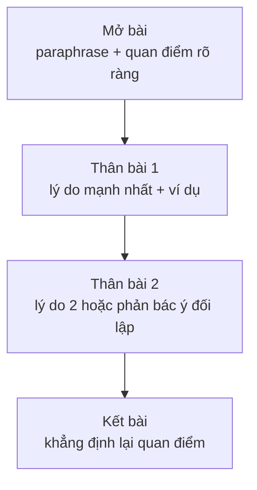

# Bài luận nêu ý kiến (Opinion essay)

<SkillMeta id="viet-14" />

:::info[Mục tiêu]
Viết được **một bài luận khoảng 250 từ, 4 đoạn** trả lời dạng đề *Do you agree or disagree?* / *To what extent do you agree?*, giữ **một quan điểm nhất quán** từ mở bài đến kết bài.
Ngữ pháp trọng tâm: [liên từ & từ nối](/docs/ngu-phap/g24-lien-tu-tu-noi), [câu điều kiện loại 0, 1, 2](/docs/ngu-phap/g20-cau-dieu-kien-loai-0-1-2) (dự đoán hệ quả nếu chính sách được áp dụng) và [đảo ngữ](/docs/ngu-phap/g28-dao-ngu) (*Not only does …, Only by … can …*) để nhấn mạnh lập luận.
Đây là dạng đề phổ biến nhất của IELTS Writing Task 2, đồng thời là dạng bài luận thuyết phục (argumentative essay) ở đại học và thư góp ý chính sách trong công việc.
:::

## 1. Bố cục

| Phần | Nội dung | Độ dài | Ví dụ |
|---|---|---|---|
| Mở bài | Paraphrase đề + nêu rõ mức độ đồng ý | 2 câu, 40–50 từ | *I completely agree that community service should be compulsory for secondary students.* |
| Thân bài 1 | Lý do 1 (mạnh nhất): Point – Explain – Example – Link | 80–90 từ | *The most important benefit is that volunteering teaches young people practical skills.* |
| Thân bài 2 | Lý do 2, **hoặc** nêu quan điểm đối lập rồi phản bác | 80–90 từ | *Some critics argue that students are already too busy; however, …* |
| Kết bài | Nhắc lại quan điểm + tóm tắt 2 lý do | 2 câu, 30–40 từ | *In conclusion, I firmly believe that the benefits of compulsory volunteering outweigh its drawbacks.* |

Mức độ đồng ý có thể là **hoàn toàn đồng ý**, **hoàn toàn phản đối**, hoặc **đồng ý một phần** – nhưng phải rõ ràng ngay từ mở bài và giữ nguyên đến cuối.

## 2. Từ vựng & cụm từ

### Nêu mức độ đồng ý

<VocabList>

| Từ / cụm từ | Phiên âm | Nghĩa | Ví dụ |
|---|---|---|---|
| wholeheartedly agree | /ˌhəʊlˈhɑːtɪdli əˈɡriː/ | hoàn toàn đồng ý | I wholeheartedly agree with this proposal. |
| strongly disagree | /ˈstrɒŋli ˌdɪsəˈɡriː/ | hoàn toàn phản đối | I strongly disagree that zoos should be closed. |
| partly agree | /ˈpɑːtli əˈɡriː/ | đồng ý một phần | I partly agree, but the idea has some limits. |
| to a large extent | /tə ə lɑːdʒ ɪkˈstent/ | ở mức độ lớn | To a large extent, I support this view. |
| be convinced that | /bi kənˈvɪnst ðæt/ | tin chắc rằng | I am convinced that this policy will work. |
| hold the view that | /həʊld ðə vjuː ðæt/ | giữ quan điểm rằng | Many teachers hold the view that exams are necessary. |
| a valid point | /ə ˈvælɪd pɔɪnt/ | một ý hợp lý | Critics raise a valid point about the cost. |

</VocabList>

### Lập luận & phản bác

<VocabList>

| Từ / cụm từ | Phiên âm | Nghĩa | Ví dụ |
|---|---|---|---|
| opponents of | /əˈpəʊnənts əv/ | những người phản đối | Opponents of the plan say it is too expensive. |
| critics claim that | /ˈkrɪtɪks kleɪm ðæt/ | những người chỉ trích cho rằng | Critics claim that the scheme wastes money. |
| admittedly | /ədˈmɪtɪdli/ | phải thừa nhận rằng | Admittedly, the change will take time. |
| nevertheless | /ˌnevəðəˈles/ | tuy nhiên, dù vậy | Nevertheless, the long-term benefits are clear. |
| this argument ignores | /ðɪs ˈɑːɡjumənt ɪɡˈnɔːz/ | lập luận này bỏ qua | This argument ignores the needs of rural students. |
| be outweighed by | /bi ˌaʊtˈweɪd baɪ/ | bị lấn át bởi | The costs are outweighed by the benefits. |
| compelling | /kəmˈpelɪŋ/ | thuyết phục, mạnh mẽ | There is compelling evidence for this claim. |
| far-reaching | /ˌfɑːˈriːtʃɪŋ/ | sâu rộng | The policy has far-reaching effects on society. |

</VocabList>

### Chủ đề: giáo dục & cộng đồng

<VocabList>

| Từ / cụm từ | Phiên âm | Nghĩa | Ví dụ |
|---|---|---|---|
| compulsory | /kəmˈpʌlsəri/ | bắt buộc | Physical education is compulsory in most schools. |
| community service | /kəˈmjuːnəti ˈsɜːvɪs/ | hoạt động phục vụ cộng đồng | Students do community service at weekends. |
| sense of responsibility | /sens əv rɪˌspɒnsəˈbɪləti/ | tinh thần trách nhiệm | Volunteering builds a sense of responsibility. |
| curriculum | /kəˈrɪkjələm/ | chương trình học | The curriculum is already very full. |
| well-rounded | /ˌwel ˈraʊndɪd/ | phát triển toàn diện | Schools should produce well-rounded citizens. |
| academic workload | /ˌækəˈdemɪk ˈwɜːkləʊd/ | khối lượng học tập | Many teenagers struggle with a heavy academic workload. |

</VocabList>

## 3. Mẫu câu & từ nối

| Chức năng | Mẫu câu |
|---|---|
| Mở bài – quan điểm | *I completely agree / disagree that …* · *I agree with this statement to a large extent.* |
| Mở bài – báo trước lý do | *…, mainly because … and …* |
| Lý do 1 | *The most important reason is that …* · *First and foremost, …* |
| Lý do 2 | *Another compelling argument is that …* · *In addition, …* |
| Ví dụ | *For instance, …* · *This is clearly illustrated by …* |
| Điều kiện – dự đoán | *If schools introduced …, students would …* · *If this policy is adopted, … will …* |
| Nêu ý đối lập | *Opponents of this idea argue that …* · *It is sometimes claimed that …* |
| Phản bác | *However, this argument ignores the fact that …* · *Admittedly, …; nevertheless, …* |
| Đảo ngữ nhấn mạnh | *Not only does …, but it also …* · *Only by … can we …* |
| Đảo ngữ tiêu cực | *Never before have …* · *Under no circumstances should …* |
| Kết bài | *In conclusion, I firmly believe that …* · *For the reasons outlined above, …* |

## 4. Bài mẫu

> **Đề bài:** Some people believe that unpaid community service should be a compulsory part of secondary school programmes (for example, working for a charity, improving the neighbourhood or teaching sports to younger children). To what extent do you agree or disagree?

<SpeakText title="Bài mẫu – Compulsory community service at school (≈260 từ)">

In some countries, secondary students are required to spend a certain number of hours doing voluntary work in their local community. I completely agree that this should be a compulsory part of school programmes, mainly because it develops essential life skills and strengthens the bond between young people and society.

The most important reason is that community service teaches practical skills that classrooms cannot. When teenagers organise a charity event or coach younger children, they have to plan, communicate and solve real problems. Not only does this build their confidence, but it also prepares them for the workplace. For instance, many employers say that graduates who have volunteered are better at teamwork than those who have focused only on exams. If schools made such activities compulsory, every student, not just the most active ones, would gain these benefits.

Opponents of this idea argue that students already have a heavy academic workload, so extra duties may harm their grades. Admittedly, time is limited for teenagers. However, this argument ignores the fact that just two or three hours a week is enough to make a difference, and this time can be taken from less useful activities such as scrolling on social media. Moreover, only by helping others directly can young people truly understand the problems that their neighbours face, such as poverty or loneliness among the elderly.

In conclusion, I firmly believe that compulsory community service benefits both students and society. It equips teenagers with valuable skills and a sense of responsibility, and these advantages far outweigh the small amount of time it requires.

Bản dịch

Ở một số quốc gia, học sinh trung học phải dành một số giờ nhất định làm công việc tình nguyện tại cộng đồng địa phương. Tôi hoàn toàn đồng ý rằng điều này nên là một phần bắt buộc trong chương trình học, chủ yếu vì nó phát triển các kỹ năng sống thiết yếu và tăng cường sự gắn kết giữa người trẻ với xã hội.

Lý do quan trọng nhất là hoạt động phục vụ cộng đồng dạy những kỹ năng thực tế mà lớp học không thể dạy. Khi thanh thiếu niên tổ chức một sự kiện từ thiện hay huấn luyện các em nhỏ hơn, các em phải lên kế hoạch, giao tiếp và giải quyết vấn đề thật. Điều này không chỉ xây dựng sự tự tin mà còn chuẩn bị cho các em bước vào môi trường làm việc. Ví dụ, nhiều nhà tuyển dụng cho biết những sinh viên tốt nghiệp từng làm tình nguyện làm việc nhóm tốt hơn những người chỉ tập trung vào thi cử. Nếu nhà trường bắt buộc các hoạt động này, mọi học sinh – chứ không chỉ những em năng động nhất – đều sẽ được hưởng những lợi ích đó.

Những người phản đối ý kiến này cho rằng học sinh vốn đã có khối lượng học tập nặng nề, nên nhiệm vụ thêm có thể ảnh hưởng đến điểm số. Phải thừa nhận rằng thời gian của thanh thiếu niên có hạn. Tuy nhiên, lập luận này bỏ qua thực tế rằng chỉ hai hoặc ba giờ mỗi tuần là đủ để tạo ra khác biệt, và thời gian này có thể lấy từ những hoạt động ít hữu ích hơn như lướt mạng xã hội. Hơn nữa, chỉ khi trực tiếp giúp đỡ người khác, người trẻ mới thực sự hiểu được những khó khăn mà hàng xóm của mình gặp phải, như nghèo đói hay sự cô đơn ở người cao tuổi.

Tóm lại, tôi tin chắc rằng hoạt động phục vụ cộng đồng bắt buộc mang lại lợi ích cho cả học sinh và xã hội. Nó trang bị cho thanh thiếu niên những kỹ năng quý giá và tinh thần trách nhiệm, và những lợi ích này vượt xa lượng thời gian nhỏ mà nó đòi hỏi.

</SpeakText>

:::note[Phân tích bài mẫu]
| Phần | Câu trong bài |
|---|---|
| Mở bài | *In some countries, … I completely agree that …, mainly because …* – paraphrase + quan điểm + báo trước 2 lý do |
| Thân bài 1 – Point | *The most important reason is that community service teaches practical skills that classrooms cannot.* |
| Thân bài 1 – Explain / Example | *Not only does this build their confidence, but it also …* – **đảo ngữ**; *For instance, many employers say …* |
| Thân bài 1 – Link | *If schools made such activities compulsory, every student … would gain …* – **điều kiện loại 2** |
| Thân bài 2 – ý đối lập | *Opponents of this idea argue that … Admittedly, …* |
| Thân bài 2 – phản bác | *However, this argument ignores the fact that … only by helping others directly can young people …* – **đảo ngữ Only by** |
| Kết bài | *In conclusion, I firmly believe that … far outweigh …* |
:::

## 5. Đề bài luyện tập

1. **(Dễ)** Some people think that all students should learn to cook at school. Do you agree or disagree?
   

   
Gợi ý dàn ý

   Mở bài: paraphrase + hoàn toàn đồng ý (sức khỏe, tự lập) → Thân bài 1: ăn uống lành mạnh hơn, ít đồ ăn nhanh (ví dụ: học sinh Nhật Bản học nấu ăn từ tiểu học) → Thân bài 2: kỹ năng sống tự lập khi đi học xa nhà; câu điều kiện *If students learned …, they would …* → Kết bài: nhắc lại quan điểm + tóm tắt 2 lý do.

   

2. **(Dễ)** Some people believe that watching television is a waste of time for children. Do you agree or disagree?
3. **(Trung bình)** Many companies now monitor their employees' computer use at work. Do you think this is acceptable?
4. **(Trung bình)** Some people say that it is more important to protect the environment than to develop the economy. To what extent do you agree?
5. **(Khó)** Artificial intelligence will soon replace teachers in most classrooms, so governments should reduce spending on teacher training. To what extent do you agree or disagree?

## 6. Lỗi thường gặp

| ❌ Sai | ✅ Đúng | Giải thích |
|---|---|---|
| Mở bài đồng ý, kết bài lại nói "both sides have advantages" | Giữ **một quan điểm** từ đầu đến cuối | Quan điểm không nhất quán bị trừ điểm Task Response |
| Not only it builds confidence, but also … | Not only **does it build** confidence, but it also … | *Not only* đầu câu → đảo trợ động từ lên trước chủ ngữ |
| Only by volunteering young people can understand … | Only by volunteering **can young people** understand … | *Only by …* đầu câu → đảo ngữ |
| If schools make it compulsory, students would benefit. | If schools **made** it compulsory, students would benefit. | Câu điều kiện loại 2: quá khứ đơn + *would* |
| Everybody knows that volunteering is good. | **Research suggests** that volunteering is beneficial. | Tránh khái quát cảm tính; dùng dẫn chứng |
| I think … I think … I think … | *I firmly believe … / In my view … / I am convinced …* | Đa dạng cách nêu quan điểm |

## 7. Checklist tự sửa

- [ ] Mở bài có quan điểm **rõ ràng** (đồng ý / phản đối / một phần) và báo trước lý do.
- [ ] Hai đoạn thân bài đều **ủng hộ quan điểm** đó (đoạn 2 có thể phản bác ý đối lập).
- [ ] Mỗi đoạn thân bài có câu chủ đề, giải thích và **ví dụ cụ thể**.
- [ ] Dùng ít nhất 1 câu điều kiện và 1 cấu trúc đảo ngữ đúng ngữ pháp.
- [ ] Kết bài nhắc lại **cùng quan điểm** với mở bài, không thêm ý mới.
- [ ] Khoảng 250–280 từ, 4 đoạn; không viết tắt, không dùng *I think* quá 2 lần.
