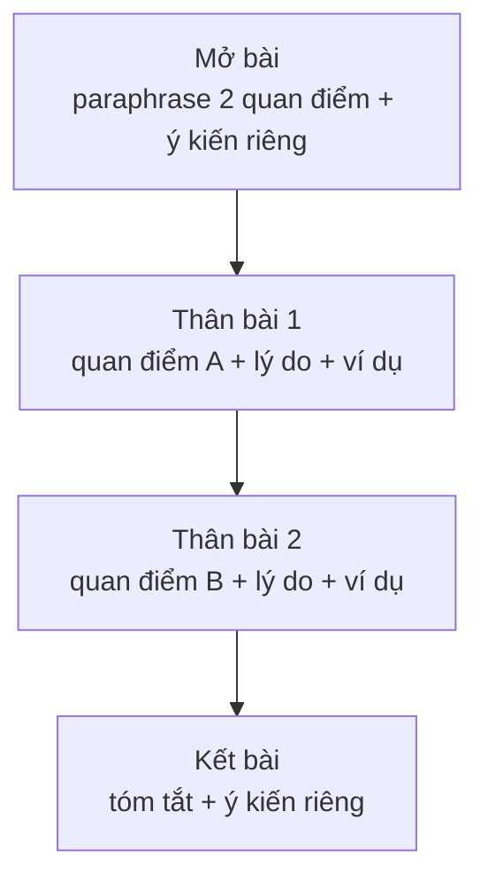

# Bài luận thảo luận hai quan điểm (Discussion essay)

<SkillMeta id="viet-15" />

:::info[Mục tiêu]
Viết được **một bài luận khoảng 250 từ, 4 đoạn** cho dạng đề *Discuss both views and give your opinion*: trình bày **công bằng** quan điểm A, quan điểm B, rồi nêu **ý kiến riêng** rõ ràng.
Ngữ pháp trọng tâm: [liên từ & từ nối](/docs/ngu-phap/g24-lien-tu-tu-noi) chỉ đối lập (*on the one hand, on the other hand, whereas*), [mệnh đề quan hệ](/docs/ngu-phap/g22-menh-de-quan-he) (*those who …, graduates who …*) và [câu bị động](/docs/ngu-phap/g19-cau-bi-dong) (*It is argued that …, … is often seen as …*) để trình bày ý kiến người khác một cách khách quan.
Dạng đề này rất thường gặp trong IELTS Writing Task 2, bài luận phân tích ở đại học và các báo cáo so sánh phương án trước khi ra quyết định trong công việc.
:::

## 1. Bố cục

| Phần | Nội dung | Độ dài | Ví dụ |
|---|---|---|---|
| Mở bài | Paraphrase **cả hai** quan điểm + nêu ý kiến của mình | 2–3 câu, 40–50 từ | *While some believe universities should train students for jobs, others feel they should focus on knowledge itself. In my view, both goals matter, but …* |
| Thân bài 1 | Quan điểm A: lý do + ví dụ (viết khách quan) | 80–90 từ | *On the one hand, it is argued that practical training helps graduates find work quickly.* |
| Thân bài 2 | Quan điểm B: lý do + ví dụ; có thể lồng ý kiến riêng | 80–90 từ | *On the other hand, those who value academic knowledge point out that …* |
| Kết bài | Tóm tắt hai quan điểm + khẳng định ý kiến riêng | 2 câu, 30–40 từ | *In conclusion, although job skills are important, I believe …* |

Ý kiến riêng phải xuất hiện ở **mở bài** và **kết bài** (và có thể ở cuối đoạn thân bài mà bạn ủng hộ).

## 2. Từ vựng & cụm từ

### Trình bày quan điểm của người khác

<VocabList>

| Từ / cụm từ | Phiên âm | Nghĩa | Ví dụ |
|---|---|---|---|
| it is argued that | /ɪt ɪz ˈɑːɡjuːd ðæt/ | có ý kiến cho rằng | It is argued that tourism damages local culture. |
| it is often claimed that | /ɪt ɪz ˈɒfn kleɪmd ðæt/ | người ta thường cho rằng | It is often claimed that city life is stressful. |
| supporters of | /səˈpɔːtəz əv/ | những người ủng hộ | Supporters of online learning praise its flexibility. |
| those who | /ðəʊz huː/ | những người mà | Those who oppose the idea worry about the cost. |
| be seen as | /bi siːn æz/ | được xem là | English is seen as a key skill for many jobs. |
| from this perspective | /frɒm ðɪs pəˈspektɪv/ | từ góc nhìn này | From this perspective, the policy seems fair. |
| proponents | /prəˈpəʊnənts/ | người đề xướng, ủng hộ | Proponents say the scheme will create jobs. |
| advocate | /ˈædvəkeɪt/ | ủng hộ, chủ trương | Many doctors advocate a plant-based diet. |

</VocabList>

### Đối lập & nêu ý kiến riêng

<VocabList>

| Từ / cụm từ | Phiên âm | Nghĩa | Ví dụ |
|---|---|---|---|
| on the one hand | /ɒn ðə wʌn hænd/ | một mặt | On the one hand, cars are convenient. |
| on the other hand | /ɒn ði ˈʌðə hænd/ | mặt khác | On the other hand, they cause pollution. |
| by contrast | /baɪ ˈkɒntrɑːst/ | ngược lại | By contrast, trains produce far less carbon. |
| personally | /ˈpɜːsənəli/ | cá nhân tôi | Personally, I prefer the second option. |
| I side with | /aɪ saɪd wɪð/ | tôi đứng về phía | I side with those who support free healthcare. |
| strike a balance | /straɪk ə ˈbæləns/ | cân bằng | Schools must strike a balance between theory and practice. |
| both views have merit | /bəʊθ vjuːz hæv ˈmerɪt/ | cả hai quan điểm đều có lý | Both views have merit, but the second is stronger. |

</VocabList>

### Chủ đề: đại học & việc làm

<VocabList>

| Từ / cụm từ | Phiên âm | Nghĩa | Ví dụ |
|---|---|---|---|
| employability | /ɪmˌplɔɪəˈbɪləti/ | khả năng được tuyển dụng | Internships improve students' employability. |
| vocational | /vəʊˈkeɪʃənl/ | thuộc nghề nghiệp | Vocational courses teach specific trades. |
| critical thinking | /ˈkrɪtɪkl ˈθɪŋkɪŋ/ | tư duy phản biện | Philosophy develops critical thinking. |
| job market | /dʒɒb ˈmɑːkɪt/ | thị trường việc làm | The job market changes very quickly. |
| graduate | /ˈɡrædʒuət/ | người tốt nghiệp | Many graduates struggle to find work. |
| outdated | /ˌaʊtˈdeɪtɪd/ | lỗi thời | Some technical skills become outdated within years. |
| pursue knowledge | /pəˈsjuː ˈnɒlɪdʒ/ | theo đuổi tri thức | Universities allow students to pursue knowledge freely. |

</VocabList>

## 3. Mẫu câu & từ nối

| Chức năng | Mẫu câu |
|---|---|
| Mở bài – hai quan điểm | *While some people believe that …, others argue that …* |
| Mở bài – ý kiến riêng | *This essay will discuss both views, but I believe that …* |
| Giới thiệu quan điểm A | *On the one hand, it is argued that …* · *Supporters of … claim that …* |
| Giới thiệu quan điểm B | *On the other hand, those who … point out that …* |
| Bị động khách quan | *It is widely believed that …* · *… is often seen as …* · *… is considered to be …* |
| Mệnh đề quan hệ | *Those who …* · *Graduates who …* · *…, which is why …* |
| Giải thích | *Their main reason is that …* · *This is because …* |
| Ví dụ | *For example, …* · *This can be seen in …* |
| Đối lập trong câu | *…, whereas …* · *Although …, …* |
| Nêu ý kiến riêng | *Personally, I side with …* · *In my opinion, the second view is more convincing because …* |
| Kết bài | *In conclusion, while …, I believe …* · *To sum up, both views have merit, but …* |

## 4. Bài mẫu

> **Đề bài:** Some people believe that the main purpose of university is to prepare students for employment. Others think universities should give students access to knowledge for its own sake. Discuss both views and give your own opinion.

<SpeakText title="Bài mẫu – The purpose of university (≈250 từ)">

Opinions differ on what universities are really for. While some people believe that higher education should mainly prepare young people for the job market, others argue that its true purpose is to pass on knowledge for its own sake. This essay will discuss both views, but I believe that universities should do both.

On the one hand, it is argued that a degree is, above all, a pathway to employment. Students often borrow large sums of money to pay for their studies, so they reasonably expect to find a good job afterwards. From this perspective, courses which include internships and practical projects are more valuable than purely theoretical ones. For example, engineering programmes that are run in partnership with local companies are often praised because their graduates are hired quickly.

On the other hand, those who support a broader view of education point out that specific job skills can become outdated within a few years. In contrast, subjects such as history, philosophy and science teach critical thinking, which is useful in any career. Furthermore, many major discoveries were made by researchers who were simply curious, not by people trying to meet the needs of employers. If universities focused only on employability, this spirit of discovery could be lost.

In conclusion, although preparing students for work is clearly important, universities should not be seen merely as training centres. In my opinion, the best institutions strike a balance, giving students practical skills while also encouraging them to pursue knowledge for its own sake.

Bản dịch

Mọi người có những ý kiến khác nhau về mục đích thực sự của đại học. Trong khi một số người cho rằng giáo dục đại học chủ yếu nên chuẩn bị cho người trẻ bước vào thị trường việc làm, những người khác lại cho rằng mục đích thật sự của nó là truyền đạt tri thức vì chính giá trị của tri thức. Bài luận này sẽ thảo luận cả hai quan điểm, nhưng tôi tin rằng đại học nên làm được cả hai điều.

Một mặt, có ý kiến cho rằng tấm bằng trước hết là con đường dẫn đến việc làm. Sinh viên thường vay những khoản tiền lớn để trang trải việc học, nên họ có lý do chính đáng để mong đợi tìm được việc tốt sau đó. Từ góc nhìn này, những khóa học có thực tập và dự án thực tế có giá trị hơn những khóa thuần lý thuyết. Ví dụ, các chương trình kỹ thuật được tổ chức hợp tác với doanh nghiệp địa phương thường được đánh giá cao vì sinh viên tốt nghiệp nhanh chóng được tuyển dụng.

Mặt khác, những người ủng hộ một quan niệm giáo dục rộng hơn chỉ ra rằng các kỹ năng nghề cụ thể có thể trở nên lỗi thời chỉ sau vài năm. Ngược lại, những môn như lịch sử, triết học và khoa học rèn luyện tư duy phản biện, vốn hữu ích trong bất kỳ nghề nghiệp nào. Hơn nữa, nhiều khám phá lớn được thực hiện bởi những nhà nghiên cứu chỉ đơn giản là tò mò, chứ không phải bởi những người cố gắng đáp ứng nhu cầu của nhà tuyển dụng. Nếu các trường đại học chỉ tập trung vào khả năng được tuyển dụng, tinh thần khám phá này có thể bị mất đi.

Tóm lại, dù việc chuẩn bị cho sinh viên đi làm rõ ràng là quan trọng, đại học không nên chỉ được xem như những trung tâm đào tạo nghề. Theo tôi, những trường tốt nhất là những trường biết cân bằng: trang bị kỹ năng thực tế cho sinh viên đồng thời khuyến khích họ theo đuổi tri thức vì chính tri thức.

</SpeakText>

:::note[Phân tích bài mẫu]
| Phần | Câu trong bài |
|---|---|
| Mở bài | *While some people believe that …, others argue that … This essay will discuss both views, but I believe …* – hai quan điểm + ý kiến riêng |
| Thân bài 1 – quan điểm A | *On the one hand, it is argued that …* – **bị động khách quan** |
| Thân bài 1 – ví dụ | *courses which include …* · *programmes that are run in partnership … are often praised …* – **MĐ quan hệ + bị động** |
| Thân bài 2 – quan điểm B | *On the other hand, those who support … point out that …* – **those who** |
| Thân bài 2 – lý do + giả định | *… critical thinking, which is useful … If universities focused only on …, … could be lost.* |
| Kết bài | *In conclusion, although … should not be seen merely as … In my opinion, …* – nhắc lại ý kiến riêng |
:::

## 5. Đề bài luyện tập

1. **(Dễ)** Some people think children should have a lot of free time to play. Others believe they should spend most of their time on schoolwork and extra classes. Discuss both views and give your opinion.
   

   
Gợi ý dàn ý

   Mở bài: paraphrase 2 quan điểm + ý kiến riêng (cần cân bằng, nghiêng về vui chơi) → Thân bài 1: học thêm nhiều giúp điểm cao, cạnh tranh vào trường tốt (ví dụ: kỳ thi vào lớp 10) → Thân bài 2: vui chơi phát triển sức khỏe, sáng tạo, kỹ năng xã hội; trẻ học quá nhiều dễ căng thẳng → Kết bài: tóm tắt + khẳng định cần cân bằng.

   

2. **(Dễ)** Some people prefer to live in a house, while others prefer an apartment. Discuss both views and give your opinion.
3. **(Trung bình)** Some people believe that governments should spend money on public transport, while others think building more roads is a better solution. Discuss both views and give your opinion.
4. **(Trung bình)** Some people think that young people should be free to choose their own careers. Others believe parents should help decide. Discuss both views and give your opinion.
5. **(Khó)** Some argue that space exploration is a waste of money that should be spent on problems on Earth, while others believe it brings important benefits to humanity. Discuss both views and give your own opinion.

## 6. Lỗi thường gặp

| ❌ Sai | ✅ Đúng | Giải thích |
|---|---|---|
| Chỉ thảo luận hai quan điểm, không nêu ý kiến riêng | Nêu ý kiến ở **mở bài và kết bài** | Đề yêu cầu *give your own opinion* – thiếu bị trừ điểm nặng |
| It is argue that degrees lead to jobs. | It is **argued** that degrees lead to jobs. | Bị động: *be* + V3 |
| People who they support this view … | People who support this view … | Sau *who* không lặp lại chủ ngữ *they* |
| On the other hand, I also agree with the first view. | **Moreover,** I agree with the first view. | *On the other hand* chỉ dùng khi chuyển sang ý đối lập |
| Many discoveries made by curious researchers. | Many discoveries **were made** by curious researchers. | Câu bị động thiếu động từ *be* |
| Viết đoạn thân bài 1 dài 150 từ, đoạn 2 chỉ 40 từ | Hai đoạn thân bài **cân đối** (80–90 từ mỗi đoạn) | Thảo luận phải công bằng cho cả hai phía |

## 7. Checklist tự sửa

- [ ] Mở bài paraphrase **cả hai** quan điểm và nêu **ý kiến riêng**.
- [ ] Mỗi đoạn thân bài chỉ trình bày **một quan điểm**, có lý do và ví dụ.
- [ ] Hai đoạn thân bài có độ dài **cân đối**.
- [ ] Dùng ít nhất 2 câu bị động (*it is argued that, … is seen as*) và 2 mệnh đề quan hệ.
- [ ] Kết bài nhắc lại ý kiến riêng **thống nhất** với mở bài.
- [ ] Khoảng 250–280 từ; từ nối đối lập dùng đúng chỗ (*on the one hand / on the other hand*).
