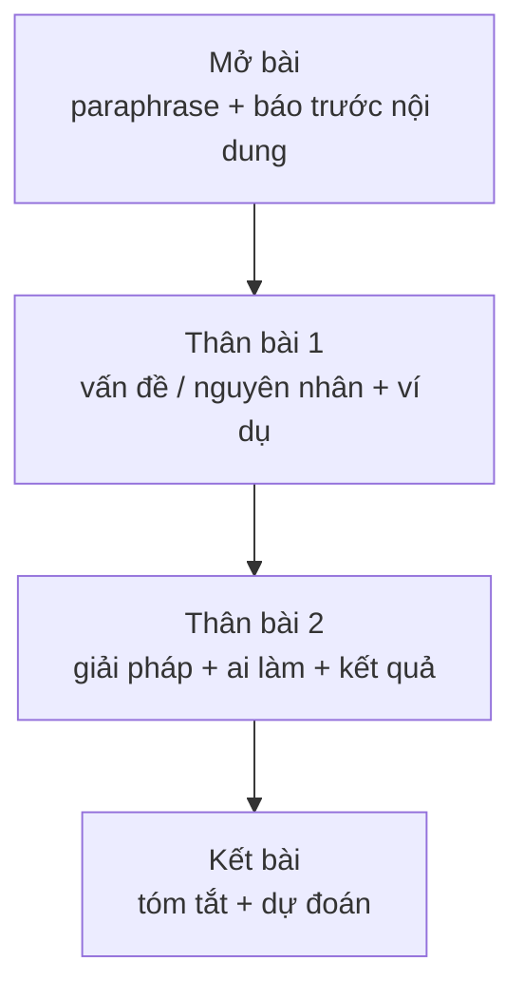

# Bài luận vấn đề – giải pháp (Problem–solution essay)

<SkillMeta id="viet-16" />

:::info[Mục tiêu]
Viết được **một bài luận khoảng 250 từ, 4 đoạn** cho dạng đề *What problems does this cause? What solutions can you suggest?* (hoặc *causes – solutions*): phân tích **vấn đề / nguyên nhân** rồi đề xuất **giải pháp khả thi**, mỗi giải pháp gắn với một vấn đề cụ thể.
Ngữ pháp trọng tâm: [câu điều kiện loại 0, 1, 2](/docs/ngu-phap/g20-cau-dieu-kien-loai-0-1-2) (dự đoán kết quả của giải pháp), [động từ khuyết thiếu](/docs/ngu-phap/g11-dong-tu-khuyet-thieu) (*should, could, must*) để đề xuất và [câu bị động](/docs/ngu-phap/g19-cau-bi-dong) (*measures should be taken, a tax could be introduced*).
Dạng bài này gặp trong IELTS Writing Task 2, bài luận chính sách ở đại học và các báo cáo đề xuất cải tiến trong công việc.
:::

## 1. Bố cục

| Phần | Nội dung | Độ dài | Ví dụ |
|---|---|---|---|
| Mở bài | Paraphrase vấn đề + báo trước nội dung (vấn đề và giải pháp) | 2 câu, 40–50 từ | *Childhood obesity has become a serious concern in many countries. This essay will examine the main problems it causes and suggest some solutions.* |
| Thân bài 1 – Vấn đề | 1–2 vấn đề / nguyên nhân chính + giải thích + ví dụ | 80–90 từ | *The most serious problem is the long-term damage to children's health.* |
| Thân bài 2 – Giải pháp | 1–2 giải pháp tương ứng + ai thực hiện + kết quả dự kiến | 80–90 từ | *To tackle this issue, governments should introduce a tax on sugary drinks.* |
| Kết bài | Tóm tắt vấn đề và giải pháp + lời kêu gọi / dự đoán | 2 câu, 30–40 từ | *If these measures are taken, the next generation will be much healthier.* |

## 2. Từ vựng & cụm từ

### Nêu vấn đề

<VocabList>

| Từ / cụm từ | Phiên âm | Nghĩa | Ví dụ |
|---|---|---|---|
| a growing concern | /ə ˈɡrəʊɪŋ kənˈsɜːn/ | mối lo ngại ngày càng tăng | Air pollution is a growing concern in Asian cities. |
| pose a threat to | /pəʊz ə θret tə/ | gây mối đe dọa cho | Rising sea levels pose a threat to coastal towns. |
| put pressure on | /pʊt ˈpreʃər ɒn/ | gây áp lực lên | An ageing population puts pressure on hospitals. |
| have a detrimental effect on | /hæv ə ˌdetrɪˈmentl ɪˈfekt ɒn/ | có tác hại đến | Junk food has a detrimental effect on health. |
| root cause | /ruːt kɔːz/ | nguyên nhân gốc rễ | Poverty is often the root cause of crime. |
| be exacerbated by | /bi ɪɡˈzæsəbeɪtɪd baɪ/ | trở nên trầm trọng hơn bởi | The problem is exacerbated by poor planning. |
| widespread | /ˈwaɪdspred/ | lan rộng, phổ biến | Smartphone addiction is widespread among teenagers. |

</VocabList>

### Đề xuất giải pháp

<VocabList>

| Từ / cụm từ | Phiên âm | Nghĩa | Ví dụ |
|---|---|---|---|
| tackle | /ˈtækl/ | giải quyết, xử lý | The city must tackle its waste problem. |
| address the issue | /əˈdres ði ˈɪʃuː/ | giải quyết vấn đề | Schools need to address the issue of bullying. |
| take measures | /teɪk ˈmeʒəz/ | thực hiện biện pháp | Urgent measures must be taken to save water. |
| introduce a law | /ˌɪntrəˈdjuːs ə lɔː/ | ban hành luật | The government introduced a law banning plastic bags. |
| raise awareness of | /reɪz əˈweənəs əv/ | nâng cao nhận thức về | Campaigns can raise awareness of healthy eating. |
| impose a tax on | /ɪmˈpəʊz ə tæks ɒn/ | đánh thuế lên | Several countries impose a tax on sugary drinks. |
| provide incentives | /prəˈvaɪd ɪnˈsentɪvz/ | đưa ra ưu đãi, khuyến khích | Firms could provide incentives for staff to cycle. |
| effective | /ɪˈfektɪv/ | hiệu quả | The most effective solution is education. |

</VocabList>

### Chủ đề: sức khỏe trẻ em

<VocabList>

| Từ / cụm từ | Phiên âm | Nghĩa | Ví dụ |
|---|---|---|---|
| obesity | /əʊˈbiːsəti/ | béo phì | Obesity rates have doubled in ten years. |
| processed food | /ˈprəʊsest fuːd/ | thực phẩm chế biến sẵn | Processed food is often high in salt. |
| physical activity | /ˈfɪzɪkl ækˈtɪvəti/ | vận động thể chất | Children need an hour of physical activity a day. |
| diabetes | /ˌdaɪəˈbiːtiːz/ | bệnh tiểu đường | Type 2 diabetes is increasing among teenagers. |
| self-esteem | /ˌself ɪˈstiːm/ | lòng tự trọng, tự tin | Bullying can damage a child's self-esteem. |
| screen time | /skriːn taɪm/ | thời gian dùng thiết bị điện tử | Doctors recommend limiting screen time. |

</VocabList>

## 3. Mẫu câu & từ nối

| Chức năng | Mẫu câu |
|---|---|
| Mở bài | *… has become a growing concern in …* · *This essay will examine … and propose …* |
| Vấn đề chính | *The most serious problem is that …* · *One major consequence of … is …* |
| Vấn đề thứ hai | *Another issue is that …* · *In addition, … puts pressure on …* |
| Nguyên nhân | *This is largely due to …* · *The root cause of this is …* |
| Giới thiệu giải pháp | *To tackle this problem, …* · *One possible solution would be to …* |
| Đề xuất (chủ động) | *Governments should / could / must …* |
| Đề xuất (bị động) | *Stricter rules should be introduced.* · *Measures must be taken to …* |
| Kết quả của giải pháp (loại 1) | *If schools offer …, children will …* |
| Kết quả giả định (loại 2) | *If junk food were more expensive, fewer families would buy it.* |
| Mục đích | *… in order to / so that …* |
| Kết bài | *In conclusion, … can be solved if …* · *Only through the combined efforts of … can …* |

## 4. Bài mẫu

> **Đề bài:** In many countries, the number of overweight children is increasing. What problems does this cause, and what measures could be taken to solve them?

<SpeakText title="Bài mẫu – Childhood obesity: problems and solutions (≈255 từ)">

In recent decades, childhood obesity has become a growing concern in both developed and developing countries. This essay will examine the main problems caused by this trend and suggest some practical measures that could be taken by governments and schools.

The most serious problem is the long-term damage to children's physical health. Overweight children are far more likely to develop diabetes and heart disease as adults, which puts enormous pressure on public health systems. In the UK, for example, treating obesity-related illnesses costs the National Health Service billions of pounds every year. Another issue is the effect on young people's mental well-being. Children who are overweight are often bullied at school, and this can damage their self-esteem and lead to anxiety or depression.

To tackle these problems, governments should use the tax system to make unhealthy food less attractive. If a tax were imposed on sugary drinks and snacks, fewer families would buy them, and the money raised could be used to fund sports programmes. In addition, schools must play a more active role. Healthy lunches should be provided at a low price, and at least one hour of physical activity ought to be included in the daily timetable. If children learn to enjoy exercise at a young age, they will probably stay active for the rest of their lives.

In conclusion, childhood obesity harms both the physical and mental health of young people and places a heavy burden on society. However, if governments and schools work together, this problem can be significantly reduced.

Bản dịch

Trong những thập kỷ gần đây, béo phì ở trẻ em đã trở thành mối lo ngại ngày càng tăng ở cả các nước phát triển lẫn đang phát triển. Bài luận này sẽ xem xét những vấn đề chính mà xu hướng này gây ra và đề xuất một số biện pháp thiết thực mà chính phủ và nhà trường có thể thực hiện.

Vấn đề nghiêm trọng nhất là tổn hại lâu dài đến sức khỏe thể chất của trẻ. Trẻ thừa cân có nguy cơ mắc tiểu đường và bệnh tim khi trưởng thành cao hơn nhiều, điều này gây áp lực rất lớn lên hệ thống y tế công. Ví dụ, ở Anh, việc điều trị các bệnh liên quan đến béo phì tiêu tốn của Dịch vụ Y tế Quốc gia hàng tỷ bảng mỗi năm. Một vấn đề khác là ảnh hưởng đến sức khỏe tinh thần của người trẻ. Trẻ thừa cân thường bị bắt nạt ở trường, và điều này có thể làm tổn thương lòng tự trọng, dẫn đến lo âu hoặc trầm cảm.

Để giải quyết những vấn đề này, chính phủ nên dùng chính sách thuế để khiến đồ ăn không lành mạnh kém hấp dẫn hơn. Nếu đồ uống có đường và đồ ăn vặt bị đánh thuế, sẽ ít gia đình mua chúng hơn, và số tiền thu được có thể dùng để tài trợ các chương trình thể thao. Bên cạnh đó, nhà trường phải đóng vai trò tích cực hơn. Bữa trưa lành mạnh nên được cung cấp với giá thấp, và ít nhất một giờ vận động thể chất nên được đưa vào thời khóa biểu hằng ngày. Nếu trẻ học được cách yêu thích vận động từ nhỏ, các em có lẽ sẽ duy trì lối sống năng động suốt đời.

Tóm lại, béo phì ở trẻ em gây hại cho cả sức khỏe thể chất lẫn tinh thần của người trẻ và tạo gánh nặng lớn cho xã hội. Tuy nhiên, nếu chính phủ và nhà trường phối hợp với nhau, vấn đề này có thể được giảm thiểu đáng kể.

</SpeakText>

:::note[Phân tích bài mẫu]
| Phần | Câu trong bài |
|---|---|
| Mở bài | *In recent decades, … has become a growing concern … This essay will examine … and suggest …* |
| Vấn đề 1 + ví dụ | *The most serious problem is … which puts enormous pressure on … In the UK, for example, …* |
| Vấn đề 2 | *Another issue is the effect on young people's mental well-being. Children who are overweight are often bullied …* – **bị động** |
| Giải pháp 1 + kết quả | *governments should use … If a tax were imposed on …, fewer families would buy them …* – **should + điều kiện loại 2 bị động** |
| Giải pháp 2 | *schools must play … Healthy lunches should be provided … ought to be included …* – **modal + bị động** |
| Kết quả dài hạn | *If children learn to enjoy exercise …, they will probably stay active …* – **điều kiện loại 1** |
| Kết bài | *In conclusion, … However, if governments and schools work together, this problem can be significantly reduced.* |
:::

## 5. Đề bài luyện tập

1. **(Dễ)** Many students find it difficult to concentrate in class. What are the causes, and what can be done to help them?
   

   
Gợi ý dàn ý

   Mở bài: paraphrase + báo trước (nguyên nhân và giải pháp) → Thân bài 1: thiếu ngủ vì dùng điện thoại khuya; bài giảng một chiều, thiếu tương tác → Thân bài 2: nhà trường cấm điện thoại trong giờ học, giáo viên dùng hoạt động nhóm; *If lessons were more interactive, students would …* → Kết bài: tóm tắt + dự đoán kết quả.

   

2. **(Dễ)** In many cities, there is not enough space for parking. What problems does this cause, and how can they be solved?
3. **(Trung bình)** More and more people feel lonely, even though they live in big cities. Why is this happening, and what can be done about it?
4. **(Trung bình)** Many young graduates cannot find a job that matches their qualifications. What are the causes of this problem, and what solutions can you suggest?
5. **(Khó)** The amount of food wasted by households and restaurants is increasing. What problems does this cause for the environment and the economy, and what measures should governments and individuals take?

## 6. Lỗi thường gặp

| ❌ Sai | ✅ Đúng | Giải thích |
|---|---|---|
| Giải pháp không liên quan đến vấn đề đã nêu | Mỗi giải pháp **trả lời trực tiếp** một vấn đề ở thân bài 1 | Giám khảo đánh giá tính logic giữa vấn đề và giải pháp |
| The government should to ban junk food. | The government **should ban** junk food. | Sau modal → động từ nguyên mẫu không *to* |
| Measures must take to reduce obesity. | Measures must **be taken** to reduce obesity. | Chủ ngữ là *measures* → bị động *must be taken* |
| If a tax is imposed, fewer people would buy it. | If a tax **were** imposed, fewer people **would** buy it. / If a tax **is** imposed, fewer people **will** buy it. | Không trộn loại 1 và loại 2 |
| The solution is people should exercise. | One solution is **for people to exercise** more. / One solution is **that** people should exercise more. | Cần *that* hoặc cấu trúc *for + O + to V* |
| We must solve this problem immediately! | **It is essential that** this problem is addressed urgently. | Văn học thuật: tránh dấu chấm than và giọng ra lệnh |

## 7. Checklist tự sửa

- [ ] Mở bài paraphrase vấn đề và **báo trước** bài sẽ bàn về vấn đề và giải pháp.
- [ ] Thân bài 1 nêu 1–2 vấn đề / nguyên nhân, có **giải thích và ví dụ**.
- [ ] Thân bài 2 đưa ra giải pháp **tương ứng**, nói rõ **ai thực hiện** và **kết quả dự kiến**.
- [ ] Dùng ít nhất 2 câu điều kiện (loại 1 hoặc 2) không trộn thì.
- [ ] Dùng *should / could / must* kết hợp **bị động** (*should be introduced*) ít nhất 2 lần.
- [ ] Kết bài tóm tắt, không thêm giải pháp mới; khoảng 250–280 từ.
