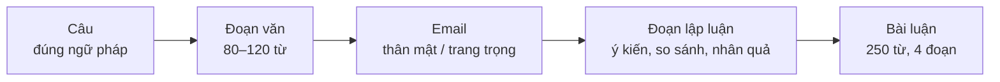

# Lộ trình luyện viết (Writing)

**16 chủ đề · 4 giai đoạn · đi từ câu → đoạn văn → email → bài luận.**

Viết là kỹ năng xây theo tầng: câu đúng là nền của đoạn văn, đoạn văn tốt là nền của bài luận.
Vì vậy lộ trình được sắp xếp theo **độ dài và độ phức tạp của văn bản**, mỗi giai đoạn dùng lại kỹ năng của giai đoạn trước.

<SkillRoadmap skill="viet" />

## Mỗi trang chủ đề gồm

| Mục | Dùng để |
|---|---|
| 1. Bố cục | Khung dàn ý – biết viết gì ở đâu |
| 2. Từ vựng & cụm từ | Từ vựng theo chủ đề và theo chức năng, bấm 🔊 để nghe |
| 3. Mẫu câu & từ nối | Khung câu dùng ngay trong bài |
| 4. Bài mẫu | Bài viết mẫu có phân tích và bản dịch |
| 5. Đề bài luyện tập | Đề từ dễ đến khó, đề đầu tiên có gợi ý dàn ý |
| 6. Lỗi thường gặp | Bảng ❌ Sai / ✅ Đúng |
| 7. Checklist tự sửa | Kiểm tra trước khi coi là xong |

## Nên học khi nào?

| Cách học | Gợi ý |
|---|---|
| **Song song với ngữ pháp** | Mỗi khi học xong vài chủ đề ngữ pháp, làm 4 chủ đề viết của giai đoạn tương ứng (khoảng 15' mỗi buổi). |
| **Sau khóa ngữ pháp** | Mỗi chủ đề 2 buổi × 45 phút: buổi 1 học bố cục + bài mẫu, buổi 2 viết đề luyện tập và tự sửa. |

Trước khi bắt đầu, đọc [Phương pháp luyện viết](./phuong-phap.mdx).
