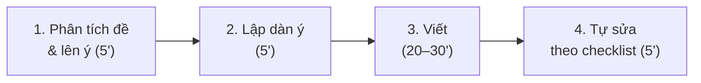

# Phương pháp luyện viết

## Quy trình 4 bước cho mỗi bài

| Bước | Làm gì |
|---|---|
| 1. Phân tích đề | Gạch chân: **viết cho ai**, **mục đích gì**, **giọng văn** (thân mật / trang trọng), **số từ**, các ý bắt buộc. Viết nhanh 5–8 ý bằng từ khóa. |
| 2. Dàn ý | Chọn 2–3 ý mạnh nhất, sắp xếp theo bố cục của dạng bài. Mỗi ý chính có **1 ví dụ / chi tiết**. |
| 3. Viết | Viết câu chủ đề trước, sau đó triển khai. Dùng từ nối để các câu "dính" vào nhau. |
| 4. Tự sửa | Đọc lại 2 lần: lần 1 kiểm tra **ý & bố cục**, lần 2 kiểm tra **ngữ pháp & chính tả** theo checklist dưới đây. |

## Cấu trúc một đoạn văn (T-E-E-C)

| Phần | Vai trò | Ví dụ |
|---|---|---|
| **T**opic sentence | Câu chủ đề – nói ý chính của cả đoạn | *Living in a big city has many advantages.* |
| **E**xplanation | Giải thích ý chính | *First, there are more job opportunities, especially in technology and finance.* |
| **E**xample | Ví dụ, số liệu, trải nghiệm | *For example, most of my classmates found jobs in Ho Chi Minh City within three months.* |
| **C**oncluding sentence | Câu kết – nhắc lại / chốt ý | *For these reasons, many young people choose to move to the city.* |

## Giọng văn: thân mật và trang trọng

| Thân mật (informal) | Trang trọng (formal) |
|---|---|
| Hi Nam, / Hey! | Dear Mr Smith, / Dear Sir or Madam, |
| Thanks for your email. | Thank you for your email. |
| I can't wait to see you. | I look forward to hearing from you. |
| Can you…? | Could you please…? / I would be grateful if you could… |
| a lot of, get, find out | a large number of, obtain / receive, discover |
| Viết tắt: I'm, don't, it's | Viết đầy đủ: I am, do not, it is |
| Love, / Cheers, / Take care, | Yours sincerely, / Yours faithfully, / Best regards, |

## Checklist tự sửa (dùng cho mọi bài)

| Nhóm | Kiểm tra |
|---|---|
| Nội dung | Đã trả lời **đủ mọi ý** của đề chưa? Có lạc đề không? |
| Bố cục | Mỗi đoạn có câu chủ đề? Các đoạn có từ nối? Có mở bài và kết bài? |
| Ngữ pháp | Thì động từ đúng? Chủ ngữ số ít → động từ thêm **-s**? Có câu thiếu động từ không? |
| Câu | Có câu quá dài (hơn 30 từ) cần tách? Có dùng được 2–3 câu phức? |
| Từ vựng | Có lặp một từ quá 3 lần? Có dùng từ mới của chủ đề? |
| Trình bày | Viết hoa đầu câu, tên riêng; dấu chấm, dấu phẩy; đủ số từ yêu cầu. |

:::tip[5 lỗi người Việt hay mắc khi viết]
1. **Thiếu động từ:** ~~She very kind.~~ → She **is** very kind.
2. **Quên -s/-es:** ~~He work in a bank.~~ → He **works** in a bank.
3. **Dịch từng chữ:** ~~I very like it.~~ → I **really** like it. / I like it **very much**.
4. **Câu chạy dài bằng dấu phẩy:** ~~I was tired, I went to bed.~~ → I was tired, **so** I went to bed.
5. **Lạm dụng "and", "but", "so" đầu câu** trong văn trang trọng → dùng *Moreover, However, Therefore*.
:::
